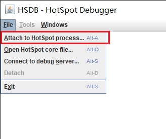
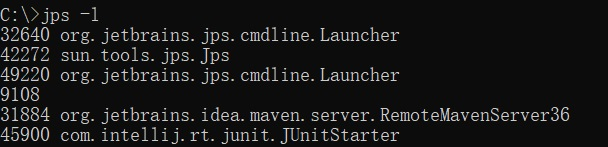
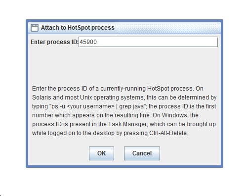
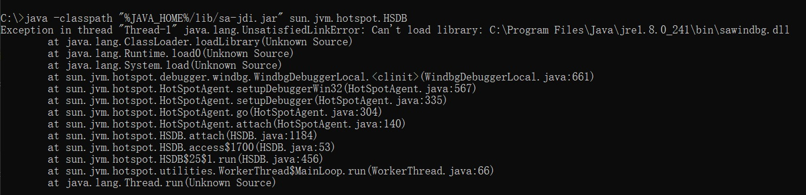
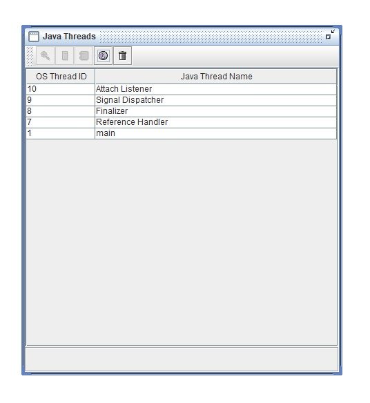
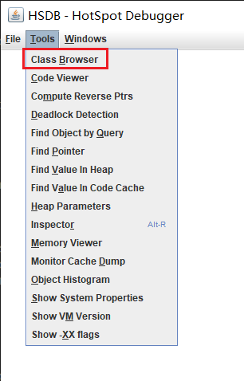
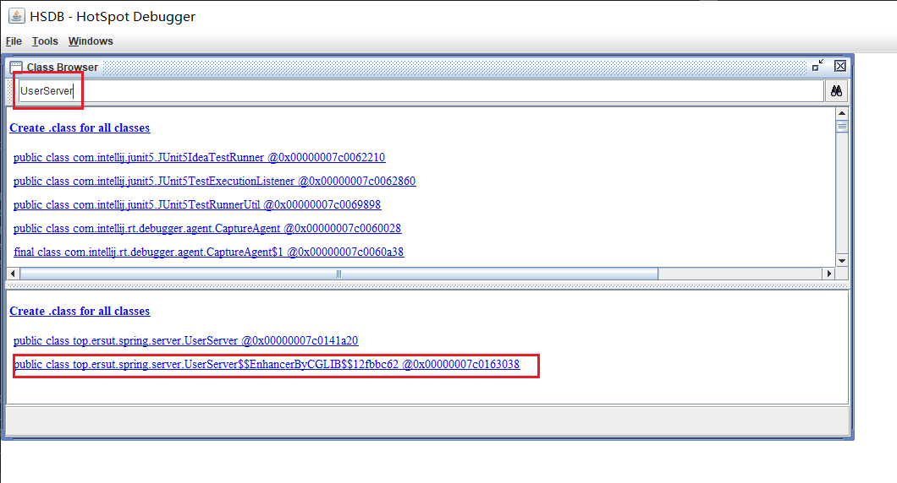
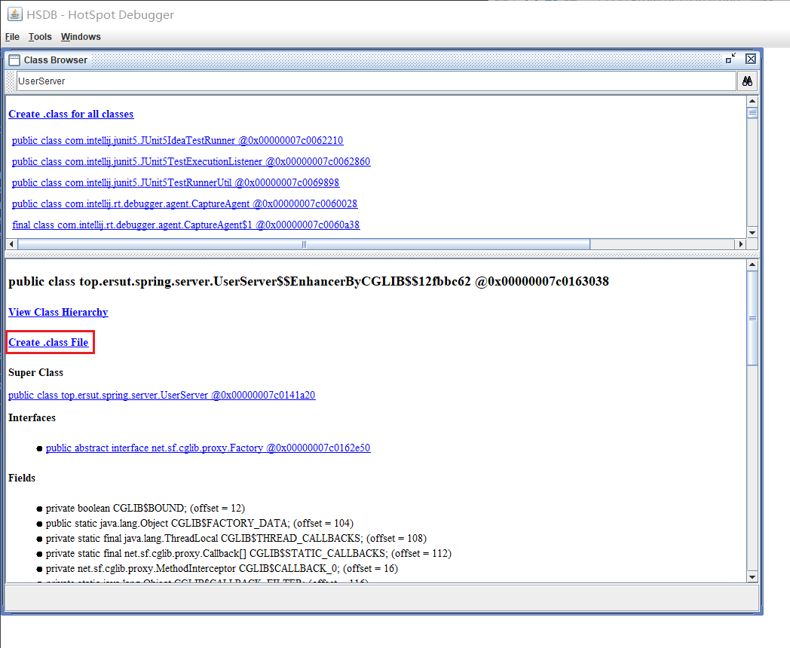
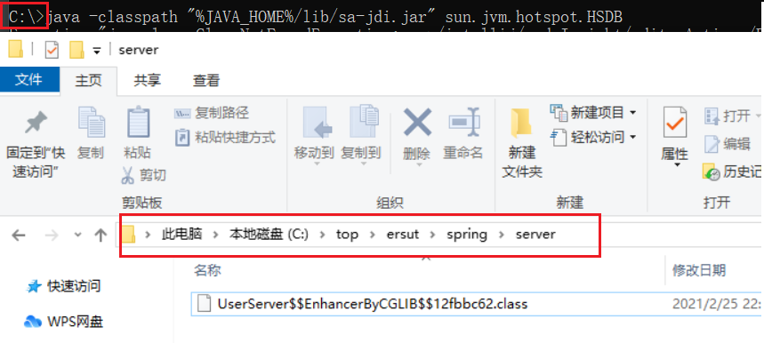

# 查看内存中的字节码文件

----------

## HSDB

1. 以管理员身份运行命令行，执行 `java -classpath "%JAVA_HOME%/lib/sa-jdi.jar" sun.jvm.hotspot.HSDB`
2. 点击 File > Attach to HotSpot process

3. 查询进程ID `jps -l` , 选择对应进程ID

4. 填入弹窗，点击OK

5. 如果报错如下,从`%JAVA_HOME%/jre/bin/`拷贝至对应目录,处理错误后从第一步重新来

6. 正常情况进入出现java Threads小窗口

7. 点击 Tools > class browser ,弹出class Browser窗口

8. 在class Browser窗口搜索类，点击进入

9. 点击 Create .class File 生成字节码文件，文件将保存在当前目录(命令行执行的目录)下以包名创建的文件夹内

10. 文件

11. 使用idea打开文件进行查看