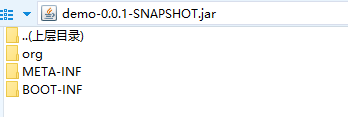

# spring-boot启动过程剖析 #
> 参考文章：
>
1. http://www.iocoder.cn/Spring-Boot/jar/?self

## jar包运行的两种方式 ##
1. 命令行指定运行类

	`java -cp xxx.jar com.xx.xxxx`
2. 读取jar包内的 MANIFEST.MF 文件的 Main-Class 属性
	1. jar包在启动时会读取jar包内的 MANIFEST.MF 文件的 Main-Class，从而启动jar包
	2. MANIFEST.MF 文件路径 META-INF/MANIFEST.MF
	3. 启动命令：
	
		`java -jar xxx.jar`

## spring boot jar包中 MANIFEST.MF 解读
###先上图
1. 工程（图1）

	
2. jar包结构
	1. 根目录（图2）

	
	2. MANIFSET.MF文件目录（图3）

	
3. MANIFSET.MF文件内容（图4）

	
	
	