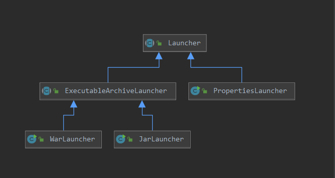
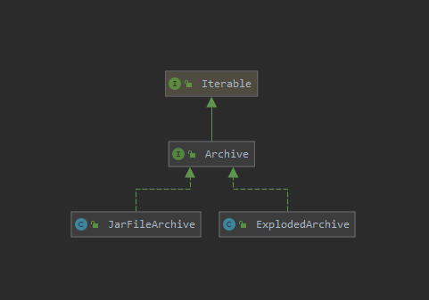
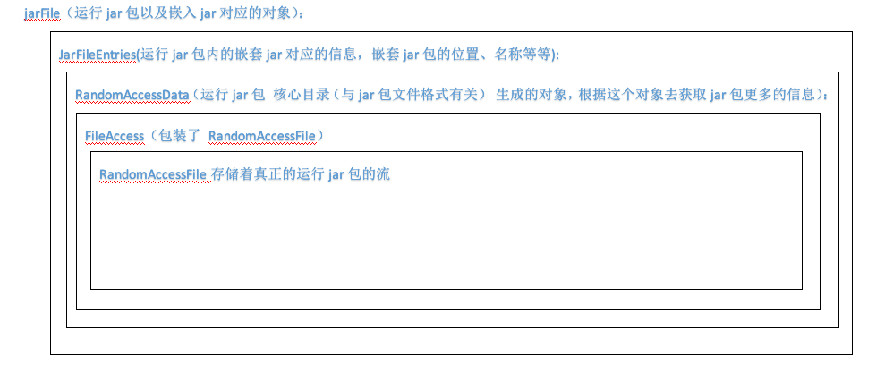

# spring-boot启动过程(源码分析) #

> 说明：
>> 以下均已 jar包 运行方式分析

> 参考文章：
>> 芋道源码: http://www.iocoder.cn/Spring-Boot/jar/?self
>> Java URL协议扩展实现: https://www.iteye.com/blog/mercyblitz-735529
>> 官方推荐的docker运行方式：
>>>https://blog.csdn.net/boling_cavalry/article/details/106597358
>>>https://juejin.im/post/6844904182743302151


## 代码来源
文章中代码均来源于 [spring-boot 开源库](https://github.com/spring-projects/spring-boot) 

spring-boot版本号：v2.4.0-M2

git版本号：e6ee3c1

## 优先阅读
- [spring-boot启动过程（简单分析）](./spring-boot启动过程（简单分析）.md)


## 类结构分析

### 涉及到的类以及类图
1. 启动器: org.springframework.boot.loader.Launcher
	
	

	1. **jar包启动类**（重点类）： org.springframework.boot.loader.JarLauncher
	2. **档案创建类**（重点类,**大部分实现在这个类**）： org.springframework.boot.loader.ExecutableArchiveLauncher
	3. war包启动类： org.springframework.boot.loader.WarLauncher
2. 档案: org.springframework.boot.loader.archive.Archive

	

	1. **jar档案类**（重点类,存储jar包的信息）： org.springframework.boot.loader.archive.JarFileArchive
	2. 目录档案类： org.springframework.boot.loader.archive.ExplodedArchive

### 启动器类与档案类的关系

> jar包启动时创建 JarLauncher 对象（通过无参构造创建）并调用launch方法；由于创建 JarLauncher ，所以会调用 ExecutableArchiveLauncher 的无参构造（类加载导致），此构造方法中生成了运行jar包的 Archive ；然后通过 JarLauncher 调用了  Launcher#launch 方法，其中生成了嵌套jar包的 Archive 。

### 相关代码
1. JarLauncher#main 内

	```
	public static void main(String[] args) throws Exception {
		new JarLauncher().launch(args);
	}
	```
2. ExecutableArchiveLauncher 无参构造

	```
	public ExecutableArchiveLauncher() {
		...
		//生成运行jar包的 Archive
		this.archive = createArchive();
		...
	}
	```
3.  Launcher#launch 方法。 ExecutableArchiveLauncher、JarLauncher 均未重写 launch 方法，所以调用 Launcher的launch 方法
	```
	protected void launch(String[] args) throws Exception {
		
		//其中getClassPathArchivesIterator 方法创建了 BOOT-INF/lib中的嵌套jar以及BOOT-INF/classes中的class文件 对应的Archive
		ClassLoader classLoader = createClassLoader(getClassPathArchivesIterator());
		...
	}
		
	```

## new JarLauncher() 源码分析
1. JarLauncher 无参构造
	```
	public class JarLauncher extends ExecutableArchiveLauncher {
		...
		public JarLauncher() {
			//隐式调用父类的无参构造,下边这行是我写上的源码中没有。
			super();
		}
		...
	}
	```
2. ExecutableArchiveLauncher 无参构造
	```
	public abstract class ExecutableArchiveLauncher extends Launcher {
		...
		public ExecutableArchiveLauncher() {
			try {
				//生成运行jar包的 Archive
				this.archive = createArchive();
				//获取jar包中扩展包的索引文件（使用官方推荐的docker打包方式会用到这个索引文件），此处忽略不再赘述
				this.classPathIndex = getClassPathIndex(this.archive);
			}
			catch (Exception ex) {
				throw new IllegalStateException(ex);
			}
		}
		...
	}
	```
	1. ExecutableArchiveLauncher未重写 createArchive 方法，所以调用 Launcher#createArchive 方法
		```
		public abstract class Launcher {
			...
			protected final Archive createArchive() throws Exception {
				ProtectionDomain protectionDomain = getClass().getProtectionDomain();
				CodeSource codeSource = protectionDomain.getCodeSource();
				URI location = (codeSource != null) ? codeSource.getLocation().toURI() : null;
				String path = (location != null) ? location.getSchemeSpecificPart() : null;
				if (path == null) {
					throw new IllegalStateException("Unable to determine code source archive");
				}
				//以上几行为获取到运行程序根路径
				File root = new File(path);
				if (!root.exists()) {
					throw new IllegalStateException("Unable to determine code source archive from " + root);
				}
				//目录（war包 或者 官方推荐的docker打包方式）创建 ExplodedArchive ; jar包创建 JarFileArchive
				return (root.isDirectory() ? new ExplodedArchive(root) : new JarFileArchive(root));
			}
			...
		}
		```
		1. JarFileArchive#JarFileArchive(java.io.File) 构造方法
			```
			public class JarFileArchive implements Archive {
				...

				//jar文件对应的对象
				private final JarFile jarFile;
				//jar文件的绝对路径
				private URL url;

				public JarFileArchive(File file) throws IOException {
					this(file, file.toURI().toURL());
				}
			
				public JarFileArchive(File file, URL url) throws IOException {
					//这里创建了 jarFile对象
					this(new JarFile(file));
					this.url = url;
				}
			
				public JarFileArchive(JarFile jarFile) {
					this.jarFile = jarFile;
				}
				...
			}
			```
			1. [JarFile存储了jar包的所有内容，具体得展开讲，可以先跳过](#JarFile)

## Launcher#launch 方法源码分析
1. Launcher#launch(java.lang.String[]) 
	```
	public abstract class Launcher {
	
		private static final String JAR_MODE_LAUNCHER = "org.springframework.boot.loader.jarmode.JarModeLauncher";
	
		protected void launch(String[] args) throws Exception {
			if (!isExploded()) {
				//注册可读嵌套jar的协议
				JarFile.registerUrlProtocolHandler();
			}
			/**
			 * 获取所有BOOT-INF/lib中的嵌套jar以及BOOT-INF/classes中的class文件 对应的Archive
			 * 并创建自定义 ClassLoader 对应实现类 LaunchedURLClassLoader
			 * 后期加载 BOOT-INF/lib中的嵌套jar以及BOOT-INF/classes中的class文件 都是通过 LaunchedURLClassLoader
			 * /
			ClassLoader classLoader = createClassLoader(getClassPathArchivesIterator());
			//官方推荐的dockerFile使用,此处忽略
			String jarMode = System.getProperty("jarmode");
			//获取springboot启动类
			String launchClass = (jarMode != null && !jarMode.isEmpty()) ? JAR_MODE_LAUNCHER : getMainClass();
			//启动springboot启动类
			launch(args, launchClass, classLoader);
		}
		...
	}
	```
	1. JarFile#registerUrlProtocolHandler
	这段代码需要有 Java URL协议扩展实现 的基础。推荐文章：https://www.iteye.com/blog/mercyblitz-735529

	```
	public class JarFile extends java.util.jar.JarFile implements Iterable<java.util.jar.JarEntry> {
		...
		//自定义 URL 扩展方式之一
		private static final String PROTOCOL_HANDLER = "java.protocol.handler.pkgs";
		//扩展 jar协议的包路径
		private static final String HANDLERS_PACKAGE = "org.springframework.boot.loader";
		...
		public static void registerUrlProtocolHandler() {
			//获取系统参数值
			String handlers = System.getProperty(PROTOCOL_HANDLER, "");
			//添加 springboot自己 扩展jar的协议
			System.setProperty(PROTOCOL_HANDLER,
					("".equals(handlers) ? HANDLERS_PACKAGE : handlers + "|" + HANDLERS_PACKAGE));
			//清除工厂扩展方式 以及 已缓存的Handler
			resetCachedUrlHandlers();
		}
	
		private static void resetCachedUrlHandlers() {
			try {
				URL.setURLStreamHandlerFactory(null);
			}
			catch (Error ex) {
				// Ignore
			}
		}
	}
	```
	2. ExecutableArchiveLauncher#getClassPathArchivesIterator 获取所有BOOT-INF/lib中的嵌套jar以及BOOT-INF/classes中的class文件。
	
	这段比较绕建议直接看源码去理解 其中涉及 JarFileArchive、JarFile 中的一部分方法（其中还使用了lambda）
	3. createClassLoader
	```
	//第一段
	public abstract class ExecutableArchiveLauncher extends Launcher {
		...
		@Override
		protected ClassLoader createClassLoader(Iterator<Archive> archives) throws Exception {
			List<URL> urls = new ArrayList<>(guessClassPathSize());
			while (archives.hasNext()) {
				//获取 BOOT-INF/lib中的嵌套jar以及BOOT-INF/classes中的class文件 对应的URL
				urls.add(archives.next().getUrl());
			}
			//这可以不看 jar包 运行这是空的，官方推荐的dockerFile运行会走这里
			if (this.classPathIndex != null) {
				urls.addAll(this.classPathIndex.getUrls());
			}
			return createClassLoader(urls.toArray(new URL[0]));
		}
	
		private int guessClassPathSize() {
			if (this.classPathIndex != null) {
				return this.classPathIndex.size() + 10;
			}
			return 50;
		}
		...
	}
	//第二段	
	public abstract class Launcher {
		...
		protected ClassLoader createClassLoader(URL[] urls) throws Exception {
			//对 BOOT-INF/lib中的嵌套jar以及BOOT-INF/classes中的class文件对应的URL 创建LaunchedURLClassLoader
			return new LaunchedURLClassLoader(isExploded(), getArchive(), urls, getClass().getClassLoader());
		}
		...
	}

	```
	4. ExecutableArchiveLauncher#getMainClass
	```
	public abstract class ExecutableArchiveLauncher extends Launcher {
		//MANIFSET文件中springboot启动类的属性名
		private static final String START_CLASS_ATTRIBUTE = "Start-Class";
		@Override
		protected String getMainClass() throws Exception {
			//获取MANIFSET文件生成的对象
			Manifest manifest = this.archive.getManifest();
			String mainClass = null;
			if (manifest != null) {
				//获取Start-Class属性对应的值
				mainClass = manifest.getMainAttributes().getValue(START_CLASS_ATTRIBUTE);
			}
			if (mainClass == null) {
				throw new IllegalStateException("No 'Start-Class' manifest entry specified in " + this);
			}
			return mainClass;
		}
	}
	```
	5. Launcher#launch(java.lang.String[], java.lang.String, java.lang.ClassLoader)

	第一段
	```
	protected void launch(String[] args, String launchClass, ClassLoader classLoader) throws Exception {
		//设置 LaunchedURLClassLoader 作为类加载器
		Thread.currentThread().setContextClassLoader(classLoader);
		//创建MainMethodRunner并执行run方法
		createMainMethodRunner(launchClass, args, classLoader).run();
	}
	protected MainMethodRunner createMainMethodRunner(String mainClass, String[] args, ClassLoader classLoader) {
		//看第二段
		return new MainMethodRunner(mainClass, args);
	}
	```
	
	第二段
	
	```
	public class MainMethodRunner {
	
		private final String mainClassName;
	
		private final String[] args;
	
		/**
		 * Create a new {@link MainMethodRunner} instance.
		 * @param mainClass the main class
		 * @param args incoming arguments
		 */
		public MainMethodRunner(String mainClass, String[] args) {
			this.mainClassName = mainClass;
			this.args = (args != null) ? args.clone() : null;
		}
	
		public void run() throws Exception {
			//获取启动类
			Class<?> mainClass = Class.forName(this.mainClassName, false, Thread.currentThread().getContextClassLoader());
			//获取main方法
			Method mainMethod = mainClass.getDeclaredMethod("main", String[].class);
			mainMethod.setAccessible(true);
			//通过反射运行main方法
			mainMethod.invoke(null, new Object[] { this.args });
		}
	
	}
	```

## <span id="JarFile">【可选】</span> org.springframework.boot.loader.jar.JarFile#JarFile(java.io.File) 构造方法

> 小知识：jar包其实是一个zip压缩包，所有jar包的文件结构与zip的文件结构一致；
>> zip的文件大致结构：
1. 文件数据区
2. 文件目录区(核心目录)
3. 目录结束标志（EOCD）

>> 他们之间的关系 目录结束标志 可以找到 文件目录区 ，文件目录区 可以找到 文件数据区

### 此 JarFile 非彼 JarFile
org.springframework.boot.loader.jar.JarFile 继承了 java.util.jar.JarFile
上图


### jarFile 重要属性
上图


 
#### JarFile.entries（JarFile.JarFileEntries）
先看下 JarFileEntries 的类图，JarFileEntries 实现了 CentralDirectoryVisitor接口。


提前声明JarFile.entries 其实是 核心目录解析类（CentralDirectoryParser） 进行的处理，具体怎么处理下边会讲到，先跟看序号按顺序源码吧

	```
	public class JarFile extends java.util.jar.JarFile implements Iterable<java.util.jar.JarEntry> {
		...
		//META-INF目录的对象
		private static final AsciiBytes META_INF = new AsciiBytes("META-INF/");
		//jar包签名文件的后缀
		private static final AsciiBytes SIGNATURE_FILE_EXTENSION = new AsciiBytes(".SF");

		...
		
		//存储了嵌套jar的位置、名称
		private JarFileEntries entries;
		
		...

		//1、构造
		public JarFile(File file) throws IOException {
			this(new RandomAccessDataFile(file));
		}
		//2、构造
		JarFile(RandomAccessDataFile file) throws IOException {
			this(file, "", file, JarFileType.DIRECT);
		}
		//3、构造
		private JarFile(RandomAccessDataFile rootFile, String pathFromRoot, RandomAccessData data, JarFileType type)
				throws IOException {
			this(null, rootFile, pathFromRoot, data, null, type, null);
		}
		//4、构造
		private JarFile(JarFile parent, RandomAccessDataFile rootFile, String pathFromRoot, RandomAccessData data,
			JarEntryFilter filter, JarFileType type, Supplier<Manifest> manifestSupplier) throws IOException {
			...
			//5、创建 核心目录解析类
			CentralDirectoryParser parser = new CentralDirectoryParser();
			//6、添加 JarFileEntries 给 核心目录解析类
			this.entries = parser.addVisitor(new JarFileEntries(this, filter));
			//7、添加 centralDirectoryVisitor() 给 核心目录解析类
			arser.addVisitor(centralDirectoryVisitor());
			try {
				//9、开始解析 核心目录 经过这一步 this.entries 就已经处理完了
				this.data = parser.parse(data, filter == null);
			}
			catch (RuntimeException ex) {
				close();
				throw ex;
			}
			...
		}
		...
		//8、这个方法处理了两件事情
		private CentralDirectoryVisitor centralDirectoryVisitor() {
			return new CentralDirectoryVisitor() {
	
				@Override
				public void visitStart(CentralDirectoryEndRecord endRecord, RandomAccessData centralDirectoryData) {
					//8.1、获取运行jar包注释内容
					JarFile.this.comment = endRecord.getComment();
				}
	
				@Override
				public void visitFileHeader(CentralDirectoryFileHeader fileHeader, int dataOffset) {
					//8.2判断jar包是否签名 ，签名文件在 META-INF/ 后缀名为 .SF
					AsciiBytes name = fileHeader.getName();
					if (name.startsWith(META_INF) && name.endsWith(SIGNATURE_FILE_EXTENSION)) {
						JarFile.this.signed = true;
					}
				}
	
				@Override
				public void visitEnd() {
				}
	
			};
		}
		...
	}
	```
#### 核心目录解析类（CentralDirectoryParser） 具体怎么处理的。
CentralDirectoryEndRecord、CentralDirectoryFileHeader这两个类不再深入，接下来跟着序号继续看源码吧
```
class CentralDirectoryParser {
	//核心目录中 单个目录的基础字节，了解zip文件机构会明白这块。
	private static final int CENTRAL_DIRECTORY_HEADER_BASE_SIZE = 46;

	//JarFile.entries、centralDirectoryVisitor() 到这个list里了
	private final List<CentralDirectoryVisitor> visitors = new ArrayList<>();

	//6.1 
	<T extends CentralDirectoryVisitor> T addVisitor(T visitor) {
		this.visitors.add(visitor);
		return visitor;
	}

	//9.1、解析RandomAccessData
	RandomAccessData parse(RandomAccessData data, boolean skipPrefixBytes) throws IOException {
		//获取运行jar包的结束标识（EOCD）
		CentralDirectoryEndRecord endRecord = new CentralDirectoryEndRecord(data);

		//这个判断是个迷
		if (skipPrefixBytes) {
			//获取真实的jar包，还不太明白（好像是因为部分jar包可以文件结构中嵌入脚本）
			data = getArchiveData(endRecord, data);
		}

		//9.2、获取核心目录，其中记录压缩文件的目录信息,通过这个可以在‘文件数据区’找到被压缩的文件
		RandomAccessData centralDirectoryData = endRecord.getCentralDirectory(data);
		//9.3、
		visitStart(endRecord, centralDirectoryData);
		//9.4、
		parseEntries(endRecord, centralDirectoryData);
		//9.5、
		visitEnd();
		return data;
	}

	private void parseEntries(CentralDirectoryEndRecord endRecord, RandomAccessData centralDirectoryData)
			throws IOException {
		//9.4.1、读取核心目录的所有字节
		byte[] bytes = centralDirectoryData.read(0, centralDirectoryData.getSize());
		CentralDirectoryFileHeader fileHeader = new CentralDirectoryFileHeader();
		//偏移量
		int dataOffset = 0;
		//9.4.2、 遍历 核心目录，endRecord.getNumberOfRecords()得到的核心目录里的数量 与 jar包内文件数一致
		for (int i = 0; i < endRecord.getNumberOfRecords(); i++) {
			//9.4.3、根据偏移量加载一个核心目录文件的头信息
			fileHeader.load(bytes, dataOffset, null, 0, null);
			//9.4.4、
			visitFileHeader(dataOffset, fileHeader);
			//9.4.5、下一个核心目录文件的偏移量
			dataOffset += CENTRAL_DIRECTORY_HEADER_BASE_SIZE + fileHeader.getName().length()
					+ fileHeader.getComment().length() + fileHeader.getExtra().length;
		}
	}
	
	...

	private void visitStart(CentralDirectoryEndRecord endRecord, RandomAccessData centralDirectoryData) {
		for (CentralDirectoryVisitor visitor : this.visitors) {
			//9.3.1、等下看实现
			visitor.visitStart(endRecord, centralDirectoryData);
		}
	}

	private void visitFileHeader(int dataOffset, CentralDirectoryFileHeader fileHeader) {
		for (CentralDirectoryVisitor visitor : this.visitors) {
			//9.4.4.1、等下看实现
			visitor.visitFileHeader(fileHeader, dataOffset);
		}
	}

	private void visitEnd() {
		for (CentralDirectoryVisitor visitor : this.visitors) {
			//9.5.1、等下看实现
			visitor.visitEnd();
		}
	}

}
```
#### JarFileEntries 怎么实现的 CentralDirectoryVisitor接口
接着看代码~

```
class JarFileEntries implements CentralDirectoryVisitor, Iterable<JarEntry> {
	//运行jar包 核心目录（与jar包文件格式有关） 生成的对象，根据这个对象去获取jar包更多的信息
	private RandomAccessData centralDirectoryData;
	
	//JarFileEntries的大小
	private int size;
	//存储运行jar中每个文件对应的hash值
	private int[] hashCodes;
	//存储运行jar中每个文件对应的偏移量
	private int[] centralDirectoryOffsets;


	//9.3.1、 核心目录赋值以及初始化 hashCodes、centralDirectoryOffsets
	@Override
	public void visitStart(CentralDirectoryEndRecord endRecord, RandomAccessData centralDirectoryData) {
		//最大文件数
		int maxSize = endRecord.getNumberOfRecords();
		//核心目录赋值
		this.centralDirectoryData = centralDirectoryData;
		//初始化hashCodes、centralDirectoryOffsets
		this.hashCodes = new int[maxSize];
		this.centralDirectoryOffsets = new int[maxSize];
		this.positions = new int[maxSize];
	}

	//9.4.4.1、
	/**
	 * @param fileHeader 核心目录中的头信息
	 * @param dataOffset 头信息 对于centralDirectoryData的偏移量
	 */
	@Override
	public void visitFileHeader(CentralDirectoryFileHeader fileHeader, int dataOffset) {
		//获取文件名
		AsciiBytes name = applyFilter(fileHeader.getName());
		if (name != null) {
			//9.4.4.1.1、记录偏移量与文件名的hash值
			add(name, dataOffset);
		}
	}

	private void add(AsciiBytes name, int dataOffset) {
		//存储hash值
		this.hashCodes[this.size] = name.hashCode();
		//存储偏移量
		this.centralDirectoryOffsets[this.size] = dataOffset;
		this.positions[this.size] = this.size;
		this.size++;
	}
	//9.5.1、
	@Override
	public void visitEnd() {
		//根据hash值排序
		sort(0, this.size - 1);

		int[] positions = this.positions;
		this.positions = new int[positions.length];
		for (int i = 0; i < this.size; i++) {
			this.positions[positions[i]] = i;
		}
	}
}
```

## 扩展资料

### 官方推荐的dockerFile
[官方2.4.0-M2文档](https://docs.spring.io/spring-boot/docs/2.4.0-M2/reference/pdf/spring-boot-reference.pdf)
```
FROM adoptopenjdk:11-jre-hotspot as builder
WORKDIR application
ARG JAR_FILE=target/*.jar
COPY ${JAR_FILE} application.jar
RUN java -D jarmode=layertools -jar application.jar extract
FROM adoptopenjdk:11-jre-hotspot
WORKDIR application
COPY --from=builder application/dependencies/ ./
COPY --from=builder application/spring-boot-loader/ ./
COPY --from=builder application/snapshot-dependencies/ ./
COPY --from=builder application/application/ ./
ENTRYPOINT ["java", "org.springframework.boot.loader.JarLauncher"]
```
值得注意的是 jarmode=layertools 他会进行jar包的分层。
#### 具体怎么分层又怎么启动，感兴趣的话可再深入学习以下代码（此处只作为敲门砖）
> 相关资料：
> 
1. https://blog.csdn.net/boling_cavalry/article/details/106597358
2. https://juejin.im/post/6844904182743302151

1. 第一块
	```
	public abstract class Launcher {
		...
		protected final Archive createArchive() throws Exception {
			...
			//这里创建ExplodedArchive对象
			return (root.isDirectory() ? new ExplodedArchive(root) : new JarFileArchive(root));
		}
		...
	}
	```
2. 第二块
	```
	public abstract class ExecutableArchiveLauncher extends Launcher {
		...
		public ExecutableArchiveLauncher() {
			try {
				//这里 去查看对应 JarLauncher#getClassPathIndex 的重写
				this.classPathIndex = getClassPathIndex(this.archive);
			}
			catch (Exception ex) {
				throw new IllegalStateException(ex);
			}
		}
		...
	}
	```
2. 	第三块
	```
	public abstract class Launcher {

		private static final String JAR_MODE_LAUNCHER = "org.springframework.boot.loader.jarmode.JarModeLauncher";
	
		protected void launch(String[] args) throws Exception {
			//获取系统参数 即 dockerFile 中的 -Djarmode=layertools
			String jarMode = System.getProperty("jarmode");
			//获取启动类 对应启动类就是 Launcher.JAR_MODE_LAUNCHER
			String launchClass = (jarMode != null && !jarMode.isEmpty()) ? JAR_MODE_LAUNCHER : getMainClass();
			//启动启动类
			launch(args, launchClass, classLoader);
		}
	}
	```
3. 	第四块：看JarModeLauncher源码去吧！

## 遗留的问题
- spingboot 推荐的打包方式中为什么要分层，分层的好处是啥？