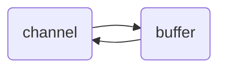
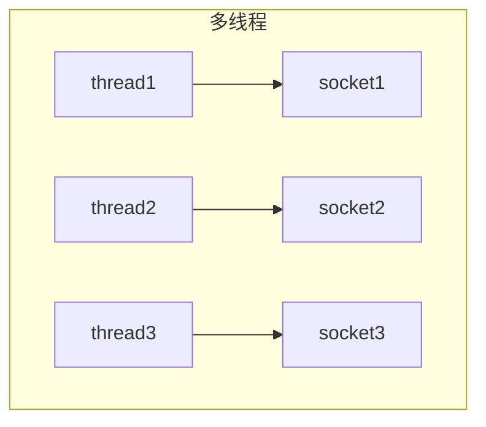
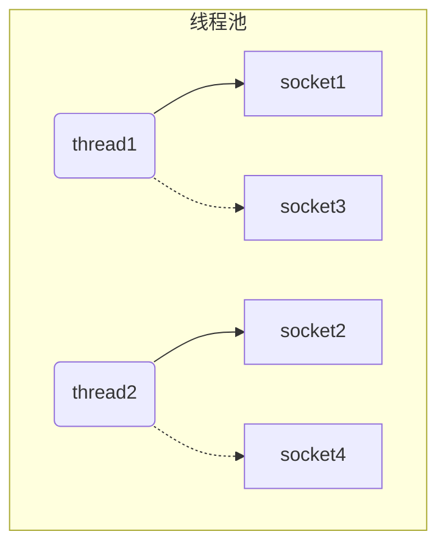
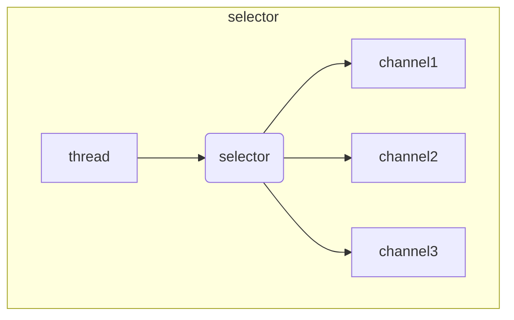

# NIO基础

> 全称 ： non-blocking IO 非阻塞IO

## 1. 三大组件：Buffer、Channel 、Selector

### 1.1 Buffer 

Buffer用来**缓冲数据**，常见的buffer：

- **ByteBuffer**  常用
  - MappedByteBuffer
  - DirectByteBuffer
  - HeapByteBuffer
- ShortBuffer
- IntBuffer
- LongBuffer
- FloatBuffer
- DoubleBuffer
- CharBuffer

### 1.2 Channel

Channel 是读取数据的**双向通道**，可以从channel读取数据后写入buffer，也可以将buffer的数据写入到channel。

常用的Channel：

- FileChannel：文件的数据通道
- DatagramChannel：UDP协议的数据通道
- SocketChannel：TCP的数据通道，客户端或服务端都可用
- ServerSocketChannel：TCP的数据通道，服务端专用

### 1.3 Selector

用于在一个线程中管理多个channel，节省CPU和内存的消耗，在同服务器配置下提高程序的性能

#### 多线程版本

##### ⚠️多线程缺点

- 内存占用高（每个线程都会消耗内存）
- 线程上下切换成本高
- 仅适合连接数较少的场景

#### 线程池版本

线程池是阻塞模式的，只有线程处理完当前socket后才能处理下一个socket

##### ⚠️线程池缺点

- 阻塞模式，每个线程只能处理一个socket连接
- 仅适合短链接的场景

#### Selector版本

selector的作用是配合一个线程中管理多个channel，channel工作在非阻塞模式下，线程不会吊死在某个channel上。selector工作在阻塞模式下，等待channel的读写。

**适合连接数少，流量低的场景**

调用 selector 的 select() 会阻塞直到 channel 发生了读写就绪事件，这些事件发生，select 方法就会返回这些事件交给 thread 来处理

## 2. ByteBuffer

### 2.1 基础使用

#### 2.1.1 读数据

#### 2.1.2 写数据

### 2.2 ByteBuffer的结构

* capacity：ByteBuffer的容量
* position：ByteBuffer的指针
* limit：ByteBuffer的读写限制

### 2.3 ❤常用方法和示例

flip 和 get方法

put 、clear 和 compact方法

make 和 reset方法

字符串与 ByteBuffer 互转

