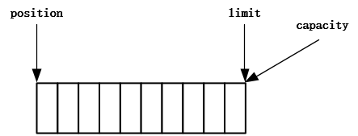

# NIO基础

> 全称 ： non-blocking IO 非阻塞IO

## 1. 三大组件：Buffer、Channel 、Selector

### 1.1 Buffer 

Buffer用来**缓冲数据**，常见的buffer：

- **ByteBuffer**  常用
  - MappedByteBuffer
  - DirectByteBuffer
  - HeapByteBuffer
- ShortBuffer
- IntBuffer
- LongBuffer
- FloatBuffer
- DoubleBuffer
- CharBuffer

### 1.2 Channel

Channel 是读取数据的**双向通道**，可以从channel读取数据后写入buffer，也可以将buffer的数据写入到channel。


常用的Channel：

- FileChannel：文件的数据通道
- DatagramChannel：UDP协议的数据通道
- SocketChannel：TCP的数据通道，客户端或服务端都可用
- ServerSocketChannel：TCP的数据通道，服务端专用

### 1.3 Selector

用于在一个线程中管理多个channel，节省CPU和内存的消耗，在同服务器配置下提高程序的性能

#### 多线程版本


##### ⚠️多线程缺点

- 内存占用高（每个线程都会消耗内存）
- 线程上下切换成本高
- 仅适合连接数较少的场景

#### 线程池版本


线程池是阻塞模式的，只有线程处理完当前socket后才能处理下一个socket

##### ⚠️线程池缺点

- 阻塞模式，每个线程只能处理一个socket连接
- 仅适合短链接的场景

#### Selector版本

selector的作用是配合一个线程中管理多个channel，channel工作在非阻塞模式下，线程不会吊死在某个channel上。selector工作在阻塞模式下，等待channel的读写。

**适合连接数少，流量低的场景**


调用 selector 的 select() 会阻塞直到 channel 发生了读写就绪事件，这些事件发生，select 方法就会返回这些事件交给 thread 来处理

## 2. ByteBuffer

### 2.1 基础使用

#### 2.1.1 读数据

```java
public void testRead(){
    try (RandomAccessFile file = new RandomAccessFile("abc.txt", "rw")) {
        FileChannel channel = file.getChannel();
        //创建一个 大小为11 的ByteBuffer
        ByteBuffer byteBuffer = ByteBuffer.allocate(10);
        while (true) {
            //从通道中读取数据到ByteBuffer，每次读取的数据是ByteBuffer的大小
            int len = channel.read(byteBuffer);
            //len表示读取了多少数据，0表示数据已全部读取
            if (len <= 0) {
                break;
            }
            //切换为读模式
            byteBuffer.flip();
            for (int i = 0; i < len; i++) {
                System.out.println((char) byteBuffer.get());
            }
            //切换为写模式
            byteBuffer.clear();
        }
    } catch (IOException ioException) {
    }
}
```

`abc.txt`文件内容

```tex
134567890abcdef
```

代码输出内容

```tex
1
3
4
5
6
7
8
9
0
a
b
c
d
e
f

```

[读数据示例](./netty_demo/src/main/test/top/ersut/ByteBufferDemoTest.java)

#### 2.1.2 写数据

```java
public void testWrite(){
    try (RandomAccessFile file = new RandomAccessFile("write.txt", "rw")) {
        FileChannel channel = file.getChannel();

        //创建ByteBuffer
        ByteBuffer byteBuffer = ByteBuffer.allocate(4);
        //往ByteBuffer中写入数据
        byteBuffer.put("test".getBytes());
        //切换为读模式
        byteBuffer.flip();

        //通过channel将ByteBuffer写入到文件中
        channel.write(byteBuffer);
    } catch (IOException ioException) {
    }
}
```

`write.txt`文件内没有内容，代码运行后内容如下：

```tex
test
```

[写数据示例](./netty_demo/src/main/test/top/ersut/ByteBufferDemoTest.java)

### 2.2 ByteBuffer的结构

**三个重要属性：**

* capacity：ByteBuffer的容量
* position：ByteBuffer的指针
* limit：ByteBuffer的读写限制

1、运行`ByteBuffer.allocate(10)`，创建了一个容量为10的ByteBuffer，三个重要属性如下：



2、写模式下（新建的`ByteBuffer`默认为写模式，当`clear()` 或者`compact()`动作发生时切换为写模式），`position`是待写入位置；`limit`和`capacity`相等，下图写入了5个字节后的状态：


3、读模式下，`position`是待读取位置，指向最前方的位置；`limit`是当前字节的个数（读取限制）；状态如下：


4、读取2个字节的状态：


5、切换为写模式，

​		5.1、情况1：执行`clear()`动作，状态如下：


​		[clear示例#testStructureClear](./netty_demo/src/main/test/top/ersut/ByteBufferDemoTest.java)

​		5.2、情况2：执行`compact()`动作，把未读取的数据向前压缩，状态如下：


​		[compact示例#testStructureCompact](./netty_demo/src/main/test/top/ersut/ByteBufferDemoTest.java)

### 2.3 ❤常用方法和示例

#### 写入数据：put 、clear 和 compact方法

##### put方法：写入数据使用

`public ByteBuffer put(byte value)`：写入一个字节，同时position向后移动一位

`public ByteBuffer put(byte[] values)`：写入多个字节，同时position向后移动多位（写入多少个字节就移动多少位）

`public ByteBuffer put(int index, byte value)`：根据位置写入一个字节，**position不会变动**

示例代码：

```java
public void testPut() {
    ByteBuffer byteBuffer = ByteBuffer.allocate(16);
    //写入单个字节，写入后 position 自动 +1
    byteBuffer.put((byte)'a');
    ByteBufferUtil.debugAll(byteBuffer);
    System.out.println();

    //写入多个字节，写入后 position 自动 + byte数组的长度
    byteBuffer.put(new byte[]{'b','c'});
    ByteBufferUtil.debugAll(byteBuffer);
    System.out.println();

    //指定位置写入字节，注意该方式 position 不会变动
    byteBuffer.put(2,(byte)'e');
    ByteBufferUtil.debugAll(byteBuffer);
}
```

<details>
    <summary>展开查看运行结果</summary>
<pre><code>
+--------+-------------------- all ------------------------+----------------+
position: [1], limit: [16]
        +-------------------------------------------------+
        |  0  1  2  3  4  5  6  7  8  9  a  b  c  d  e  f |
+--------+-------------------------------------------------+----------------+
|00000000| 61 00 00 00 00 00 00 00 00 00 00 00 00 00 00 00 |a...............|
+--------+-------------------------------------------------+----------------+
<br>
+--------+-------------------- all ------------------------+----------------+
position: [3], limit: [16]
        +-------------------------------------------------+
        |  0  1  2  3  4  5  6  7  8  9  a  b  c  d  e  f |
+--------+-------------------------------------------------+----------------+
|00000000| 61 62 63 00 00 00 00 00 00 00 00 00 00 00 00 00 |abc.............|
+--------+-------------------------------------------------+----------------+
<br>
+--------+-------------------- all ------------------------+----------------+
position: [3], limit: [16]
        +-------------------------------------------------+
        |  0  1  2  3  4  5  6  7  8  9  a  b  c  d  e  f |
+--------+-------------------------------------------------+----------------+
|00000000| 61 62 65 00 00 00 00 00 00 00 00 00 00 00 00 00 |abe.............|
+--------+-------------------------------------------------+----------------+
</code></pre>
</details>

[put示例源码#testPut](./netty_demo/src/main/test/top/ersut/ByteBufferDemoTest.java)

##### clear方法：清除数据

clear方法实际上是移动了`postion`和`limit`，并未真正的清除数据，**将position移动到头的位置，limit移动到尾**

示例代码：

```java
public void testClear() {
    ByteBuffer byteBuffer = ByteBuffer.allocate(16);
    //写入多个字节
    byteBuffer.put(new byte[]{'a','b','c'});
    ByteBufferUtil.debugAll(byteBuffer);
    System.out.println("↓↓↓↓↓↓↓↓↓↓↓↓↓↓↓↓↓↓↓↓↓↓↓↓↓↓↓↓↓↓↓↓↓↓↓↓↓↓↓↓↓↓↓↓↓↓↓↓↓↓↓↓↓↓↓↓↓↓↓↓↓↓↓↓↓↓↓↓↓↓↓↓↓↓↓↓↓");

    //清空数据，实际上是移动了postion和limit，并未真正的清除数据
    byteBuffer.clear();
    ByteBufferUtil.debugAll(byteBuffer);
    System.out.println("↓↓↓↓↓↓↓↓↓↓↓↓↓↓↓↓↓↓↓↓↓↓↓↓↓↓↓↓↓↓↓↓↓↓↓↓↓↓↓↓↓↓↓↓↓↓↓↓↓↓↓↓↓↓↓↓↓↓↓↓↓↓↓↓↓↓↓↓↓↓↓↓↓↓↓↓↓");

    //覆盖之前的数据写入新数据
    byteBuffer.put((byte) 'd');
    ByteBufferUtil.debugAll(byteBuffer);
}
```

<details>
    <summary>展开查看运行结果</summary>
    <pre><code>
 +--------+-------------------- all ------------------------+----------------+
position: [3], limit: [16]
         +-------------------------------------------------+
         |  0  1  2  3  4  5  6  7  8  9  a  b  c  d  e  f |
+--------+-------------------------------------------------+----------------+
|00000000| 61 62 63 00 00 00 00 00 00 00 00 00 00 00 00 00 |abc.............|
+--------+-------------------------------------------------+----------------+
↓↓↓↓↓↓↓↓↓↓↓↓↓↓↓↓↓↓↓↓↓↓↓↓↓↓↓↓↓↓↓↓↓↓↓↓↓↓↓↓↓↓↓↓↓↓↓↓↓↓↓↓↓↓↓↓↓↓↓↓↓↓↓↓↓↓↓↓↓↓↓↓↓↓↓↓↓
+--------+-------------------- all ------------------------+----------------+
position: [0], limit: [16]
         +-------------------------------------------------+
         |  0  1  2  3  4  5  6  7  8  9  a  b  c  d  e  f |
+--------+-------------------------------------------------+----------------+
|00000000| 61 62 63 00 00 00 00 00 00 00 00 00 00 00 00 00 |abc.............|
+--------+-------------------------------------------------+----------------+
↓↓↓↓↓↓↓↓↓↓↓↓↓↓↓↓↓↓↓↓↓↓↓↓↓↓↓↓↓↓↓↓↓↓↓↓↓↓↓↓↓↓↓↓↓↓↓↓↓↓↓↓↓↓↓↓↓↓↓↓↓↓↓↓↓↓↓↓↓↓↓↓↓↓↓↓↓
+--------+-------------------- all ------------------------+----------------+
position: [1], limit: [16]
         +-------------------------------------------------+
         |  0  1  2  3  4  5  6  7  8  9  a  b  c  d  e  f |
+--------+-------------------------------------------------+----------------+
|00000000| 64 62 63 00 00 00 00 00 00 00 00 00 00 00 00 00 |dbc.............|
+--------+-------------------------------------------------+----------------+
    </code></pre>
</details>

[clear示例源码#testClear](./netty_demo/src/main/test/top/ersut/ByteBufferDemoTest.java)

##### compact方法：压缩数据

compact方法把未读取的数据向前压缩，再将position移动至压缩后数据的尾端，limit移动到尾

示例代码：

```java
public void testCompact() {
    ByteBuffer byteBuffer = ByteBuffer.allocate(16);
    //写入多个字节
    byteBuffer.put(new byte[]{'a','b','c'});

    //读取两个字节
    byteBuffer.flip();
    byteBuffer.get();
    byteBuffer.get();
    ByteBufferUtil.debugAll(byteBuffer);

    //压缩数据
    byteBuffer.compact();
    System.out.println("↓↓↓↓↓↓↓↓↓↓↓↓↓↓↓↓↓↓↓↓↓↓↓↓↓↓↓↓↓↓↓↓↓↓↓compact↓↓↓↓↓↓↓↓↓↓↓↓↓↓↓↓↓↓↓↓↓↓↓↓↓↓↓↓↓↓↓↓↓↓↓");
    ByteBufferUtil.debugAll(byteBuffer);

    //覆盖之前的数据写入新数据
    byteBuffer.put((byte) 'd');
    System.out.println("↓↓↓↓↓↓↓↓↓↓↓↓↓↓↓↓↓↓↓↓↓↓↓↓↓↓↓↓↓↓↓↓↓↓↓↓↓↓↓↓↓↓↓↓↓↓↓↓↓↓↓↓↓↓↓↓↓↓↓↓↓↓↓↓↓↓↓↓↓↓↓↓↓↓↓↓↓");
    ByteBufferUtil.debugAll(byteBuffer);
}
```

<details>
    <summary>展开查看运行结果</summary>
    <pre><code>
+--------+-------------------- all ------------------------+----------------+
position: [2], limit: [3]
         +-------------------------------------------------+
         |  0  1  2  3  4  5  6  7  8  9  a  b  c  d  e  f |
+--------+-------------------------------------------------+----------------+
|00000000| 61 62 63 00 00 00 00 00 00 00 00 00 00 00 00 00 |abc.............|
+--------+-------------------------------------------------+----------------+
↓↓↓↓↓↓↓↓↓↓↓↓↓↓↓↓↓↓↓↓↓↓↓↓↓↓↓↓↓↓↓↓↓↓↓compact↓↓↓↓↓↓↓↓↓↓↓↓↓↓↓↓↓↓↓↓↓↓↓↓↓↓↓↓↓↓↓↓↓↓↓
+--------+-------------------- all ------------------------+----------------+
position: [1], limit: [16]
         +-------------------------------------------------+
         |  0  1  2  3  4  5  6  7  8  9  a  b  c  d  e  f |
+--------+-------------------------------------------------+----------------+
|00000000| 63 62 63 00 00 00 00 00 00 00 00 00 00 00 00 00 |cbc.............|
+--------+-------------------------------------------------+----------------+
↓↓↓↓↓↓↓↓↓↓↓↓↓↓↓↓↓↓↓↓↓↓↓↓↓↓↓↓↓↓↓↓↓↓↓↓↓↓↓↓↓↓↓↓↓↓↓↓↓↓↓↓↓↓↓↓↓↓↓↓↓↓↓↓↓↓↓↓↓↓↓↓↓↓↓↓↓
+--------+-------------------- all ------------------------+----------------+
position: [2], limit: [16]
         +-------------------------------------------------+
         |  0  1  2  3  4  5  6  7  8  9  a  b  c  d  e  f |
+--------+-------------------------------------------------+----------------+
|00000000| 63 64 63 00 00 00 00 00 00 00 00 00 00 00 00 00 |cdc.............|
+--------+-------------------------------------------------+----------------+
    </code></pre>
</details>

[clear示例源码#testCompact](./netty_demo/src/main/test/top/ersut/ByteBufferDemoTest.java)

#### 读取数据：flip 和 get 方法


#### 标记位置：make 和 reset方法


#### 字符串与 ByteBuffer 互转


### 2.4 应用实例

#### 2.4.1 粘包、拆包

**模拟网络请求的粘包：每条数据以\n作为结尾**
数据1：say hi!\nhello
数据2： world~\nhi\n
将数据拆包并打印

```java
public void testStickingAndUnpacking() {
    ByteBuffer byteBuffer = ByteBuffer.allocate(16);
    //发送数据1
    //                     7     12
    byteBuffer.put("say hi!\nhello".getBytes());

    decodeData(byteBuffer);
    System.out.println("↓↓↓↓↓↓↓↓↓↓↓↓↓↓↓↓↓↓↓↓↓↓↓↓↓↓↓↓↓↓↓↓↓↓↓compact↓↓↓↓↓↓↓↓↓↓↓↓↓↓↓↓↓↓↓↓↓↓↓↓↓↓↓↓↓↓↓↓↓↓↓");
    ByteBufferUtil.debugAll(byteBuffer);

    //发送数据2
    byteBuffer.put(" world~\nhi\n".getBytes());
    System.out.println("↓↓↓↓↓↓↓↓↓↓↓↓↓↓↓↓↓↓↓↓↓↓↓↓↓↓↓↓↓↓↓↓↓↓↓↓data2↓↓↓↓↓↓↓↓↓↓↓↓↓↓↓↓↓↓↓↓↓↓↓↓↓↓↓↓↓↓↓↓↓↓↓↓");
    ByteBufferUtil.debugAll(byteBuffer);

    decodeData(byteBuffer);
    System.out.println("↓↓↓↓↓↓↓↓↓↓↓↓↓↓↓↓↓↓↓↓↓↓↓↓↓↓↓↓↓↓↓↓↓↓↓compact↓↓↓↓↓↓↓↓↓↓↓↓↓↓↓↓↓↓↓↓↓↓↓↓↓↓↓↓↓↓↓↓↓↓↓");
    ByteBufferUtil.debugAll(byteBuffer);
}

/**
     * 解析数据
     * @param byteBuffer
     */
private void decodeData(ByteBuffer byteBuffer){
    //存储已读取的数据
    StringBuilder readBytes = new StringBuilder();
    //改为读模式，并获取limit
    int len = byteBuffer.flip().limit();
    for (int i = 0; i < len; i++) {
        byte currByte = byteBuffer.get(i);
        if(currByte == '\n'){
            //byte转string
            String data = new String(StringUtil.decodeHexDump(readBytes.toString()), StandardCharsets.UTF_8);
            System.out.println(data);
            //清空旧数据，准备接收新数据
            readBytes = new StringBuilder();
            //调整 position 保证 compact 运行后数据正确
            byteBuffer.position(i+1);
        } else {
            readBytes.append(StringUtil.byteToHexStringPadded(currByte));
        }
    }
    byteBuffer.compact();
}
```

<details>
	<summary>展开查看运行结果</summary>
    <pre><code>
say hi!
↓↓↓↓↓↓↓↓↓↓↓↓↓↓↓↓↓↓↓↓↓↓↓↓↓↓↓↓↓↓↓↓↓↓↓compact↓↓↓↓↓↓↓↓↓↓↓↓↓↓↓↓↓↓↓↓↓↓↓↓↓↓↓↓↓↓↓↓↓↓↓
+--------+-------------------- all ------------------------+----------------+
position: [5], limit: [16]
         +-------------------------------------------------+
         |  0  1  2  3  4  5  6  7  8  9  a  b  c  d  e  f |
+--------+-------------------------------------------------+----------------+
|00000000| 68 65 6c 6c 6f 69 21 0a 68 65 6c 6c 6f 00 00 00 |helloi!.hello...|
+--------+-------------------------------------------------+----------------+
↓↓↓↓↓↓↓↓↓↓↓↓↓↓↓↓↓↓↓↓↓↓↓↓↓↓↓↓↓↓↓↓↓↓↓↓data2↓↓↓↓↓↓↓↓↓↓↓↓↓↓↓↓↓↓↓↓↓↓↓↓↓↓↓↓↓↓↓↓↓↓↓↓
+--------+-------------------- all ------------------------+----------------+
position: [16], limit: [16]
         +-------------------------------------------------+
         |  0  1  2  3  4  5  6  7  8  9  a  b  c  d  e  f |
+--------+-------------------------------------------------+----------------+
|00000000| 68 65 6c 6c 6f 20 77 6f 72 6c 64 7e 0a 68 69 0a |hello world~.hi.|
+--------+-------------------------------------------------+----------------+
hello world~
hi
↓↓↓↓↓↓↓↓↓↓↓↓↓↓↓↓↓↓↓↓↓↓↓↓↓↓↓↓↓↓↓↓↓↓↓compact↓↓↓↓↓↓↓↓↓↓↓↓↓↓↓↓↓↓↓↓↓↓↓↓↓↓↓↓↓↓↓↓↓↓↓
+--------+-------------------- all ------------------------+----------------+
position: [0], limit: [16]
         +-------------------------------------------------+
         |  0  1  2  3  4  5  6  7  8  9  a  b  c  d  e  f |
+--------+-------------------------------------------------+----------------+
|00000000| 68 65 6c 6c 6f 20 77 6f 72 6c 64 7e 0a 68 69 0a |hello world~.hi.|
+--------+-------------------------------------------------+----------------+
    </code></pre>
</details>
