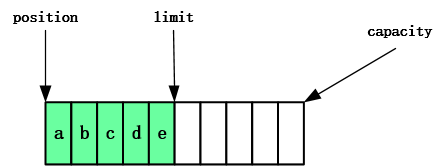

# NIO基础

> 全称 ： non-blocking IO 非阻塞IO

## 1. 三大组件：Buffer、Channel 、Selector

### 1.1 Buffer 

Buffer用来**缓冲数据**，常见的buffer：

- **ByteBuffer**  常用
  - MappedByteBuffer
  - DirectByteBuffer
  - HeapByteBuffer
- ShortBuffer
- IntBuffer
- LongBuffer
- FloatBuffer
- DoubleBuffer
- CharBuffer

### 1.2 Channel

Channel 是读取数据的**双向通道**，可以从channel读取数据后写入buffer，也可以将buffer的数据写入到channel。


常用的Channel：

- FileChannel：文件的数据通道
- DatagramChannel：UDP协议的数据通道
- SocketChannel：TCP的数据通道，客户端或服务端都可用
- ServerSocketChannel：TCP的数据通道，服务端专用

### 1.3 Selector

用于在一个线程中管理多个channel，节省CPU和内存的消耗，在同服务器配置下提高程序的性能

#### 多线程版本


##### ⚠️多线程缺点

- 内存占用高（每个线程都会消耗内存）
- 线程上下切换成本高
- 仅适合连接数较少的场景

#### 线程池版本


线程池是阻塞模式的，只有线程处理完当前socket后才能处理下一个socket

##### ⚠️线程池缺点

- 阻塞模式，每个线程只能处理一个socket连接
- 仅适合短链接的场景

#### Selector版本

selector的作用是配合一个线程中管理多个channel，channel工作在非阻塞模式下，线程不会吊死在某个channel上。selector工作在阻塞模式下，等待channel的读写。

**适合连接数少，流量低的场景**


调用 selector 的 select() 会阻塞直到 channel 发生了读写就绪事件，这些事件发生，select 方法就会返回这些事件交给 thread 来处理

## 2. ByteBuffer

### 2.1 基础使用

#### 2.1.1 读数据

```java
public void testRead(){
    try (RandomAccessFile file = new RandomAccessFile("abc.txt", "rw")) {
        FileChannel channel = file.getChannel();
        //创建一个 大小为11 的ByteBuffer
        ByteBuffer byteBuffer = ByteBuffer.allocate(10);
        while (true) {
            //从通道中读取数据到ByteBuffer，每次读取的数据是ByteBuffer的大小
            int len = channel.read(byteBuffer);
            //len表示读取了多少数据，0表示数据已全部读取
            if (len <= 0) {
                break;
            }
            //切换为读模式
            byteBuffer.flip();
            for (int i = 0; i < len; i++) {
                System.out.println((char) byteBuffer.get());
            }
            //切换为写模式
            byteBuffer.clear();
        }
    } catch (IOException ioException) {
    }
}
```

`abc.txt`文件内容

```tex
134567890abcdef
```

代码输出内容

```tex
1
3
4
5
6
7
8
9
0
a
b
c
d
e
f

```

[读数据示例](./netty_demo/src/main/test/top/ersut/ByteBufferDemoTest.java)

#### 2.1.2 写数据

```java
public void testWrite(){
    try (RandomAccessFile file = new RandomAccessFile("write.txt", "rw")) {
        FileChannel channel = file.getChannel();

        //创建ByteBuffer
        ByteBuffer byteBuffer = ByteBuffer.allocate(4);
        //往ByteBuffer中写入数据
        byteBuffer.put("test".getBytes());
        //切换为读模式
        byteBuffer.flip();

        //通过channel将ByteBuffer写入到文件中
        channel.write(byteBuffer);
    } catch (IOException ioException) {
    }
}
```

`write.txt`文件内没有内容，代码运行后内容如下：

```tex
test
```

[写数据示例](./netty_demo/src/main/test/top/ersut/ByteBufferDemoTest.java)

### 2.2 ByteBuffer的结构

**三个重要属性：**

* capacity：ByteBuffer的容量
* position：ByteBuffer的指针
* limit：ByteBuffer的读写限制

1、运行`ByteBuffer.allocate(10)`，创建了一个容量为10的ByteBuffer，三个重要属性如下：


2、写模式下（新建的`ByteBuffer`默认为写模式，当`clear()` 或者`compact()`动作发生时切换为写模式），`position`是待写入位置；`limit`和`capacity`相等，下图写入了4个字节后的状态：


3、读模式下，`position`是待读取位置，指向最前方的位置；`limit`是当前字节的个数（读取限制）；状态如下：



4、读取2个字节的状态：


5、切换为写模式，

​		5.1、情况1：执行`clear()`动作，状态如下：


​		[clear示例#testStructureClear](./netty_demo/src/main/test/top/ersut/ByteBufferDemoTest.java)

​		5.2、情况2：执行`compact()`动作，把未读取的数据向前压缩，状态如下：


​		[compact示例#testStructureCompact](./netty_demo/src/main/test/top/ersut/ByteBufferDemoTest.java)

### 2.3 ❤常用方法和示例

flip 和 get方法


put 、clear 和 compact方法


make 和 reset方法


字符串与 ByteBuffer 互转

