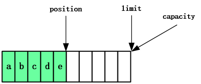
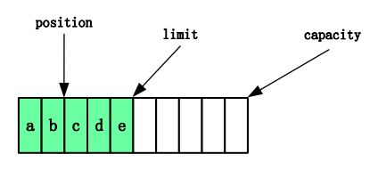

# NIO基础

> 全称 ： non-blocking IO 非阻塞IO

**阻塞和非阻塞、同步和异步的概念**

阻塞和非阻塞：是针对于线程来说的

- 阻塞：当前线程挂起
- 非阻塞：当前线程不会挂起，可以处理其他事情
- 区别：线程是否被挂起

同步和异步：是针对于代码来说的

- 同步：等待当前代码执行完成，并获取到结果，再继续支持下一行代码
- 异步：不等待代码执行完成，立即执行下一行代码，通过回调或其他方式拿到运行结果
- 区别：获取结果的方式

**小明去吃饭**

小明到了饭店

1. 情况1：
   1. 点了饭，等待上饭，期间玩手机（非阻塞），每过一段时间问下服务员饭好了没有（同步）。（小明此时是**同步非阻塞**的）
   2. 玩了会手机没啥玩的了，放下手机，也没有其他事情做（阻塞），每过一段时间问下服务员饭好了没有（同步）。（小明此时是**同步阻塞**的）
2. 情况2
   1. 点了饭，等待上饭，期间玩手机（非阻塞），等服务员端来饭（异步）。（小明此时是**异步非阻塞**的）
   2. 玩了会手机没啥玩的了，放下手机，也没有其他事情做（阻塞），等服务员端来饭（异步）。（小明此时是**异步阻塞**的）


## 1. 三大组件：Buffer、Channel 、Selector

### 1.1 Buffer 

Buffer用来**缓冲数据**，常见的buffer：

- **ByteBuffer**  常用
  - MappedByteBuffer
  - DirectByteBuffer
  - HeapByteBuffer
- ShortBuffer
- IntBuffer
- LongBuffer
- FloatBuffer
- DoubleBuffer
- CharBuffer

### 1.2 Channel

Channel 是读取数据的**双向通道**，可以从channel读取数据后写入buffer，也可以将buffer的数据写入到channel。


常用的Channel：

- FileChannel：文件的数据通道
- DatagramChannel：UDP协议的数据通道
- SocketChannel：TCP的数据通道，客户端或服务端都可用
- ServerSocketChannel：TCP的数据通道，服务端专用

### 1.3 Selector

用于在一个线程中管理多个channel，节省CPU和内存的消耗，在同服务器配置下提高程序的性能

#### 多线程版本


##### ⚠️多线程缺点

- 内存占用高（每个线程都会消耗内存）
- 线程上下切换成本高
- 仅适合连接数较少的场景

#### 线程池版本


线程池是阻塞模式的，只有线程处理完当前socket后才能处理下一个socket

##### ⚠️线程池缺点

- 阻塞模式，每个线程只能处理一个socket连接
- 仅适合短链接的场景

#### Selector版本

selector的作用是配合一个线程中管理多个channel，channel工作在非阻塞模式下，线程不会吊死在某个channel上。selector工作在阻塞模式下，等待channel的读写。

**适合连接数少，流量低的场景**


调用 selector 的 select() 会阻塞直到 channel 发生了读写就绪事件，这些事件发生，select 方法就会返回这些事件交给 thread 来处理

## 2. ByteBuffer(字节缓冲)

### 2.1 基础使用

#### 2.1.1 读数据

```java
public void testRead(){
    try (RandomAccessFile file = new RandomAccessFile("abc.txt", "rw")) {
        FileChannel channel = file.getChannel();
        //创建一个 大小为11 的ByteBuffer
        ByteBuffer byteBuffer = ByteBuffer.allocate(10);
        while (true) {
            //从通道中读取数据到ByteBuffer，每次读取的数据是ByteBuffer的大小
            int len = channel.read(byteBuffer);
            //len表示读取了多少数据，0表示数据已全部读取
            if (len <= 0) {
                break;
            }
            //切换为读模式
            byteBuffer.flip();
            for (int i = 0; i < len; i++) {
                System.out.println((char) byteBuffer.get());
            }
            //切换为写模式
            byteBuffer.clear();
        }
    } catch (IOException ioException) {
    }
}
```

`abc.txt`文件内容

```tex
134567890abcdef
```

代码输出内容

```tex
1
3
4
5
6
7
8
9
0
a
b
c
d
e
f

```

[读数据示例](./netty_demo/src/main/test/top/ersut/ByteBufferDemoTest.java)

#### 2.1.2 写数据

```java
public void testWrite(){
    try (RandomAccessFile file = new RandomAccessFile("write.txt", "rw")) {
        FileChannel channel = file.getChannel();

        //创建ByteBuffer
        ByteBuffer byteBuffer = ByteBuffer.allocate(4);
        //往ByteBuffer中写入数据
        byteBuffer.put("test".getBytes());
        //切换为读模式
        byteBuffer.flip();

        //通过channel将ByteBuffer写入到文件中
        channel.write(byteBuffer);
    } catch (IOException ioException) {
    }
}
```

`write.txt`文件内没有内容，代码运行后内容如下：

```tex
test
```

[写数据示例](./netty_demo/src/main/test/top/ersut/ByteBufferDemoTest.java)

### 2.2 ByteBuffer的结构

**三个重要属性：**

* capacity：ByteBuffer的容量
* position：ByteBuffer的指针
* limit：ByteBuffer的读写限制

1、运行`ByteBuffer.allocate(10)`，创建了一个容量为10的ByteBuffer，三个重要属性如下：


2、写模式下（新建的`ByteBuffer`默认为写模式，当`clear()` 或者`compact()`动作发生时切换为写模式），`position`是待写入位置；`limit`和`capacity`相等，下图写入了5个字节后的状态：



3、读模式下，`position`是待读取位置，指向最前方的位置；`limit`是当前字节的个数（读取限制）；状态如下：


4、读取2个字节的状态：



5、切换为写模式，

​		5.1、情况1：执行`clear()`动作，状态如下：


​		[clear示例#testStructureClear](./netty_demo/src/main/test/top/ersut/ByteBufferDemoTest.java)

​		5.2、情况2：执行`compact()`动作，把未读取的数据向前压缩，状态如下：


​		[compact示例#testStructureCompact](./netty_demo/src/main/test/top/ersut/ByteBufferDemoTest.java)

### 2.3 ❤常用方法和示例

#### 2.3.1 写入数据：put 、clear 和 compact方法

##### put方法：写入数据使用

`public ByteBuffer put(byte value)`：写入一个字节，同时position向后移动一位

`public ByteBuffer put(byte[] values)`：写入多个字节，同时position向后移动多位（写入多少个字节就移动多少位）

`public ByteBuffer put(int index, byte value)`：根据位置写入一个字节，**position不会变动**

示例代码：

```java
public void testPut() {
    ByteBuffer byteBuffer = ByteBuffer.allocate(16);
    //写入单个字节，写入后 position 自动 +1
    byteBuffer.put((byte)'a');
    ByteBufferUtil.debugAll(byteBuffer);
    System.out.println();

    //写入多个字节，写入后 position 自动 + byte数组的长度
    byteBuffer.put(new byte[]{'b','c'});
    ByteBufferUtil.debugAll(byteBuffer);
    System.out.println();

    //指定位置写入字节，注意该方式 position 不会变动
    byteBuffer.put(2,(byte)'e');
    ByteBufferUtil.debugAll(byteBuffer);
}
```

<details>
    <summary>展开查看运行结果</summary>
<pre><code>
+--------+-------------------- all ------------------------+----------------+
position: [1], limit: [16]
        +-------------------------------------------------+
        |  0  1  2  3  4  5  6  7  8  9  a  b  c  d  e  f |
+--------+-------------------------------------------------+----------------+
|00000000| 61 00 00 00 00 00 00 00 00 00 00 00 00 00 00 00 |a...............|
+--------+-------------------------------------------------+----------------+
<br>
+--------+-------------------- all ------------------------+----------------+
position: [3], limit: [16]
        +-------------------------------------------------+
        |  0  1  2  3  4  5  6  7  8  9  a  b  c  d  e  f |
+--------+-------------------------------------------------+----------------+
|00000000| 61 62 63 00 00 00 00 00 00 00 00 00 00 00 00 00 |abc.............|
+--------+-------------------------------------------------+----------------+
<br>
+--------+-------------------- all ------------------------+----------------+
position: [3], limit: [16]
        +-------------------------------------------------+
        |  0  1  2  3  4  5  6  7  8  9  a  b  c  d  e  f |
+--------+-------------------------------------------------+----------------+
|00000000| 61 62 65 00 00 00 00 00 00 00 00 00 00 00 00 00 |abe.............|
+--------+-------------------------------------------------+----------------+
</code></pre>
</details>
[put示例源码#testPut](./netty_demo/src/main/test/top/ersut/ByteBufferDemoTest.java)

##### clear方法：清除数据

clear方法实际上是移动了`postion`和`limit`，并未真正的清除数据，**将position移动到头的位置，limit移动到尾**

示例代码：

```java
public void testClear() {
    ByteBuffer byteBuffer = ByteBuffer.allocate(16);
    //写入多个字节
    byteBuffer.put(new byte[]{'a','b','c'});
    ByteBufferUtil.debugAll(byteBuffer);
    System.out.println("↓↓↓↓↓↓↓↓↓↓↓↓↓↓↓↓↓↓↓↓↓↓↓↓↓↓↓↓↓↓↓↓↓↓↓↓↓↓↓↓↓↓↓↓↓↓↓↓↓↓↓↓↓↓↓↓↓↓↓↓↓↓↓↓↓↓↓↓↓↓↓↓↓↓↓↓↓");

    //清空数据，实际上是移动了postion和limit，并未真正的清除数据
    byteBuffer.clear();
    ByteBufferUtil.debugAll(byteBuffer);
    System.out.println("↓↓↓↓↓↓↓↓↓↓↓↓↓↓↓↓↓↓↓↓↓↓↓↓↓↓↓↓↓↓↓↓↓↓↓↓↓↓↓↓↓↓↓↓↓↓↓↓↓↓↓↓↓↓↓↓↓↓↓↓↓↓↓↓↓↓↓↓↓↓↓↓↓↓↓↓↓");

    //覆盖之前的数据写入新数据
    byteBuffer.put((byte) 'd');
    ByteBufferUtil.debugAll(byteBuffer);
}
```

<details>
    <summary>展开查看运行结果</summary>
    <pre><code>
 +--------+-------------------- all ------------------------+----------------+
position: [3], limit: [16]
         +-------------------------------------------------+
         |  0  1  2  3  4  5  6  7  8  9  a  b  c  d  e  f |
+--------+-------------------------------------------------+----------------+
|00000000| 61 62 63 00 00 00 00 00 00 00 00 00 00 00 00 00 |abc.............|
+--------+-------------------------------------------------+----------------+
↓↓↓↓↓↓↓↓↓↓↓↓↓↓↓↓↓↓↓↓↓↓↓↓↓↓↓↓↓↓↓↓↓↓↓↓↓↓↓↓↓↓↓↓↓↓↓↓↓↓↓↓↓↓↓↓↓↓↓↓↓↓↓↓↓↓↓↓↓↓↓↓↓↓↓↓↓
+--------+-------------------- all ------------------------+----------------+
position: [0], limit: [16]
         +-------------------------------------------------+
         |  0  1  2  3  4  5  6  7  8  9  a  b  c  d  e  f |
+--------+-------------------------------------------------+----------------+
|00000000| 61 62 63 00 00 00 00 00 00 00 00 00 00 00 00 00 |abc.............|
+--------+-------------------------------------------------+----------------+
↓↓↓↓↓↓↓↓↓↓↓↓↓↓↓↓↓↓↓↓↓↓↓↓↓↓↓↓↓↓↓↓↓↓↓↓↓↓↓↓↓↓↓↓↓↓↓↓↓↓↓↓↓↓↓↓↓↓↓↓↓↓↓↓↓↓↓↓↓↓↓↓↓↓↓↓↓
+--------+-------------------- all ------------------------+----------------+
position: [1], limit: [16]
         +-------------------------------------------------+
         |  0  1  2  3  4  5  6  7  8  9  a  b  c  d  e  f |
+--------+-------------------------------------------------+----------------+
|00000000| 64 62 63 00 00 00 00 00 00 00 00 00 00 00 00 00 |dbc.............|
+--------+-------------------------------------------------+----------------+
    </code></pre>
</details>

[clear示例源码#testClear](./netty_demo/src/main/test/top/ersut/ByteBufferDemoTest.java)

##### compact方法：压缩数据

compact方法把未读取的数据向前压缩，再将position移动至压缩后数据的尾端，limit移动到尾

示例代码：

```java
public void testCompact() {
    ByteBuffer byteBuffer = ByteBuffer.allocate(16);
    //写入多个字节
    byteBuffer.put(new byte[]{'a','b','c'});

    //读取两个字节
    byteBuffer.flip();
    byteBuffer.get();
    byteBuffer.get();
    ByteBufferUtil.debugAll(byteBuffer);

    //压缩数据
    byteBuffer.compact();
    System.out.println("↓↓↓↓↓↓↓↓↓↓↓↓↓↓↓↓↓↓↓↓↓↓↓↓↓↓↓↓↓↓↓↓↓↓↓compact↓↓↓↓↓↓↓↓↓↓↓↓↓↓↓↓↓↓↓↓↓↓↓↓↓↓↓↓↓↓↓↓↓↓↓");
    ByteBufferUtil.debugAll(byteBuffer);

    //覆盖之前的数据写入新数据
    byteBuffer.put((byte) 'd');
    System.out.println("↓↓↓↓↓↓↓↓↓↓↓↓↓↓↓↓↓↓↓↓↓↓↓↓↓↓↓↓↓↓↓↓↓↓↓↓↓↓↓↓↓↓↓↓↓↓↓↓↓↓↓↓↓↓↓↓↓↓↓↓↓↓↓↓↓↓↓↓↓↓↓↓↓↓↓↓↓");
    ByteBufferUtil.debugAll(byteBuffer);
}
```

<details>
    <summary>展开查看运行结果</summary>
    <pre><code>
+--------+-------------------- all ------------------------+----------------+
position: [2], limit: [3]
         +-------------------------------------------------+
         |  0  1  2  3  4  5  6  7  8  9  a  b  c  d  e  f |
+--------+-------------------------------------------------+----------------+
|00000000| 61 62 63 00 00 00 00 00 00 00 00 00 00 00 00 00 |abc.............|
+--------+-------------------------------------------------+----------------+
↓↓↓↓↓↓↓↓↓↓↓↓↓↓↓↓↓↓↓↓↓↓↓↓↓↓↓↓↓↓↓↓↓↓↓compact↓↓↓↓↓↓↓↓↓↓↓↓↓↓↓↓↓↓↓↓↓↓↓↓↓↓↓↓↓↓↓↓↓↓↓
+--------+-------------------- all ------------------------+----------------+
position: [1], limit: [16]
         +-------------------------------------------------+
         |  0  1  2  3  4  5  6  7  8  9  a  b  c  d  e  f |
+--------+-------------------------------------------------+----------------+
|00000000| 63 62 63 00 00 00 00 00 00 00 00 00 00 00 00 00 |cbc.............|
+--------+-------------------------------------------------+----------------+
↓↓↓↓↓↓↓↓↓↓↓↓↓↓↓↓↓↓↓↓↓↓↓↓↓↓↓↓↓↓↓↓↓↓↓↓↓↓↓↓↓↓↓↓↓↓↓↓↓↓↓↓↓↓↓↓↓↓↓↓↓↓↓↓↓↓↓↓↓↓↓↓↓↓↓↓↓
+--------+-------------------- all ------------------------+----------------+
position: [2], limit: [16]
         +-------------------------------------------------+
         |  0  1  2  3  4  5  6  7  8  9  a  b  c  d  e  f |
+--------+-------------------------------------------------+----------------+
|00000000| 63 64 63 00 00 00 00 00 00 00 00 00 00 00 00 00 |cdc.............|
+--------+-------------------------------------------------+----------------+
    </code></pre>
</details>
[clear示例源码#testCompact](./netty_demo/src/main/test/top/ersut/ByteBufferDemoTest.java)

#### 2.3.2 读取数据：flip 和 get 方法

##### flip方法

**将limit移动到当前已写入数据的尾部（即position的所在的位置），position移动到头。**

源码：

```java
public final Buffer flip() {
    //limit移动到position的位置
    limit = position;
    //position移动到头
    position = 0;
    mark = -1;
    return this;
}
```

示例：

```java
public void testFlip(){
    ByteBuffer byteBuffer = ByteBuffer.allocate(16);
    //写入多个字节
    byteBuffer.put("abcde".getBytes());
    ByteBufferUtil.debugAll(byteBuffer);
    //切换为读模式
    byteBuffer.flip();
    System.out.println("↓↓↓↓↓↓↓↓↓↓↓↓↓↓↓↓↓↓↓↓↓↓↓↓↓↓↓↓↓↓↓↓↓↓↓↓flip↓↓↓↓↓↓↓↓↓↓↓↓↓↓↓↓↓↓↓↓↓↓↓↓↓↓↓↓↓↓↓↓↓↓↓↓↓");
    ByteBufferUtil.debugAll(byteBuffer);

    //读取全部数据
    int limit = byteBuffer.limit();
    for (int i = 0; i < limit; i++) {
        System.out.println(byteBuffer.get());
    }

    System.out.println("↓↓↓↓↓↓↓↓↓↓↓↓↓↓↓↓↓↓↓↓↓↓↓↓↓↓↓↓↓↓↓↓↓↓↓↓↓get↓↓↓↓↓↓↓↓↓↓↓↓↓↓↓↓↓↓↓↓↓↓↓↓↓↓↓↓↓↓↓↓↓↓↓↓↓");
    ByteBufferUtil.debugAll(byteBuffer);
}
```

<details>
	<summary>展开查看运行结果</summary>
    <pre><code>
+--------+-------------------- all ------------------------+----------------+
position: [5], limit: [16]
         +-------------------------------------------------+
         |  0  1  2  3  4  5  6  7  8  9  a  b  c  d  e  f |
+--------+-------------------------------------------------+----------------+
|00000000| 61 62 63 64 65 00 00 00 00 00 00 00 00 00 00 00 |abcde...........|
+--------+-------------------------------------------------+----------------+
↓↓↓↓↓↓↓↓↓↓↓↓↓↓↓↓↓↓↓↓↓↓↓↓↓↓↓↓↓↓↓↓↓↓↓↓flip↓↓↓↓↓↓↓↓↓↓↓↓↓↓↓↓↓↓↓↓↓↓↓↓↓↓↓↓↓↓↓↓↓↓↓↓↓
+--------+-------------------- all ------------------------+----------------+
position: [0], limit: [5]
         +-------------------------------------------------+
         |  0  1  2  3  4  5  6  7  8  9  a  b  c  d  e  f |
+--------+-------------------------------------------------+----------------+
|00000000| 61 62 63 64 65 00 00 00 00 00 00 00 00 00 00 00 |abcde...........|
+--------+-------------------------------------------------+----------------+
97
98
99
100
101
↓↓↓↓↓↓↓↓↓↓↓↓↓↓↓↓↓↓↓↓↓↓↓↓↓↓↓↓↓↓↓↓↓↓↓↓↓get↓↓↓↓↓↓↓↓↓↓↓↓↓↓↓↓↓↓↓↓↓↓↓↓↓↓↓↓↓↓↓↓↓↓↓↓↓
+--------+-------------------- all ------------------------+----------------+
position: [5], limit: [5]
         +-------------------------------------------------+
         |  0  1  2  3  4  5  6  7  8  9  a  b  c  d  e  f |
+--------+-------------------------------------------------+----------------+
|00000000| 61 62 63 64 65 00 00 00 00 00 00 00 00 00 00 00 |abcde...........|
+--------+-------------------------------------------------+----------------+
    </code></pre>
</details>

[flip示例源码#testFlip](./netty_demo/src/main/test/top/ersut/ByteBufferDemoTest.java)

##### get方法

读取值

`public byte get()`：以`position`为索引读取`ByteBuffer`对应的字节，**并将`position`后移一位（即`position++`）。**

`public byte get(int index)`：以参数为索引读取`ByteBuffer`对应的字节，**`position`不会变更。**

示例：

```java
public void testGet(){
    ByteBuffer byteBuffer = ByteBuffer.allocate(16);
    //写入多个字节
    byteBuffer.put("abcde".getBytes());
    //切换为读模式
    byteBuffer.flip();
    System.out.println("↓↓↓↓↓↓↓↓↓↓↓↓↓↓↓↓↓↓↓↓↓↓↓↓↓↓↓↓↓↓↓↓↓↓↓↓flip↓↓↓↓↓↓↓↓↓↓↓↓↓↓↓↓↓↓↓↓↓↓↓↓↓↓↓↓↓↓↓↓↓↓↓↓↓");
    ByteBufferUtil.debugAll(byteBuffer);

    //读取限制
    int limit = byteBuffer.limit();
    //通过索引读取，position值不变更
    for (int i = 0; i < limit; i=i+2) {
        System.out.println(byteBuffer.get(i));
    }
    System.out.println("↓↓↓↓↓↓↓↓↓↓↓↓↓↓↓↓↓↓↓↓↓↓↓↓↓↓↓↓↓↓↓↓↓get(index)↓↓↓↓↓↓↓↓↓↓↓↓↓↓↓↓↓↓↓↓↓↓↓↓↓↓↓↓↓↓↓↓↓↓");
    ByteBufferUtil.debugAll(byteBuffer);

    //使用position作为索引读取，position变更
    for (int i = 0; i < limit; i++) {
        System.out.println(byteBuffer.get());
    }
    System.out.println("↓↓↓↓↓↓↓↓↓↓↓↓↓↓↓↓↓↓↓↓↓↓↓↓↓↓↓↓↓↓↓↓↓↓↓get()↓↓↓↓↓↓↓↓↓↓↓↓↓↓↓↓↓↓↓↓↓↓↓↓↓↓↓↓↓↓↓↓↓↓↓↓↓");
    ByteBufferUtil.debugAll(byteBuffer);
}
```

<details>
	<summary>展开查看运行结果</summary>
    <pre><code>
↓↓↓↓↓↓↓↓↓↓↓↓↓↓↓↓↓↓↓↓↓↓↓↓↓↓↓↓↓↓↓↓↓↓↓↓flip↓↓↓↓↓↓↓↓↓↓↓↓↓↓↓↓↓↓↓↓↓↓↓↓↓↓↓↓↓↓↓↓↓↓↓↓↓
+--------+-------------------- all ------------------------+----------------+
position: [0], limit: [5]
         +-------------------------------------------------+
         |  0  1  2  3  4  5  6  7  8  9  a  b  c  d  e  f |
+--------+-------------------------------------------------+----------------+
|00000000| 61 62 63 64 65 00 00 00 00 00 00 00 00 00 00 00 |abcde...........|
+--------+-------------------------------------------------+----------------+
97
99
101
↓↓↓↓↓↓↓↓↓↓↓↓↓↓↓↓↓↓↓↓↓↓↓↓↓↓↓↓↓↓↓↓↓get(index)↓↓↓↓↓↓↓↓↓↓↓↓↓↓↓↓↓↓↓↓↓↓↓↓↓↓↓↓↓↓↓↓↓↓
+--------+-------------------- all ------------------------+----------------+
position: [0], limit: [5]
         +-------------------------------------------------+
         |  0  1  2  3  4  5  6  7  8  9  a  b  c  d  e  f |
+--------+-------------------------------------------------+----------------+
|00000000| 61 62 63 64 65 00 00 00 00 00 00 00 00 00 00 00 |abcde...........|
+--------+-------------------------------------------------+----------------+
97
98
99
100
101
↓↓↓↓↓↓↓↓↓↓↓↓↓↓↓↓↓↓↓↓↓↓↓↓↓↓↓↓↓↓↓↓↓↓↓get()↓↓↓↓↓↓↓↓↓↓↓↓↓↓↓↓↓↓↓↓↓↓↓↓↓↓↓↓↓↓↓↓↓↓↓↓↓
+--------+-------------------- all ------------------------+----------------+
position: [5], limit: [5]
         +-------------------------------------------------+
         |  0  1  2  3  4  5  6  7  8  9  a  b  c  d  e  f |
+--------+-------------------------------------------------+----------------+
|00000000| 61 62 63 64 65 00 00 00 00 00 00 00 00 00 00 00 |abcde...........|
+--------+-------------------------------------------------+----------------+
    </code></pre>
</details>

[get示例源码#testGet](./netty_demo/src/main/test/top/ersut/ByteBufferDemoTest.java)

#### 2.3.3 标记位置：make 和 reset方法

**不建议使用！！！！！**

make方法：标记当前`position`的值

reset方法：将`make()`记录的值恢复到`position`

[make、reset示例源码#testMakeAndReset](./netty_demo/src/main/test/top/ersut/ByteBufferDemoTest.java)

##### 不建议使用原因

reset方法在执行的时候，如果会判断是否标记，没有标记会抛出异常，而这个异常无法提前预知。

异常代码示例：

```java
public void testResetException(){
    ByteBuffer byteBuffer = ByteBuffer.allocate(16);
    //写入多个字节
    byteBuffer.put("abcde".getBytes());
    //切换为读模式
    byteBuffer.flip();

    System.out.println(byteBuffer.get());
    System.out.println(byteBuffer.get());
    byteBuffer.mark();
    System.out.println("↓↓↓↓↓↓↓↓↓↓↓↓↓↓↓↓↓↓↓↓↓↓↓↓↓↓↓↓↓↓↓get()2↓↓↓make()↓↓↓↓↓↓↓↓↓↓↓↓↓↓↓↓↓↓↓↓↓↓↓↓↓↓↓↓↓↓↓");
    ByteBufferUtil.debugAll(byteBuffer);

    //position方法，当make值比 po
    byteBuffer.position(1);
    System.out.println("↓↓↓↓↓↓↓↓↓↓↓↓↓↓↓↓↓↓↓↓↓↓↓↓↓↓↓↓↓↓↓↓↓↓position↓↓↓↓↓↓↓↓↓↓↓↓↓↓↓↓↓↓↓↓↓↓↓↓↓↓↓↓↓↓↓↓↓↓↓");
    ByteBufferUtil.debugAll(byteBuffer);

    System.out.println(byteBuffer.get());

    //发生异常，而且异常不可预知，只能try catch
    byteBuffer.reset();
}
```

最后一行`byteBuffer.reset();`会抛出异常

明明执行了`make()`为什么还抛出异常？

异常的原因：

先看`make() reset() position()`源码

```java
//标记变量
private int mark = -1;
public final Buffer mark() {
    //make变量记录下当前的position，即标记
    mark = position;
    return this;
}
public final Buffer position(int newPosition) {
    position = newPosition;
    //若make 大于 新指定的position 则make置为-1，也就是取消标记
    if (mark > position) mark = -1;
    return this;
}
public final Buffer reset() {
    int m = mark;
    //判断make是否在小于0，小于0则不存在抛出异常
    if (m < 0)
        throw new InvalidMarkException();
    //make存在 赋值给 position
    position = m;
    return this;
}
```

那么执行`make()`后再执行` position(int newPosition)`，如果`make`变量小于`newPosition`变量，`make`会被赋值为-1，接下来在执行`reset`会报错，结合上边的异常代码示例可以理解的更彻透。

[异常代码示例源码#testResetException](./netty_demo/src/main/test/top/ersut/ByteBufferDemoTest.java)

#### 2.3.4 字符串与 ByteBuffer 互转

```java
public void testString2ByteBuffer(){
    //字符串转ByteBuffer 方法1
    ByteBuffer byteBuffer = ByteBuffer.allocate(16);
    byteBuffer.put("abcde".getBytes());
    //读模式
    byteBuffer.flip();

    //字符串转ByteBuffer  方法2：已经为读模式
    ByteBuffer byteBuffer1 = StandardCharsets.UTF_8.encode("12345");

    //字符串转ByteBuffer  方法3：已经为读模式
    ByteBuffer byteBuffer2 = ByteBuffer.wrap("abcde".getBytes());

    //ByteBuffer转字符串
    CharBuffer decode = StandardCharsets.UTF_8.decode(byteBuffer);
    System.out.println(decode);
    System.out.println(StandardCharsets.UTF_8.decode(byteBuffer1));
    System.out.println(StandardCharsets.UTF_8.decode(byteBuffer2));
}
```

**本质上是byte数组与char数组的互转**

[互转代码示例源码#testString2ByteBuffer](./netty_demo/src/main/test/top/ersut/ByteBufferDemoTest.java)

### 2.4 应用实例

#### 2.4.1 粘包、拆包

**模拟网络请求的粘包：每条数据以\n作为结尾**
数据1：say hi!\nhello
数据2： world~\nhi\n
将数据拆包并打印

```java
public void testStickingAndUnpacking() {
    ByteBuffer byteBuffer = ByteBuffer.allocate(16);
    //发送数据1
    //                     7     12
    byteBuffer.put("say hi!\nhello".getBytes());

    decodeData(byteBuffer);
    System.out.println("↓↓↓↓↓↓↓↓↓↓↓↓↓↓↓↓↓↓↓↓↓↓↓↓↓↓↓↓↓↓↓↓↓↓↓compact↓↓↓↓↓↓↓↓↓↓↓↓↓↓↓↓↓↓↓↓↓↓↓↓↓↓↓↓↓↓↓↓↓↓↓");
    ByteBufferUtil.debugAll(byteBuffer);

    //发送数据2
    byteBuffer.put(" world~\nhi\n".getBytes());
    System.out.println("↓↓↓↓↓↓↓↓↓↓↓↓↓↓↓↓↓↓↓↓↓↓↓↓↓↓↓↓↓↓↓↓↓↓↓↓data2↓↓↓↓↓↓↓↓↓↓↓↓↓↓↓↓↓↓↓↓↓↓↓↓↓↓↓↓↓↓↓↓↓↓↓↓");
    ByteBufferUtil.debugAll(byteBuffer);

    decodeData(byteBuffer);
    System.out.println("↓↓↓↓↓↓↓↓↓↓↓↓↓↓↓↓↓↓↓↓↓↓↓↓↓↓↓↓↓↓↓↓↓↓↓compact↓↓↓↓↓↓↓↓↓↓↓↓↓↓↓↓↓↓↓↓↓↓↓↓↓↓↓↓↓↓↓↓↓↓↓");
    ByteBufferUtil.debugAll(byteBuffer);
}

/**
     * 解析数据
     * @param byteBuffer
     */
private void decodeData(ByteBuffer byteBuffer){
    //存储已读取的数据
    StringBuilder readBytes = new StringBuilder();
    //改为读模式，并获取limit
    int len = byteBuffer.flip().limit();
    for (int i = 0; i < len; i++) {
        byte currByte = byteBuffer.get(i);
        if(currByte == '\n'){
            //byte转string
            String data = new String(StringUtil.decodeHexDump(readBytes.toString()), StandardCharsets.UTF_8);
            System.out.println(data);
            //清空旧数据，准备接收新数据
            readBytes = new StringBuilder();
            //调整 position 保证 compact 运行后数据正确
            byteBuffer.position(i+1);
        } else {
            readBytes.append(StringUtil.byteToHexStringPadded(currByte));
        }
    }
    byteBuffer.compact();
}
```

<details>
	<summary>展开查看运行结果</summary>
    <pre><code>
say hi!
↓↓↓↓↓↓↓↓↓↓↓↓↓↓↓↓↓↓↓↓↓↓↓↓↓↓↓↓↓↓↓↓↓↓↓compact↓↓↓↓↓↓↓↓↓↓↓↓↓↓↓↓↓↓↓↓↓↓↓↓↓↓↓↓↓↓↓↓↓↓↓
+--------+-------------------- all ------------------------+----------------+
position: [5], limit: [16]
         +-------------------------------------------------+
         |  0  1  2  3  4  5  6  7  8  9  a  b  c  d  e  f |
+--------+-------------------------------------------------+----------------+
|00000000| 68 65 6c 6c 6f 69 21 0a 68 65 6c 6c 6f 00 00 00 |helloi!.hello...|
+--------+-------------------------------------------------+----------------+
↓↓↓↓↓↓↓↓↓↓↓↓↓↓↓↓↓↓↓↓↓↓↓↓↓↓↓↓↓↓↓↓↓↓↓↓data2↓↓↓↓↓↓↓↓↓↓↓↓↓↓↓↓↓↓↓↓↓↓↓↓↓↓↓↓↓↓↓↓↓↓↓↓
+--------+-------------------- all ------------------------+----------------+
position: [16], limit: [16]
         +-------------------------------------------------+
         |  0  1  2  3  4  5  6  7  8  9  a  b  c  d  e  f |
+--------+-------------------------------------------------+----------------+
|00000000| 68 65 6c 6c 6f 20 77 6f 72 6c 64 7e 0a 68 69 0a |hello world~.hi.|
+--------+-------------------------------------------------+----------------+
hello world~
hi
↓↓↓↓↓↓↓↓↓↓↓↓↓↓↓↓↓↓↓↓↓↓↓↓↓↓↓↓↓↓↓↓↓↓↓compact↓↓↓↓↓↓↓↓↓↓↓↓↓↓↓↓↓↓↓↓↓↓↓↓↓↓↓↓↓↓↓↓↓↓↓
+--------+-------------------- all ------------------------+----------------+
position: [0], limit: [16]
         +-------------------------------------------------+
         |  0  1  2  3  4  5  6  7  8  9  a  b  c  d  e  f |
+--------+-------------------------------------------------+----------------+
|00000000| 68 65 6c 6c 6f 20 77 6f 72 6c 64 7e 0a 68 69 0a |hello world~.hi.|
+--------+-------------------------------------------------+----------------+
    </code></pre>
</details>
[粘包、拆包示例源码#testStickingAndUnpacking](./netty_demo/src/main/test/top/ersut/ByteBufferDemoTest.java)

## 3. 文件编程

### 3.1 FileChannel

#### ⚠️ FileChannel 工作模式

> FileChannel 只能工作在阻塞模式下，具体原因：操作系统的限制

#### 3.1.1 获取FileChannel

可以通过`FileOutputStream`、`FileInputStream`、`RandomAccessFile`的`getChannel`方法获取`FileChannel`。

- `FileOutputStream`：只可以写入文件（只写模式）
- `FileInputStream`：只可以读取文件（只读模式）
- `RandomAccessFile`：通过实例化时的`mode`参数决定文件的访问权限
  - mode为r时可以读取
  - mode为w时可以写入
  - mode为rw时可以写入和读取

```java
try (FileOutputStream fileOutputStream = new FileOutputStream("fileChannel.txt")){
    //获取通道
    FileChannel fileChannel = fileOutputStream.getChannel();
}

try (FileInputStream fileInputStream = new FileInputStream("fileChannel.txt")){
    //获取通道
    FileChannel fileChannel = fileInputStream.getChannel();
}
```

[示例代码#getFileChannelTest](./netty_demo/src/main/test/top/ersut/FileChannelTest.java)

```java
try (RandomAccessFile randomAccessFile = new RandomAccessFile("randomAccessFile.txt","rw")){
    FileChannel fileChannel = randomAccessFile.getChannel();
}
```

[示例代码#randomAccessFileTest](./netty_demo/src/main/test/top/ersut/FileChannelTest.java)

#### 3.1.2 写入文件

```java
//字符串转换ByteBuffer
ByteBuffer byteBuffer = StandardCharsets.UTF_8.encode(writeStr);

//FileChannel.write 无法保证一次性写入所有字节，所以要循环引用直到 ByteBuffer 中没有了字节
while (byteBuffer.hasRemaining()){
    fileChannel.write(byteBuffer);
}
```

**FileChannel.write 无法保证一次性写入所有字节，所以要循环引用直到 ByteBuffer 中没有了字节**

[示例代码#getFileChannelTest](./netty_demo/src/main/test/top/ersut/FileChannelTest.java)

#### 3.1.3 读取文件

```java
ByteBuffer byteBuffer = ByteBuffer.allocate(10);
//获取文件内容
fileChannel.read(byteBuffer);
```

[示例代码#getFileChannelTest](./netty_demo/src/main/test/top/ersut/FileChannelTest.java)

#### 3.1.4 通过FileChannel拷贝文件

```java
try(
        FileInputStream from = new FileInputStream("fileChannel.txt");
        FileOutputStream to = new FileOutputStream("fileChannel_copy.txt");
){
    FileChannel fromChannel = from.getChannel();
    FileChannel toChannel = to.getChannel();
    //单次拷贝只有2GB，超出2GB部分不会进行拷贝
    fromChannel.transferTo(0,fromChannel.size(),toChannel);
}
```

**注意：`FileChannel.transferTo`方法单次拷贝只有2GB，超出2GB部分不会进行拷贝**

[示例代码#fileChannelCopyTest](./netty_demo/src/main/test/top/ersut/FileChannelTest.java)

### 3.2 Files

#### 3.2.1 拷贝文件

```java

Path from = Paths.get("fileChannel.txt");
Path to = Paths.get("fileChannel_copy1.txt");
try {
    //该方式拷贝不限制文件的大小，目标文件存在会报错
    Files.copy(from,to);
}
```

该方式拷贝不限制文件的大小，**但是目标文件存在会报错**

可以通过`StandardCopyOption.REPLACE_EXISTING`，将目标文件覆盖

```java
try {
    //StandardCopyOption.REPLACE_EXISTING 代表如果目标文件存在进行覆盖操作
    Files.copy(from,to,StandardCopyOption.REPLACE_EXISTING);
}
```

[示例代码#filesCopyTest](./netty_demo/src/main/test/top/ersut/FileChannelTest.java)

#### 3.2.2 移动文件

```java
Path source = Paths.get("fileChannel_copy1.txt");
Path targer = Paths.get("fileChannel_copy2.txt");
try {
    //StandardCopyOption.ATOMIC_MOVE 代表移动文件，并保证文件的原子性,同时可进行重命名
    Files.move(source,targer,StandardCopyOption.ATOMIC_MOVE);
}
```

**`StandardCopyOption.ATOMIC_MOVE`代表移动文件，并保证文件的原子性,同时可进行重命名**

[示例代码#filesMoveTest](./netty_demo/src/main/test/top/ersut/FileChannelTest.java)

#### 3.2.3 删除文件/目录

删除文件：

```java
Path path = Paths.get("fileChannel_copy1.txt");
try {
    //删除文件
    Files.delete(path);
}
```

删除目录：

```java
try {
    String deleteDirName = "deleteDir";
    Path dir = Paths.get(deleteDirName);

    //删除目录，注意当目录下有文件，删除目录会报异常
    Files.delete(dir);
}
```

**注意当目录下有文件，删除目录会报异常**

[示例代码#filesDeleteTest](./netty_demo/src/main/test/top/ersut/FileChannelTest.java)

#### 3.2.4 遍历目录

```java
String deleteDirName = "deleteDir3";
Path dir = Paths.get(deleteDirName);

final StringBuilder tab = new StringBuilder();
Files.walkFileTree(dir,new SimpleFileVisitor<Path>(){
    //目录的前置回调
    @Override
    public FileVisitResult preVisitDirectory(Path dir, BasicFileAttributes attrs) throws IOException {
        tab.append(" ");
        System.out.println(tab+dir.getFileName().toString());
        return super.preVisitDirectory(dir, attrs);
    }

    //文件的回调
    @Override
    public FileVisitResult visitFile(Path file, BasicFileAttributes attrs) throws IOException {
        System.out.println(tab+" |- "+file.getFileName());
        return super.visitFile(file,attrs);
    }
});
```

<details><summary>展开查看运行结果</summary><pre><code> deleteDir3
  |- 1.txt
  |- 2.txt
  |- 3.txt
  children
   |- c1.txt
</code></pre>
</details>

`Files.walkFileTree`方法是遍历文件树

`SimpleFileVisitor`类：文件树的实时回调

- `preVisitDirectory`方法：目录的前置回调
- `visitFile`方法：目录中文件的回调
- `visitFileFailed`方法： 文件访问失败的回调
- `postVisitDirectory`方法：目录的后置回调

#### 3.2.5 删除带文件目录

```java
String deleteDirName = "deleteDir2";
Path dir = Paths.get(deleteDirName);

//删除带文件的目录
try {
    //遍历文件树
    //SimpleFileVisitor 文件树的实时回调
    Files.walkFileTree(dir,new SimpleFileVisitor<Path>(){

        //文件的回调
        @Override
        public FileVisitResult visitFile(Path file, BasicFileAttributes attrs) throws IOException {
            Files.delete(file);
            return super.visitFile(file,attrs);
        }

        //对目录的后置回调
        @Override
        public FileVisitResult postVisitDirectory(Path dir, IOException exc) throws IOException {
            Files.delete(dir);
            return super.postVisitDirectory(dir,exc);
        }
    });
}
```

##### ⚠️ 删除很危险

> 删除是危险操作，确保要递归删除的文件夹没有重要内容

## 4. 网络编程

### 4.1 阻塞模式 vs 非阻塞模式

#### 4.1.1 测试的客户端

1. 打开客户端

   ```java
   SocketChannel client = SocketChannel.open();
   ```

2. 连接服务端

   ```java
   client.connect(new InetSocketAddress("127.0.0.1",6666));
   ```

3. 发送消息

   ```java
   client.write(StandardCharsets.UTF_8.encode("hello!"))
   ```

[示例代码#socketChannelTest](./netty_demo/src/main/test/top/ersut/SocketChannelTest.java)：

```java
public void socketChannelTest() throws IOException, InterruptedException {
    //打开客户端
    SocketChannel client1 = SocketChannel.open();
    //连接服务端
    client1.connect(new InetSocketAddress("127.0.0.1",6666));
    //发送消息
    client1.write(StandardCharsets.UTF_8.encode("hello!"));
    Thread.sleep(3*1000);
    client1.write(StandardCharsets.UTF_8.encode("hello2!"));

    SocketChannel client2 = SocketChannel.open();
    client2.connect(new InetSocketAddress("127.0.0.1",6666));
    client2.write(StandardCharsets.UTF_8.encode("hi!"));
    Thread.sleep(3*1000);
    client2.write(StandardCharsets.UTF_8.encode("hi2!"));
    Thread.sleep(10*1000);
}
```

#### 4.1.2 阻塞的服务端

##### 4.1.2.1 创建服务端

1. 打开服务端

   ```java
   ServerSocketChannel serverSocketChannel = ServerSocketChannel.open();
   ```

2. 绑定端口

   ```java
   serverSocketChannel.bind(new InetSocketAddress(6666));
   ```

3. 等待客户端

   ```java
   SocketChannel socketChannel = serverSocketChannel.accept();
   ```

   `accept()`方法会阻塞线程，等待新客户端的连接

4. 接收客户端的消息

   ```java
   ByteBuffer byteBuffer = ByteBuffer.allocate(16);
   socketChannel.read(byteBuffer);
   ```

   `read(byteBuffer)`方法会阻塞线程直到接收到新消息

[示例代码#serverSocketChannelBlockingTest](./netty_demo/src/main/test/top/ersut/SocketChannelTest.java)：

```java
public void serverSocketChannelBlockingTest() throws IOException {

    //1、打开服务端
    ServerSocketChannel serverSocketChannel = ServerSocketChannel.open();

    //2、绑定端口
    serverSocketChannel.bind(new InetSocketAddress(6666));
    log.debug("serverSocketChannel start...");

    //用来存放连接的客户端
    List<SocketChannel> clientSocketChannels = new ArrayList<>();

    while (true) {
        //3、与客户端建立连接。并返回一个 SocketChannel 用来与客户端通信；accept()会阻塞
        SocketChannel socketChannel = serverSocketChannel.accept();
        log.debug("remotePort:[{}],connected...",((InetSocketAddress)socketChannel.getRemoteAddress()).getPort());
        //新来的客户端放入客户端列表
        clientSocketChannels.add(socketChannel);
        //遍历客户端列表，接收客户端消息
        for (SocketChannel clientSocketChannel : clientSocketChannels) {
            int port = ((InetSocketAddress) clientSocketChannel.getRemoteAddress()).getPort();
            ByteBuffer byteBuffer = ByteBuffer.allocate(16);
            //4、获取客户端发来的消息，此处也会阻塞
            clientSocketChannel.read(byteBuffer);
            log.debug("remotePort:[{}],read...", port);
            byteBuffer.flip();

            CharBuffer charBuffer = StandardCharsets.UTF_8.decode(byteBuffer);
            log.debug("remotePort:[{}],message:[{}]", port,charBuffer);

            //清除,准备接收下一次消息
            byteBuffer.clear();
        }
    }
}
```

客户端连接后运行结果：

```txt
23:28:24.655 [main] DEBUG top.ersut.SocketChannelTest - serverSocketChannel start...
23:28:31.044 [main] DEBUG top.ersut.SocketChannelTest - remotePort:[65009],connected...
23:28:31.047 [main] DEBUG top.ersut.SocketChannelTest - remotePort:[65009],read...
23:28:31.048 [main] DEBUG top.ersut.SocketChannelTest - remotePort:[65009],message:[hello!]
23:28:34.047 [main] DEBUG top.ersut.SocketChannelTest - remotePort:[65014],connected...
23:28:34.048 [main] DEBUG top.ersut.SocketChannelTest - remotePort:[65009],read...
23:28:34.049 [main] DEBUG top.ersut.SocketChannelTest - remotePort:[65009],message:[hello2!]
23:28:34.050 [main] DEBUG top.ersut.SocketChannelTest - remotePort:[65014],read...
23:28:34.052 [main] DEBUG top.ersut.SocketChannelTest - remotePort:[65014],message:[hi!]
```

通过日志可以看到客户端发送的`hi2!`没有接收到。

##### 4.1.2.2 分析客户端与阻塞服务端的代码

1. 服务端阻塞在`accept()`方法；
2. **客户端的`client1`（即日志中的`remotePort:[65009]`）连接服务端，`accept()`方法本次阻塞结束；**
3. 服务端与`client1`的链接进行`clientSocketChannel.read(byteBuffer);`阻塞了；
4. 客户端的`client1`发送"hello!"消息，`clientSocketChannel.read(byteBuffer);`结束阻塞并成功接收"hello!"消息；
5. **客户端的`client1`发送"hello2!"消息；**
6. 服务端进入下次while循环；
7. 服务端循环第二次阻塞在了`accept()`方法；
8. **客户端的`client2`（即日志中的`remotePort:[65014]`）连接服务端，`accept()`方法本次阻塞结束；**
9. **服务端与`client1`的链接进行`clientSocketChannel.read(byteBuffer);`接收了"hello2!"消息；**
10. 服务端与`client2`的链接进行`clientSocketChannel.read(byteBuffer);`阻塞了；
11. 客户端的`client2`发送"hi!"消息，`clientSocketChannel.read(byteBuffer);`结束阻塞并成功接收"hi!"消息；
12. **客户端的`client2`发送"hi2!"消息；**
13. 服务端进入下次while循环；
14. **服务端循环第三次阻塞在了`accept()`方法；由于没有第三个客户端进行连接所以无法执行到`clientSocketChannel.read(byteBuffer);`，也就无法接收`client2`发送的"hi2!"消息；**

##### 4.1.2.3 ⚠️阻塞服务端的缺点

1. **单线程下**，无法兼顾接收客户端消息和连接新客户端
2. **多线程下**，32 位 jvm 一个线程 320k，64 位 jvm 一个线程 1024k，如果连接数过多会导致 OOM，并且线程太多，反而会因为cpu频繁切换线程导致性能降低
3. 线程池方案下，可以减少线程数和线程切换次数，但是建立很多连接会导致阻塞后边的线程，这种方案适合短连接，不适合长连接，所以治表不治本。

#### 4.1.2 非阻塞的服务端

