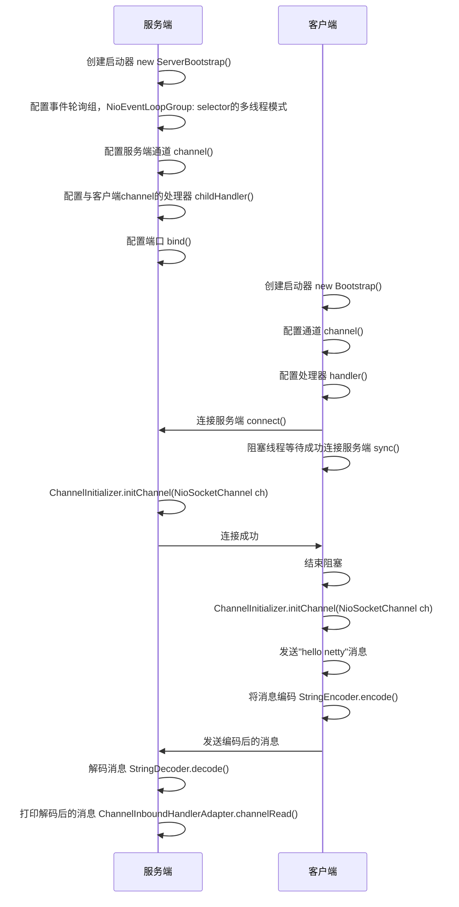

# Netty入门


## 1. 概述

### 1.1 Netty是什么

Netty是一个**异步的、基于事件驱动的**网络应用框架，用于快速开发**可维护、高性能**的网络服务器和客户端。

Netty是基于NIO实现的，上段话中“基于事件驱动的”指的是Selector的事件。

### 1.2 Netty的地位

Netty在Java网络应用框架的地位好比spring在JavaEE中的地位

以下框架都是使用了Netty，因为他们都有网络通信需求

* gRPC - rpc 框架
* Dubbo - rpc 框架
* Spring 5.x - flux api 完全抛弃了 tomcat ，使用 netty 作为服务器端
* Cassandra - nosql 数据库
* Spark - 大数据分布式计算框架
* Hadoop - 大数据分布式存储框架
* RocketMQ - ali 开源的消息队列
* ElasticSearch - 搜索引擎
* Zookeeper - 分布式协调框架

### 1.3 Netty的优势

- Netty vs NIO
  - NIO工作量大，Bug多
  - 需要自己构建协议
  - 解决TCP传输数据中的问题，例如：粘包、半包、拆包
  - NIO在Linux下，epoll 空轮询导致 CPU 100%的问题
  - 对API进行了增强，更易用，例如：FastThreadLocal => ThreadLocal，ByteBuf => ByteBuffer
- Netty vs 其他框架
  - Mina 由 Apache 维护，与 Netty 相比 Netty 的迭代速度更快，API更简洁。
  - 经久考验，Netty 诞生与2004年，至今已有19年的时间，
    - 2.x版本 2004年
    - 3.x版本 2008年
    - 4.x版本 2013年
    - 5.x版本 已废弃，没有明显的性能提升，且维护成本高

## 2. Hello Netty 

###  2.1 需求

- 服务端接收消息并打印
- 客户端向服务端发送 hello netty

引入依赖：

```xml
<dependency>
    <groupId>io.netty</groupId>
    <artifactId>netty-all</artifactId>
    <version>4.1.92.Final</version>
</dependency>
```

### 2.2 服务端

```java
//netty的服务端启动器
new ServerBootstrap()
    //1、配置事件轮询组，NioEventLoopGroup: selector的多线程模式
    .group(new NioEventLoopGroup())
    //2、配置服务端的通道
    .channel(NioServerSocketChannel.class)
    //3、配置与客户端的channel处理器
    .childHandler(new ChannelInitializer<NioSocketChannel>() {
        @Override
        //NioSocketChannel 与客户端的channel
        protected void initChannel(NioSocketChannel ch) throws Exception {
            //4、解码消息，将字节转换为字符串
            ch.pipeline().addLast(new StringDecoder());
            //5、入站消息处理器
            ch.pipeline().addLast(new ChannelInboundHandlerAdapter(){
                /**
                 * 入站消息的处理
                 * @param ctx channel的上下文
                 * @param msg 入站消息
                 */
                @Override
                public void channelRead(ChannelHandlerContext ctx, Object msg) throws Exception {
                    NioSocketChannel channel = (NioSocketChannel)ctx.channel();
                    InetSocketAddress inetSocketAddress = channel.remoteAddress();
                    //6、打印消息
                    log.info("收到来自[{}]的消息：[{}]",inetSocketAddress.toString(),msg);
                }
            });
        }
    })
    //7、绑定端口
    .bind(nettyHelloProt);
```


### 2.3 客户端

```java
//客户端启动器
new Bootstrap()
        //1、配置事件轮询组，NioEventLoopGroup: 即NIO的selector模式
        .group(new NioEventLoopGroup())
        //2、配置客户端的通道
        .channel(NioSocketChannel.class)
        //3、配置客户端的处理器
        .handler(new ChannelInitializer<NioSocketChannel>() {
            @Override
            //初始化客户端
            protected void initChannel(NioSocketChannel ch) throws Exception {
                //4、编码消息，将字符串转换成字节数组
                ch.pipeline().addLast(new StringEncoder());
            }
        })
        //5、连接客户端
        .connect(new InetSocketAddress(nettyHelloProt))
        //6、阻塞线程，直到与服务器建立连接
        .sync()
        //7、获取客户端的通道，即NioSocketChannel
        .channel()
        //8、发送消息
        .writeAndFlush("hello netty");
```

### 2.4 流程梳理



#### 💡 提示

树立正确的观念

**channel 、msg、pipeline 、handler、eventLoop的关系**

* 把 channel 理解为**数据的通道**
* 把 msg 理解为**通道中流动的数据**，最开始输入是 ByteBuf，但经过 pipeline **多道工序的加工**，会变成其它类型对象，最后输出又变成 ByteBuf
* 把 handler 理解为**数据的处理工序**
  * **工序有多道，合在一起就是 pipeline**，pipeline 负责发布事件（读、读取完成...）传播给每个 handler， handler 对自己感兴趣的事件进行处理（重写了相应事件处理方法）
  * handler 分 Inbound（输入） 和 Outbound（输出） 两类

* 把 eventLoop 理解为**处理数据的工人**
  * 工人可以管理多个 channel 的 io 操作，并且一旦工人负责了某个 channel，就要负责到底（绑定）
  * 工人既可以执行 io 操作，也可以进行任务处理，每位工人有任务队列，队列里可以堆放多个 channel 的待处理任务，任务分为普通任务、定时任务
  * **工人按照 pipeline 顺序，依次按照 handler 的规划（代码）处理数据**，可以为每道工序指定不同的工人

## 3. 组件

### 3.1 EventLoop

#### 3.1.1 事件循环对象

EventLoop本质上是一个任务执行器，同时维护了一个Selector，并且包含一个run方法来处理channel中源源不断的io事件

**继承关系**


- 继承了`java.util.concurrent.ScheduledExecutorService`任务执行器，因此包含了所有的线程池方法
- 继承了`io.netty.util.concurrent.EventExecutor`，这个接口包含了：
  - `boolean inEventLoop(Thread thread);`：**判断一个线程是否属于该EventLoop**

#### 3.1.2 事件循环组对象

`EventLoopGroup`是一组`EventLoop`，通过`EventLoopGroup`的`register`方法将`channel`绑定到某一个

`EventLoop`，这个`channel`后续所有的io事件都由此`EventLoop`处理（保证了io事件处理时的线程安全）

**`EventLoopGroup`的实现类**

- NioEventLoopGroup：可处理io事件、普通任务和定时任务
- DefaultEventLoopGroup：可普通任务和定时任务

**简单的示例**

```java
EventLoopGroup group = new DefaultEventLoopGroup(2);
//第一个eventLoop
EventLoop eventLoop1 = group.next();
//第二个eventLoop
EventLoop eventLoop2 = group.next();
//第一个eventLoop
EventLoop eventLoop3 = group.next();
//第二个eventLoop
EventLoop eventLoop4 = group.next();

//由于只有两个线程所以只有两个eventLoop，那么第一次和第三次获取的是同一个eventLoop，同理第二次和第四次获取的是同一个eventLoop
Assert.assertEquals(eventLoop1,eventLoop3);
Assert.assertEquals(eventLoop2,eventLoop4);
```

**处理普通任务和定时任务**

```java
EventLoopGroup group = new DefaultEventLoopGroup(2);

//添加任务
group.next().execute(() -> {
    try {
        Thread.sleep(1000);
    } catch (InterruptedException e) {
        e.printStackTrace();
    }
    log.debug("给eventLoop添加任务");
});

//添加定时任务
group.next().scheduleAtFixedRate(
        () -> log.debug(String.valueOf(LocalDateTime.now().getSecond()))
        //多少秒后执行第一次
        ,0
        //每隔多久执行一次
        ,1
        //参数3的时间单位
        , TimeUnit.SECONDS
);

log.debug("主线程");

try {
    Thread.sleep(1000*5);
} catch (InterruptedException e) {
    e.printStackTrace();
}
```

控制台打印：

```tex
22:17:02.988 [main] DEBUG top.ersut.netty.EventLoopTest - 主线程
22:17:03.006 [defaultEventLoopGroup-2-2] DEBUG top.ersut.netty.EventLoopTest - 3
22:17:03.989 [defaultEventLoopGroup-2-1] DEBUG top.ersut.netty.EventLoopTest - 给eventLoop添加任务
22:17:03.989 [defaultEventLoopGroup-2-2] DEBUG top.ersut.netty.EventLoopTest - 3
22:17:04.988 [defaultEventLoopGroup-2-2] DEBUG top.ersut.netty.EventLoopTest - 4
22:17:05.988 [defaultEventLoopGroup-2-2] DEBUG top.ersut.netty.EventLoopTest - 5
22:17:06.989 [defaultEventLoopGroup-2-2] DEBUG top.ersut.netty.EventLoopTest - 6
22:17:07.989 [defaultEventLoopGroup-2-2] DEBUG top.ersut.netty.EventLoopTest - 7
```

[示例代码#eventLoopGroupTest](./netty_demo/src/main/test/top/ersut/netty/EventLoopTest.java)

#### 💡 优雅关闭

优雅关闭 `shutdownGracefully` 方法。该方法会首先切换 `EventLoopGroup` 到关闭状态从而拒绝新的任务的加入，然后在任务队列的任务都处理完成后，停止线程的运行。从而确保整体应用是在正常有序的状态下退出的

#### 多个EventLoopGroup，处理不同的事件

[客户端代码](./netty_demo/src/main/test/top/ersut/netty/EventLoopTest.java)：

```java
//两个客户端各发送两条消息
public void client() throws InterruptedException {
    NioEventLoopGroup group = new NioEventLoopGroup();
    Channel channel = new Bootstrap()
            .group(group)
            .channel(NioSocketChannel.class)
            .handler(new ChannelInitializer<NioSocketChannel>() {
                @Override
                protected void initChannel(NioSocketChannel ch) throws Exception {
                    ch.pipeline().addLast(new StringEncoder());
                }
            })
            .connect(new InetSocketAddress(PORT))
            .sync()
            .channel();
    Channel channel2 = new Bootstrap()
            .group(group)
            .channel(NioSocketChannel.class)
            .handler(new ChannelInitializer<NioSocketChannel>() {
                @Override
                protected void initChannel(NioSocketChannel ch) throws Exception {
                    ch.pipeline().addLast(new StringEncoder());
                }
            })
            .connect(new InetSocketAddress(PORT))
            .sync()
            .channel();
    channel.writeAndFlush("123");
    Thread.sleep(1000);
    channel2.writeAndFlush("abc");
    Thread.sleep(1000);
    channel.writeAndFlush("456");
    Thread.sleep(1000);
    channel2.writeAndFlush("def");

    group.shutdownGracefully().sync();
    channel.close();
    channel2.close();
}
```

[服务端代码](./netty_demo/src/main/test/top/ersut/netty/EventLoopTest.java)：

```java
public static void groupServer(){
    new ServerBootstrap()
            /**
             * 参数1 parentGroup：处理 NioServerSocketChannel 的accept
             * 参数2 childGroup：处理 NioSocketChannel 的 读写
             */
            .group(new NioEventLoopGroup(1),new NioEventLoopGroup(2))
            .channel(NioServerSocketChannel.class)
            .childHandler(new ChannelInitializer<NioSocketChannel>() {
                @Override
                protected void initChannel(NioSocketChannel ch) throws Exception {
                    ch.pipeline().addLast(new ChannelInboundHandlerAdapter(){
                        @Override
                        public void channelRead(ChannelHandlerContext ctx, Object msg) throws Exception {
                            ByteBuf message = (ByteBuf) msg;
                            log.debug(message.toString(StandardCharsets.UTF_8));
                        }
                    });
                }
            })
            .bind(PORT);
}
```

打印信息：

```tex
22:36:20.907 [nioEventLoopGroup-3-1] DEBUG top.ersut.netty.EventLoopTest - 123
22:36:21.891 [nioEventLoopGroup-3-2] DEBUG top.ersut.netty.EventLoopTest - abc
22:36:22.890 [nioEventLoopGroup-3-1] DEBUG top.ersut.netty.EventLoopTest - 456
22:36:23.889 [nioEventLoopGroup-3-2] DEBUG top.ersut.netty.EventLoopTest - def
```

#### 💡进程名解释

nioEventLoopGroup-3-2

- 其中的”3“代表第3个进程池
- 其中的“2”代表EventLoopGroup中的第二个EventLoop

**通过打印的信息可以看出同一个channel中的信息在固定的EventLoop中处理，即channel与EventLoop绑定**

图解:


#### 给通道处理器指定EventLoopGroup

客户端代码与上边的一致

[服务端代码](./netty_demo/src/main/test/top/ersut/netty/EventLoopTest.java)：

```java
public static void pipelineAppointGroupServer(){
    EventLoopGroup defaultEventLoopGroup = new DefaultEventLoopGroup(2);
    new ServerBootstrap()
            /**
             * 参数1 parentGroup：处理 NioServerSocketChannel 的accept
             * 参数2 childGroup：处理 NioSocketChannel 的 读写
             */
            .group(new NioEventLoopGroup(),new NioEventLoopGroup())
            .channel(NioServerSocketChannel.class)
            .childHandler(new ChannelInitializer<NioSocketChannel>() {
                @Override
                protected void initChannel(NioSocketChannel ch) throws Exception {
                    ch.pipeline().addLast(new ChannelInboundHandlerAdapter(){
                        @Override
                        public void channelRead(ChannelHandlerContext ctx, Object msg) throws Exception {
                            ByteBuf message = (ByteBuf) msg;
                            log.debug(message.toString(StandardCharsets.UTF_8));
                            //传给pipeline中的下一个处理器
                            super.channelRead(ctx,msg);
                        }
                    });
                    ch.pipeline().addLast(defaultEventLoopGroup,"default",new ChannelInboundHandlerAdapter(){
                        @Override
                        public void channelRead(ChannelHandlerContext ctx, Object msg) throws Exception {
                            ByteBuf message = (ByteBuf) msg;
                            log.debug(message.toString(StandardCharsets.UTF_8)+"-default");
                        }
                    });
                }
            })
            .bind(PORT);
}
```

- **当多个通道处理器时，需要通过`super.channelRead(ctx,msg)`将消息传递给下一个处理器**

- **通过`addLast(EventExecutorGroup group, String name, ChannelHandler handler)`方法给通道处理器指定EventLoopGroup**
  - 参数1：指定EventLoopGroup
  - 参数2：给通道处理器指定名称
  - 参数3：通道处理器

控制台打印：

```tex
22:54:55.282 [nioEventLoopGroup-4-1] DEBUG top.ersut.netty.EventLoopTest - 123
22:54:55.283 [defaultEventLoopGroup-2-1] DEBUG top.ersut.netty.EventLoopTest - 123-default
22:54:56.246 [nioEventLoopGroup-4-2] DEBUG top.ersut.netty.EventLoopTest - abc
22:54:56.247 [defaultEventLoopGroup-2-2] DEBUG top.ersut.netty.EventLoopTest - abc-default
22:54:57.247 [nioEventLoopGroup-4-1] DEBUG top.ersut.netty.EventLoopTest - 456
22:54:57.247 [defaultEventLoopGroup-2-1] DEBUG top.ersut.netty.EventLoopTest - 456-default
22:54:58.247 [nioEventLoopGroup-4-2] DEBUG top.ersut.netty.EventLoopTest - def
22:54:58.247 [defaultEventLoopGroup-2-2] DEBUG top.ersut.netty.EventLoopTest - def-default
```

**通过打印的信息可以看出名为 default 的通道处理器使用了其他线程**

图解：


#### 💡多个通道处理器之间是怎么切换EventLoop的

追踪`super.channelRead(ctx,msg);`方法可以找到如下源码

```java
static void invokeChannelRead(final AbstractChannelHandlerContext next, Object msg) {
    final Object m = next.pipeline.touch(ObjectUtil.checkNotNull(msg, "msg"), next);
    EventExecutor executor = next.executor();
    //判断下一个EventLoop与当前EventLoop是否为同一个线程
    if (executor.inEventLoop()) {
        //是同一个，直接运行
        next.invokeChannelRead(m);
    } else {
        //不是同一个，将需要执行的代码作为任务添加到给下一个EventLoop(切换EventLoop)
        executor.execute(new Runnable() {
            @Override
            public void run() {
                next.invokeChannelRead(m);
            }
        });
    }
}
```

* 如果两个 handler 绑定的是同一个线程，那么就直接调用
* 否则，把要调用的代码封装为一个任务对象，由下一个 handler 的线程来调用

