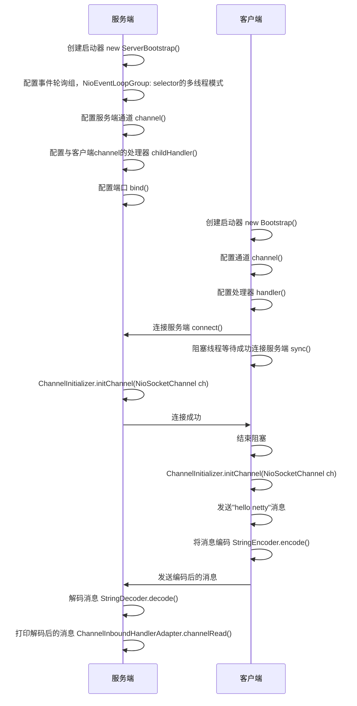

# Netty入门


## 1. 概述

### 1.1 Netty是什么

Netty是一个**异步的、基于事件驱动的**网络应用框架，用于快速开发**可维护、高性能**的网络服务器和客户端。

Netty是基于NIO实现的，上段话中“基于事件驱动的”指的是Selector的事件。

### 1.2 Netty的地位

Netty在Java网络应用框架的地位好比spring在JavaEE中的地位

以下框架都是使用了Netty，因为他们都有网络通信需求

* gRPC - rpc 框架
* Dubbo - rpc 框架
* Spring 5.x - flux api 完全抛弃了 tomcat ，使用 netty 作为服务器端
* Cassandra - nosql 数据库
* Spark - 大数据分布式计算框架
* Hadoop - 大数据分布式存储框架
* RocketMQ - ali 开源的消息队列
* ElasticSearch - 搜索引擎
* Zookeeper - 分布式协调框架

### 1.3 Netty的优势

- Netty vs NIO
  - NIO工作量大，Bug多
  - 需要自己构建协议
  - 解决TCP传输数据中的问题，例如：粘包、半包、拆包
  - NIO在Linux下，epoll 空轮询导致 CPU 100%的问题
  - 对API进行了增强，更易用，例如：FastThreadLocal => ThreadLocal，ByteBuf => ByteBuffer
- Netty vs 其他框架
  - Mina 由 Apache 维护，与 Netty 相比 Netty 的迭代速度更快，API更简洁。
  - 经久考验，Netty 诞生与2004年，至今已有19年的时间，
    - 2.x版本 2004年
    - 3.x版本 2008年
    - 4.x版本 2013年
    - 5.x版本 已废弃，没有明显的性能提升，且维护成本高

## 2. Hello Netty 

###  2.1 需求

- 服务端接收消息并打印
- 客户端向服务端发送 hello netty

引入依赖：

```xml
<dependency>
    <groupId>io.netty</groupId>
    <artifactId>netty-all</artifactId>
    <version>4.1.92.Final</version>
</dependency>
```

### 2.2 服务端

```java
//netty的服务端启动器
new ServerBootstrap()
    //1、配置事件轮询组，NioEventLoopGroup: selector的多线程模式
    .group(new NioEventLoopGroup())
    //2、配置服务端的通道
    .channel(NioServerSocketChannel.class)
    //3、配置与客户端的channel处理器
    .childHandler(new ChannelInitializer<NioSocketChannel>() {
        @Override
        //NioSocketChannel 与客户端的channel
        protected void initChannel(NioSocketChannel ch) throws Exception {
            //4、解码消息，将字节转换为字符串
            ch.pipeline().addLast(new StringDecoder());
            //5、入站消息处理器
            ch.pipeline().addLast(new ChannelInboundHandlerAdapter(){
                /**
                 * 入站消息的处理
                 * @param ctx channel的上下文
                 * @param msg 入站消息
                 */
                @Override
                public void channelRead(ChannelHandlerContext ctx, Object msg) throws Exception {
                    NioSocketChannel channel = (NioSocketChannel)ctx.channel();
                    InetSocketAddress inetSocketAddress = channel.remoteAddress();
                    //6、打印消息
                    log.info("收到来自[{}]的消息：[{}]",inetSocketAddress.toString(),msg);
                }
            });
        }
    })
    //7、绑定端口
    .bind(nettyHelloProt);
```


### 2.3 客户端

```java
//客户端启动器
new Bootstrap()
        //1、配置事件轮询组，NioEventLoopGroup: 即NIO的selector模式
        .group(new NioEventLoopGroup())
        //2、配置客户端的通道
        .channel(NioSocketChannel.class)
        //3、配置客户端的处理器
        .handler(new ChannelInitializer<NioSocketChannel>() {
            @Override
            //初始化客户端
            protected void initChannel(NioSocketChannel ch) throws Exception {
                //4、编码消息，将字符串转换成字节数组
                ch.pipeline().addLast(new StringEncoder());
            }
        })
        //5、连接客户端
        .connect(new InetSocketAddress(nettyHelloProt))
        //6、阻塞线程，直到与服务器建立连接
        .sync()
        //7、获取客户端的通道，即NioSocketChannel
        .channel()
        //8、发送消息
        .writeAndFlush("hello netty");
```

### 2.4 流程梳理



#### 💡 提示

树立正确的观念

**channel 、msg、pipeline 、handler、eventLoop的关系**

* 把 channel 理解为**数据的通道**
* 把 msg 理解为**通道中流动的数据**，最开始输入是 ByteBuf，但经过 pipeline **多道工序的加工**，会变成其它类型对象，最后输出又变成 ByteBuf
* 把 handler 理解为**数据的处理工序**
  * **工序有多道，合在一起就是 pipeline**，pipeline 负责发布事件（读、读取完成...）传播给每个 handler， handler 对自己感兴趣的事件进行处理（重写了相应事件处理方法）
  * handler 分 Inbound（输入） 和 Outbound（输出） 两类

* 把 eventLoop 理解为**处理数据的工人**
  * 工人可以管理多个 channel 的 io 操作，并且一旦工人负责了某个 channel，就要负责到底（绑定）
  * 工人既可以执行 io 操作，也可以进行任务处理，每位工人有任务队列，队列里可以堆放多个 channel 的待处理任务，任务分为普通任务、定时任务
  * **工人按照 pipeline 顺序，依次按照 handler 的规划（代码）处理数据**，可以为每道工序指定不同的工人


