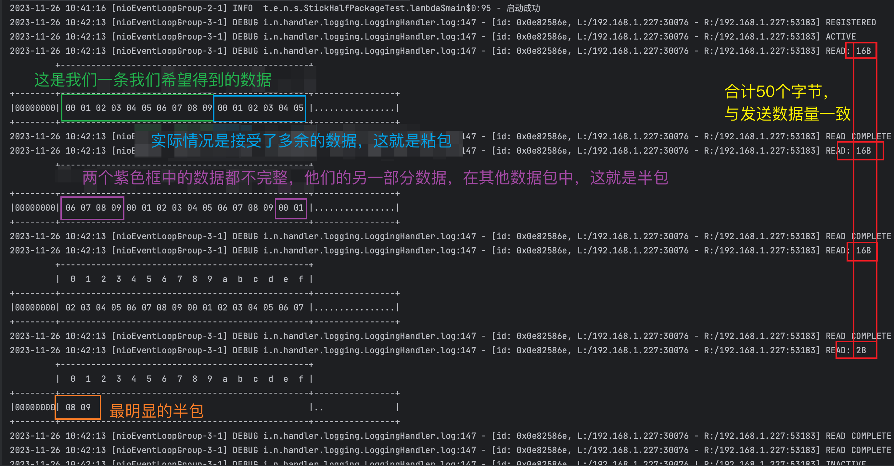
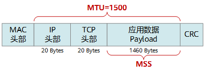
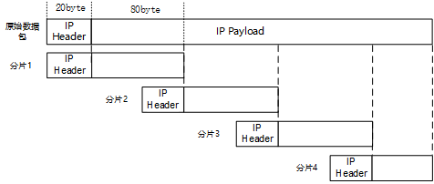
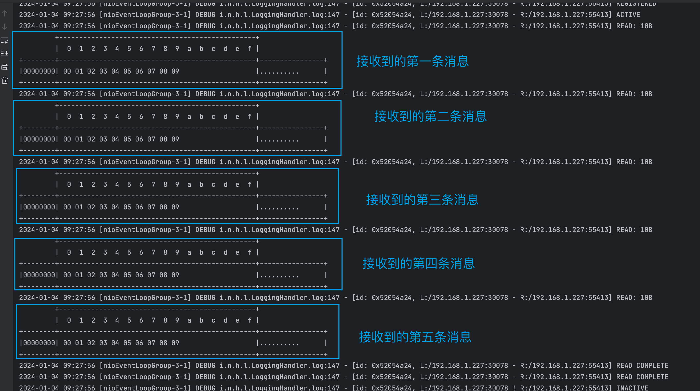
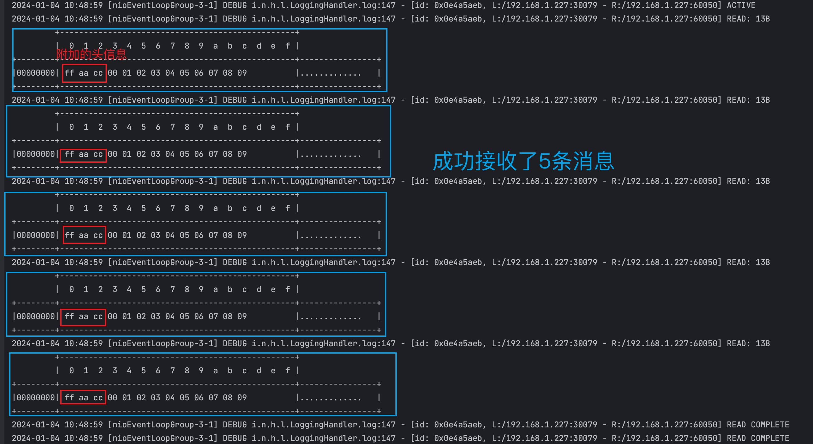
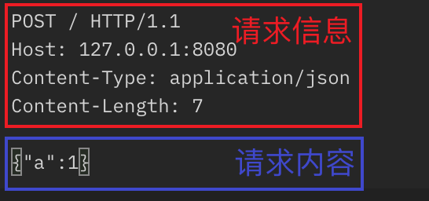
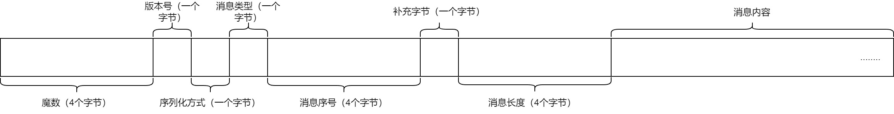
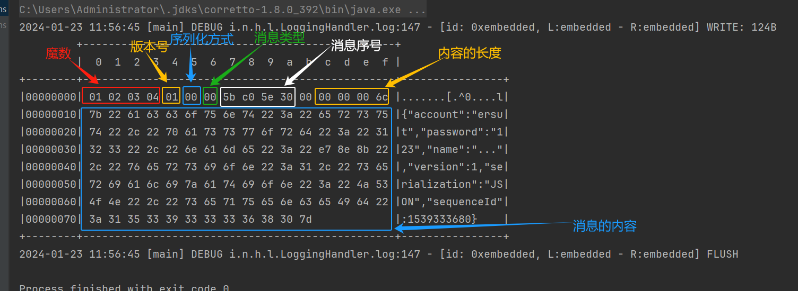

# Netty进阶


## 一、粘包与半包

需求：客户端发送5条"0x01,0x02,0x03,0x04,0x05,0x06,0x07,0x08,0x09"到服务端，服务端可正确解析每一条。

### 1.1 粘包现象&半包现象

[相关代码](./netty_demo/src/main/test/top/ersut/netty/stickhalfpackage/StickHalfPackageTest.java)

**客户端发送数据部分代码：**

```java

...

log.info("发送数据");
for (int i = 0; i < 5; i++) {
    ByteBuf byteBuf = ctx.alloc().buffer();
    //每条信息10个字节
    byteBuf.writeBytes(new byte[]{0,1, 2, 3, 4, 5, 6, 7,8,9});
    ctx.writeAndFlush(byteBuf);
}
ctx.channel().close();

...

```

客户端一次性发出来5条数据出去。

**服务端部分代码：**

```java

...

ServerBootstrap serverBootstrap = new ServerBootstrap();
serverBootstrap.channel(NioServerSocketChannel.class)
//NioSocketChannel 中ByteBuf 大小限制 16个字节
.childOption(ChannelOption.RCVBUF_ALLOCATOR,new AdaptiveRecvByteBufAllocator(16,16,16))
.group(boos, works)
.childHandler(new ChannelInitializer<NioSocketChannel>() {
    @Override
    protected void initChannel(NioSocketChannel ch) throws Exception {
        ch.pipeline().addLast(new ChannelInboundHandlerAdapter(){
            @Override
            public void channelRead(ChannelHandlerContext ctx, Object msg) throws Exception {
                ByteBuf byteBuf = ((ByteBuf) msg);
                log.info("byteBuf.writerIndex():[{}]",byteBuf.writerIndex());
                log.info("byteBuf.capacity():[{}]",byteBuf.capacity());
                super.channelRead(ctx, msg);
            }
        });
        ch.pipeline().addLast(new LoggingHandler(LogLevel.DEBUG));
    }
});

...

```

其中 `.childOption(ChannelOption.RCVBUF_ALLOCATOR,new AdaptiveRecvByteBufAllocator(16,16,16))`是控制服务端接收数据的ByteBuf大小，目前设置为16字节。

**服务端控制台打印：**



#### 1.1.1  现象的原因

##### **应用层**

- **粘包**：接收方设置的ByteBuf 太大（netty默认为1024），即`ChannelOption.RCVBUF_ALLOCATOR`

- **半包**：当接收的数据比设置的ByteBuf 大


##### 滑动窗口

什么是滑动窗口？

- TCP 每次传输的数据，称为segment（被叫做TCP段），**每发送一个段都需要等待应答（ack）**，这样有个很大的弊端，如果 **TCP段响应的时间越长性能越差**，例如发送5个段，第三个段的ack响应很慢，那这个期间第四五个段还在等待发送，这样大大降低了性能。

  图示：

  

- 为了解决这个问题，出现了滑动窗口。**滑动窗口中，可以同时发送多条消息（无需等待ack的返回），这样性能大大提升。**

  - **当消息塞满滑动窗口后，其他消息等待发送，**滑动窗口中有消息接收到ack后，窗口继续滑动发送后续的消息。
  - **接收方也会维护一个窗口，只有落在窗口中的数据才会接收。**

  图示：

  

- **粘包**：假设一条消息大小为128kb，接收方的滑动窗口还剩余512kb，如果接收方处理的不及时，下一条消息也发送过来了，就会造成粘包。

- **半包**：假设一条消息大小为128kb，接收方窗口只剩余64kb，这时接收方不能完整接收这条消息，只能先接收消息前半部分的64kb，这样就造成了半包。

##### MSS限制

- **链路层对一次能发送的数据大小称为MTU**（Maximum Transmission Unit），不同的链路设备（网卡、交换机、等）MTU值也不同

  - 以太网的MTU值为1500
  - FDDI（光纤分布式数据接口）的 MTU 是 4352
  - 回环地址（不走网卡）的MTU一般为65536，我mac电脑为16384

- MSS是最大TCP段的长度，他是**MTU刨去TCP头和ip头后剩余的大小**。

  - ipv4 tcp 头占用 20 bytes，ip 头占用 20 bytes，因此以太网 MSS 的值为 1500 - 40 = 1460

  - 图示

    

- TCP在传输大量数据时会按照MSS的大小对**数据分片发送**，这里会造成半包

  - 图示（假设MSS是80kb）

    

- 在TCP三次握手时会协商MSS值的大小，在**两者之间选择一个最小值作为MSS**（实际情况下中间还有会路由、交换机设备，会在整个网络设备中选择最小的MSS）

##### Nagle 算法

* 即使发送一个字节，也需要加入 tcp 头和 ip 头，也就是总字节数会使用 41 bytes，非常不经济。因此**为了提高网络利用率，tcp 希望尽可能发送足够大的数据，这就是 Nagle 算法产生的缘由**
* 该算法是指发送端即使还有应该发送的数据，但如果这部分数据很少的话，则进行延迟发送
  * 如果 SO_SNDBUF 的数据达到 MSS，则需要发送
  * 如果 SO_SNDBUF 中含有 FIN（表示需要连接关闭）这时将剩余数据发送，再关闭
  * 如果 TCP_NODELAY = true，则需要发送
  * 已发送的数据都收到 ack 时，则需要发送
  * 上述条件不满足，但发生超时（一般为 200ms）则需要发送
  * 除上述情况，延迟发送，这就造成了粘包


##### **粘包**总结

- 应用层：接收方设置的ByteBuf 太大（netty默认为1024），即`ChannelOption.RCVBUF_ALLOCATOR`
- 滑动窗口：假设一条消息大小为128kb，接收方的滑动窗口还剩余512kb，如果接收方处理的不及时，下一条消息也发送过来了，就会造成粘包。
- Nagle 算法：延迟发送会造成了粘包


##### **半包**总结

- 应用层：当接收的数据比设置的ByteBuf 大
- 滑动窗口：假设一条消息大小为128kb，接收方窗口只剩余64kb，这时接收方不能完整接收这条消息，只能先接收消息前半部分的64kb，这样就造成了半包。
- MSS限制：TCP在传输大量数据时会按照MSS的大小对**数据分片发送**


### 1.2 解决方案 

#### 1.2.1 行解码器

 [相关代码](netty_demo/src/main/test/top/ersut/netty/stickhalfpackage/SolutionByLineTest.java)

**根据定界符：换行(\n or \r\n) ，识别一条完整的消息**


**服务端通过 `LineBasedFrameDecoder`解码消息**

- 构造方法：`public LineBasedFrameDecoder(final int maxLength)`
  - maxLength：限制一条消息最大的长度，如果超出抛出`TooLongFrameException `异常

**客户端通过`LineEncoder`编码消息；**


服务端部分代码：

```java
NioEventLoopGroup boss = new NioEventLoopGroup();
NioEventLoopGroup works = new NioEventLoopGroup();
try {
    ServerBootstrap serverBootstrap = new ServerBootstrap();
    serverBootstrap.group(boss, works);
    serverBootstrap.channel(NioServerSocketChannel.class);
    serverBootstrap.childHandler(new ChannelInitializer<NioSocketChannel>() {
        @Override
        protected void initChannel(NioSocketChannel ch) throws Exception {
            //根据 换行符 进行解码
            ch.pipeline().addLast(new LineBasedFrameDecoder(1024));
            ch.pipeline().addLast(new LoggingHandler(LogLevel.DEBUG));
        }
    });
    ChannelFuture channelFuture = serverBootstrap.bind(PROT);

    channelFuture.addListener(future -> {
        if (future.isSuccess()) {
            log.info("启动成功");
        } else {
            log.error("启动失败", future.cause());
        }
    });
    channelFuture.channel().closeFuture().sync();
} catch (InterruptedException e) {
    throw new RuntimeException(e);
} finally {
    boss.shutdownGracefully();
    works.shutdownGracefully();
}
```


客户端代码：

```java
NioEventLoopGroup work = new NioEventLoopGroup();
try {
    ChannelFuture channelFuture = new Bootstrap()
            .group(work)
            .channel(NioSocketChannel.class)
            .handler(new ChannelInitializer<NioSocketChannel>() {
                @Override
                protected void initChannel(NioSocketChannel ch) throws Exception {
                    //在每条消息最后添加 换行符 的编码器
                    ch.pipeline().addLast(new LineEncoder());
                    ch.pipeline().addLast(new ChannelInboundHandlerAdapter() {
                        @Override
                        public void channelActive(ChannelHandlerContext ctx) throws Exception {
                            log.info("发送数据");
                            for (int i = 0; i < 5; i++) {
                                //这里要写入 CharSequence类型， 因为LineEncoder只处理 CharSequence类型 的数据
                                ctx.writeAndFlush(new String(new byte[]{0, 1, 2, 3, 4, 5, 6, 7, 8, 9}));
                            }
                            ctx.channel().close();
                        }
                    });
                }
            })
            .connect(new InetSocketAddress(PROT));
    Channel channel = channelFuture.channel();

    channelFuture.addListener(future -> {
        if (future.isSuccess()) {
            log.info("启动成功");
        } else {
            log.error("启动失败", future.cause());
        }
    });
    channel.closeFuture().sync();
} catch (InterruptedException e) {
    throw new RuntimeException(e);
} finally {
    work.shutdownGracefully();
}
```


客户端发出后，服务端的打印:




#### 1.2.2 LTC解码器

[相关代码](netty_demo/src/main/test/top/ersut/netty/stickhalfpackage/SolutionByLengthFieldTest.java) 

**根据长度字段的解析方法**


获取到**长度字段的值**后，**按照长度值的大小，向后读取字节个数**，这些字节就是消息的内容。

例如，接收到的消息为：**0x05**,0x01,0x02,0x03,0x04,0x05,**0x03**,0x06,0x07,0x08

**0x05**为长度字段，那向后继续读取5个字节，则是消息的内容，即0x01,0x02,0x03,0x04,0x05

该消息完整解析如下：

| 长度 | 消息的内容               |
| ---- | ------------------------ |
| 0x05 | 0x01,0x02,0x03,0x04,0x05 |
| 0x03 | 0x06,0x07,0x08           |

这个示例是**长度字段表示消息内容的长度**，另一种方式是**长度字段表示整体消息（包含长度字段）的长度**，就不写了


**netty提供了`LengthFieldBasedFrameDecoder`类实现了长度字段解析消息**

`LengthFieldBasedFrameDecoder`对消息分成了两部分

- **头部分：包含了长度字段，另外允许添加一些其他字段**
- 内容部分：真实的消息

`LengthFieldBasedFrameDecoder`的构造方法：

```java
public LengthFieldBasedFrameDecoder(
        int maxFrameLength,
        int lengthFieldOffset, int lengthFieldLength,
        int lengthAdjustment, int initialBytesToStrip)
```

- maxFrameLength：限制消息的最大长度
- lengthFieldOffset：长度字段在消息中的偏移量，长度字段前有附加的头信息造成的。
- lengthFieldLength：长度字段占用的字节个数
- lengthAdjustment：长度字段后的头信息还有多少个字节，
- initialBytesToStrip：从整个消息中剥离出去多少个字节（从头部开始剥离），0则不剥离


**netty提供了`LengthFieldPrepender`类实现了长度字段编码消息**

构造方法

```
public LengthFieldPrepender(int lengthFieldLength, int lengthAdjustment)
```

- lengthFieldLength：长度字段占用的字节数
- lengthAdjustment：附加的头信息占用的字节（需要是负数）

**服务端示例代码**：

```java
NioEventLoopGroup boss = new NioEventLoopGroup();
NioEventLoopGroup works = new NioEventLoopGroup();
try {
    ServerBootstrap serverBootstrap = new ServerBootstrap();
    serverBootstrap.group(boss, works);
    serverBootstrap.channel(NioServerSocketChannel.class);
    serverBootstrap.childHandler(new ChannelInitializer<NioSocketChannel>() {
        @Override
        protected void initChannel(NioSocketChannel ch) throws Exception {
            //长度字段的值是消息内容的长度
            ch.pipeline().addLast(new LengthFieldBasedFrameDecoder(1024, 0, 2, 3, 2)); //1处
            ch.pipeline().addLast(new LoggingHandler(LogLevel.DEBUG));
        }
    });
    ChannelFuture channelFuture = serverBootstrap.bind(PROT);

    channelFuture.addListener(future -> {
        if (future.isSuccess()) {
            log.info("启动成功");
        } else {
            log.error("启动失败", future.cause());
        }
    });
    channelFuture.channel().closeFuture().sync();
} catch (InterruptedException e) {
    throw new RuntimeException(e);
} finally {
    boss.shutdownGracefully();
    works.shutdownGracefully();
}
```

1处 是 长度字段编码器，指出**消息最大为1024**，**长度字段是第一个和第二个字节**，并且长度字段后有**三个字节为附加头**，**剥离掉两个字节（即长度字段）**。


**客户端示例代码**：

```java
NioEventLoopGroup work = new NioEventLoopGroup();
try {
    ChannelFuture channelFuture = new Bootstrap()
            .group(work)
            .channel(NioSocketChannel.class)
            .handler(new ChannelInitializer<NioSocketChannel>() {
                @Override
                protected void initChannel(NioSocketChannel ch) throws Exception {
                    //长度字段 编码器
                    ch.pipeline().addLast(new LengthFieldPrepender(2, -3));//2处
                    ch.pipeline().addLast(new ChannelInboundHandlerAdapter() {
                        @Override
                        public void channelActive(ChannelHandlerContext ctx) throws Exception {
                            log.info("发送数据");
                            for (int i = 0; i < 5; i++) {
                                ByteBuf buffer = ctx.alloc().buffer();
                                //自定义的头信息
                                byte[] header = new byte[]{(byte) 0xff, (byte) 0xaa};
                                buffer.writeBytes(header);
                                //数据
                                byte[] data = new byte[]{0, 1, 2, 3, 4, 5, 6, 7, 8, 9};
                                buffer.writeBytes(data);

                                ctx.writeAndFlush(buffer);
                            }
                            ctx.channel().close();
                        }
                    });
                }
            })
            .connect(new InetSocketAddress(PROT));
    Channel channel = channelFuture.channel();

    channelFuture.addListener(future -> {
        if (future.isSuccess()) {
            log.info("启动成功");
        } else {
            log.error("启动失败", future.cause());
        }
    });
    channel.closeFuture().sync();
} catch (InterruptedException e) {
    throw new RuntimeException(e);
} finally {
    work.shutdownGracefully();
}
```

2处是长度字段编码器，指出长度字段占用了2个字节，并且还有3个字节为附加的头信息


**服务端控制台的打印**：




## 二、协议的编码解码

### 2.1 HTTP的编码和解码 

Netty内置了HTTP的编解码类：`HttpServerCodec`

[相关代码](netty_demo/src/main/java/top/ersut/protocol/Http.java)

示例：

```java

serverBootstrap.childHandler(new ChannelInitializer<NioSocketChannel>() {
    @Override
    protected void initChannel(NioSocketChannel ch) throws Exception {
        //http的编解码处理器
        ch.pipeline().addLast(new HttpServerCodec());
        //请求内容部分
        ch.pipeline().addLast(new SimpleChannelInboundHandler<HttpContent>() {
            @Override
            protected void channelRead0(ChannelHandlerContext ctx, HttpContent msg) throws Exception {
                log.info(msg.content().toString(StandardCharsets.UTF_8));
            }
        });
        //SimpleChannelInboundHandler:接受一个泛型，只处理匹配泛型的msg
        //请求信息部分（请求头、协议版本、等）
        ch.pipeline().addLast(new SimpleChannelInboundHandler<HttpRequest>() {
            @Override
            protected void channelRead0(ChannelHandlerContext ctx, HttpRequest msg) throws Exception {
                //获取请求路径
                String uri = msg.uri();
                log.info("请求路径[{}]",uri);
                //http的版本
                HttpVersion httpVersion = msg.protocolVersion();

                //创建响应
                DefaultFullHttpResponse httpResponse = new DefaultFullHttpResponse(httpVersion,HttpResponseStatus.OK);

                String content = "<h1>请求路径："+uri+"</h1>";
                byte[] httpContent = content.getBytes(StandardCharsets.UTF_8);

                //响应的Http内容
                httpResponse.content().writeBytes(httpContent);
                //设置内容的长度，以便客户端解析
                httpResponse.headers().setInt(HttpHeaderNames.CONTENT_LENGTH,httpContent.length);
                //设置编码
                httpResponse.headers().set(HttpHeaderNames.CONTENT_TYPE, ContentType.TEXT_HTML+";charset="+StandardCharsets.UTF_8);

                //写出数据
                ctx.writeAndFlush(httpResponse);
            }
        });
    }
});
```

这部分代码读取了请求地址，并发送给了客户端。

- `SimpleChannelInboundHandler`：可以指定处理的消息类型，例如处理字符串消息：`new SimpleChannelInboundHandler<String>()`

- `HttpContent`存储了请求内容
- `HttpRequest`存储了请求信息



- `DefaultFullHttpResponse`是创建响应数据类，响应头、状态码、响应内容、等。

### 2.2 自定义协议

#### 2.2.1 自定义协议要素

> 摘抄自：黑马程序员Netty全套教程（BV1py4y1E7oA）

* **魔数**，用来在第一时间判定是否是无效数据包

  > **一个固定值，表示协议的类型或者版本等**
  >
  > 例如：
  >
  > - **HTTP 协议：**`48 54 54 50 2F 31 2E 31`
  >   - 这是 "HTTP/1.1" 协议的魔数。
  > - **WebSocket 协议：**`47 45 54 20`
  >   - WebSocket 握手请求的魔数，表示 "GET "。
  > - **FTP 协议：**`32 32 30 20`
  >   - FTP 协议的魔数，表示 "220 "，常用于服务器的欢迎消息。
  > - **PNG 图片文件：**`89 50 4E 47 0D 0A 1A 0A`
  >   - 这是 PNG 图片文件的魔数，它的前八个字节表示文件的特定标识。
  > - **JPEG 图片文件：**`FF D8 FF E0`
  >   - JPEG 图片文件的魔数通常以 `FF D8` 开头。
* **版本号**，可以支持协议的升级
* **序列化算法**，消息正文到底采用哪种序列化反序列化方式，可以由此扩展，例如：json、xml
* **指令（消息）类型**，是登录、注册、单聊、群聊... 跟业务相关
* **请求序号**，为了双工通信，提供异步能力，例如http中的sessionId
* 正文长度
* 消息正文

#### 2.2.2 编解码器

`ByteToMessageCodec<T>`抽象类：**将ByteBuf转换为对应的泛型。**

- `encode`方法：出站时对数据的**编码**
- `decode`方法：入站时对数据的**解码**

[示例:](netty_demo/src/main/java/top/ersut/protocol/chat/ChatMessageCustomCodec.java)

```java

@Slf4j
public class ChatMessageCustomCodec extends ByteToMessageCodec<Message> {

    /**
     * 出站的编码
     */
    @Override
    public void encode(ChannelHandlerContext ctx, Message msg, ByteBuf out) {
        //魔数
        out.writeBytes(new byte[]{1, 2, 3, 4});
        //版本号
        out.writeByte(msg.getVersion());
        //序列化方式
        out.writeByte(msg.getSerialization().val);
        //消息类型
        out.writeByte(msg.getMessageType().val);
        //序号
        out.writeInt(msg.getSequenceId());

        //补充字节，消息头部凑齐16字节
        out.writeByte(0);//1处

        byte msgByte[] = new Gson().toJson(msg).getBytes(StandardCharsets.UTF_8);

        //数据长度
        int length = msgByte.length;
        out.writeInt(length);

        //消息内容
        out.writeBytes(msgByte);
    }

    /**
     * 入栈的解码
     */
    @Override
    protected void decode(ChannelHandlerContext ctx, ByteBuf in, List<Object> out) throws Exception {
        //魔数
        byte magic[] = new byte[4];
        in.readBytes(magic);
        //版本号
        byte version = in.readByte();
        //序列化方式
        byte serialization = in.readByte();
        //消息类型
        byte msgType = in.readByte();
        //序号
        int sequenceId = in.readInt();
        //补充字节
        in.readByte();

        //长度
        int length = in.readInt();

        if (length != 0){
            byte[] content = new byte[length];
            in.readBytes(content);

            //根据序列化方式 处理消息内容
            if(SerializationTypeEnum.JSON.val == serialization){
                String s = new String(content, StandardCharsets.UTF_8);
                JsonElement jsonTree = new Gson().toJsonTree(s);
                log.info("收到数据:[{}]",jsonTree);
                //将读取的内容传给下一个处理器
                out.add(jsonTree);
            }
        } else {
            log.info("长度值与数据不匹配");
        }
    }
}
```

**其中编码的1处是为了将消息的头部数据对齐16个字节**

##### 消息结构的图示：



[测试类](./netty_demo/src/main/test/top/ersut/netty/protocol/chat/ChatMessageCustomCodecTest.java)：包含了编解码的测试以及半包情况下的测试

**编码测试：**

```java
@Test
public void encodeTest(){
    EmbeddedChannel embeddedChannel = new EmbeddedChannel();
    embeddedChannel.pipeline().addLast(
            new LoggingHandler(),
            new ChatMessageCustomCodec()
    );

    //encode
    LoginRequestMessage loginRequestMessage = new LoginRequestMessage("ersut", "123", "王");
    embeddedChannel.writeOutbound(loginRequestMessage);
}
```

控制台打印：



上图就是**字节数据的打印**

**半包测试：**

```java
@Test
public void decodeHalfPackTest(){
    EmbeddedChannel embeddedChannel = new EmbeddedChannel();
    embeddedChannel.pipeline().addLast(
            /** 添加 LengthFieldBasedFrameDecoder 解码器，解决半包粘包问题 */
            new LengthFieldBasedFrameDecoder(1024,12,4,0,0), //2处
            new ChatMessageCustomCodec()
    );

    //要发送的消息
    ByteBuf sendByteBuf = ByteBufAllocator.DEFAULT.buffer();
    LoginRequestMessage loginRequestMessage = new LoginRequestMessage("ersut", "123", "王");
    //将 loginRequestMessage 通过 encode 方法写到 sendByteBuf
    new ChatMessageCustomCodec().encode(null,loginRequestMessage,sendByteBuf);

    /** 模拟半包 */
    int firstIndex = 6;
    ByteBuf byteBuf1 = sendByteBuf.readSlice(firstIndex);
    //因为分成了两个包并发送两次 每次发送都会执行release 所以这里retain一次
    sendByteBuf.retain();
    embeddedChannel.writeInbound(byteBuf1);

    ByteBuf byteBuf2 = sendByteBuf.readSlice(sendByteBuf.writerIndex() - firstIndex);
    embeddedChannel.writeInbound(byteBuf2);

}
```

**通过2处的 `LengthFieldBasedFrameDecoder` 处理器解决了半包的问题。**

#### 2.2.3 标识可共享的处理器

通过`@ChannelHandler.Sharable`可标识一个处理器是可共享的，并且这个处理器只可以创建一次（即单例模式）。

- 处理器**无状态**的则**可共享**
  - 例如：[ChatMessageCustomCodec类](netty_demo/src/main/java/top/ersut/protocol/chat/ChatMessageCustomCodec.java)，他的编解码只使用方法内的数据，**编解码完成就发送给下一个处理器**

- 处理器**有状态**的则**可不共享**
  - 例如：`LengthFieldBasedFrameDecoder`类（LTC解码器），当他接收到的数据**不满足其长度时，会暂时存储起来**，直到接收其他数据**满足了其长度，才会发送给下一个处理器**。

<p style="color:red">可共享处理器中要注意线程安全问题</p>

[ChatMessageCustomCodec类](netty_demo/src/main/java/top/ersut/protocol/chat/ChatMessageCustomCodec.java)标识为可共享的会报错，因为他的父类（`ByteToMessageCodec`）不支持，可以使用`MessageToMessageCodec`作为父类。

示例 [ChatMessageCustomCodecSharable](netty_demo/src/main/java/top/ersut/protocol/chat/ChatMessageCustomCodecSharable.java)：

```java
@ChannelHandler.Sharable
public class ChatMessageCustomCodecSharable extends MessageToMessageCodec<ByteBuf, Message> {
    @Override
    protected void encode(ChannelHandlerContext ctx, Message msg, List<Object> out) throws Exception {
        ...
    }

    @Override
    protected void decode(ChannelHandlerContext ctx, ByteBuf in, List<Object> out) throws Exception {
        ...
    }
}
```

其中的编解码代码与[ChatMessageCustomCodec类](netty_demo/src/main/java/top/ersut/protocol/chat/ChatMessageCustomCodec.java)相同。

##### 可共享处理器的使用

可以将其定义在公共常量或者遍历中，给不同的ChannelPipelines使用，如下：

```java

final ChatMessageCustomCodecSharable CHAT_MESSAGE_CUSTOM_CODEC_SHARABLE_HANDLER = new ChatMessageCustomCodecSharable();

@Test
public void testEncode() {
    EmbeddedChannel embeddedChannel = new EmbeddedChannel();
    embeddedChannel.pipeline().addLast(new LoggingHandler(), CHAT_MESSAGE_CUSTOM_CODEC_SHARABLE_HANDLER);//1处

    //encode
    LoginRequestMessage loginRequestMessage = new LoginRequestMessage("ersut", "123");
    embeddedChannel.writeOutbound(loginRequestMessage);
}

@Test
public void decodeTest() {
    EmbeddedChannel embeddedChannel = new EmbeddedChannel();
    embeddedChannel.pipeline().addLast(CHAT_MESSAGE_CUSTOM_CODEC_SHARABLE_HANDLER);//2处

    //要发送的消息
    ByteBuf sendByteBuf = ByteBufAllocator.DEFAULT.buffer();
    LoginRequestMessage loginRequestMessage = new LoginRequestMessage("ersut", "123");
    //将 loginRequestMessage 通过 encode 方法写到 sendByteBuf
    new ChatMessageCustomCodec().encode(null, loginRequestMessage, sendByteBuf);

    //decode
    embeddedChannel.writeInbound(sendByteBuf);
}
```

1处和2处都使用了ChatMessageCustomCodecSharable处理器

## 三、聊天室案例

[代码](./netty_demo/src/main/java/top/ersut/protocol/chat)

包结构

```txt
|-- chat
    |-- ChatMessageCustomCodecSharable.java  //消息编解码器
    |-- client
    |   |-- ChatClient.java //客户端
    |   |-- handler         //客户端处理器
    |       |-- ChatHandler.java                  //命令行聊天处理器
    |       |-- HeartbeatHandlerFactory.java      //心跳处理器
    |       |-- LoginResponseMessageHandler.java  //登录响应处理器
    |-- message               //每种消息的类
    |-- server
        |-- ChatServer.java   //服务端
        |-- handler           //服务端处理器
        |   |-- ChatRequestMessageHandler.java          //单聊处理器
        |   |-- GroupChatRequestMessageHandler.java     //群聊处理器
        |   |-- GroupCreateRequestMessageHandler.java   //创建群处理器
        |   |-- GroupJoinRequestMessageHandler.java     //加入群处理器
        |   |-- GroupMembersRequestMessageHandler.java  //获取群成员处理器
        |   |-- GroupQuitRequestMessageHandler.java     //退群处理器
        |   |-- LoginRequestMessageHandler.java         //登录处理器
        |   |-- QuitHandler.java                        //客户端退出处理器
        |-- service
        |   |-- UserService.java						//用户service，主要处理用户登录
        |-- session
            |-- GroupSession.java                       //群组会话
            |-- Session.java                            //客户端会话，存储用户与channel的关联
```

### 3.1 登录部分

#### 客户端：

##### `ChatClient`类

```java

public static void main(String[] args) {
    EventLoopGroup eventLoopGroup = new NioEventLoopGroup();

    //用户在控制台输入等待
    CountDownLatch CONSOLE_IN_WAIT = new CountDownLatch(1);
    //是否登录
    AtomicBoolean IS_LOGIN = new AtomicBoolean(false);

    ...
    
    Bootstrap bootstrap = new Bootstrap();
    ChannelFuture channelFuture = bootstrap

        ...

            .handler(new ChannelInitializer<NioSocketChannel>() {
                @Override
                protected void initChannel(NioSocketChannel ch) throws Exception {

                    ...

                    //客户端的消息处理器
                    ch.pipeline().addLast(
                        new ChatHandler(CONSOLE_IN_WAIT,IS_LOGIN)
                    );
                    //客户端登录响应处理器
                    ch.pipeline().addLast(
                        new LoginResponseMessageHandler(IS_LOGIN,CONSOLE_IN_WAIT)
                    );
                }

            })
            .connect(new InetSocketAddress("127.0.0.1", 18808));

        ...


}

```

**`ChatHandler`处理器发送登录请求**

**`LoginResponseMessageHandler`处理器接收登录请求**

通过 `CONSOLE_IN_WAIT`和`IS_LOGIN`处理了线程之间的通讯


##### `ChatHandler`聊天消息处理器

```java
public class ChatHandler extends ChannelInboundHandlerAdapter {

    //用户在控制台输入等待
    private final CountDownLatch CONSOLE_IN_WAIT;
    //是否登录
    private AtomicBoolean IS_LOGIN;
    
    public ChatHandler(CountDownLatch CONSOLE_IN_WAIT,AtomicBoolean IS_LOGIN){
        this.CONSOLE_IN_WAIT = CONSOLE_IN_WAIT;
        this.IS_LOGIN = IS_LOGIN;
    }

    @Override
    public void channelActive(ChannelHandlerContext ctx) throws Exception {
        super.channelActive(ctx);

        new Thread(() -> {
            Scanner scanner = new Scanner(System.in);
            System.out.print("请输入用户名：");
            String username = scanner.nextLine();
            System.out.print("请输入密码：");
            String password = scanner.nextLine();

            LoginRequestMessage loginRequestMessage = new LoginRequestMessage(username, password);
            ctx.writeAndFlush(loginRequestMessage);

            System.out.println("等待响应......");
            try {
                CONSOLE_IN_WAIT.await();
            } catch (InterruptedException e) {
                throw new RuntimeException(e);
            }

            if (IS_LOGIN.get()) {
                System.out.println("登录成功");
            } else {
                System.out.println("登录失败");
                ctx.channel().close();
                return;
            }

        }, "system in").start();
    }
}
```

**channel连接成功（`channelActive()`）后**，新建 'system in' 线程（避免阻塞netty的线程）接收用户的输入（scanner.nextLine()）以及发送消息，**对账号密码封装到登录请求消息类（LoginRequestMessage），发送给服务端**;

**通过`CONSOLE_IN_WAIT.await();`阻塞线程等待服务端的响应**


##### `LoginResponseMessageHandler`登录响应消息处理器

```java
@Slf4j
public class LoginResponseMessageHandler extends SimpleChannelInboundHandler<LoginResponseMessage> {

    private final AtomicBoolean IS_LOGIN;
    private final CountDownLatch CONSOLE_IN_WAIT;

    public LoginResponseMessageHandler(final AtomicBoolean IS_LOGIN,final CountDownLatch CONSOLE_IN_WAIT){
        this.IS_LOGIN = IS_LOGIN;
        this.CONSOLE_IN_WAIT = CONSOLE_IN_WAIT;
    }
    @Override
    protected void channelRead0(ChannelHandlerContext ctx, LoginResponseMessage loginResponseMessage) throws Exception {
        log.info(loginResponseMessage.getReason());
        if (loginResponseMessage.isSuccess()) {
            IS_LOGIN.set(true);
        }
        CONSOLE_IN_WAIT.countDown();
    }
}
```

通过`loginResponseMessage.isSuccess()`判断是否登陆成功，如果**登录成功给`IS_LOGIN`设置为`true`;**

**最后执行`CONSOLE_IN_WAIT.countDown();`解除'system in'线程的阻塞；**

#### 服务端

`LoginRequestMessageHandler`登录请求处理器

```java
@Override
protected void channelRead0(ChannelHandlerContext ctx, LoginRequestMessage msg) throws Exception {
    LoginResponseMessage loginResponseMessage;
    
    ...
    
    User user = userService.login(msg.getAccount(), msg.getPassword());
    if (user != null) {
        
        ...
            
        loginResponseMessage = new LoginResponseMessage(true, "登录成功");
    } else {
        loginResponseMessage = new LoginResponseMessage(false, "登录失败");
    }

    ctx.writeAndFlush(loginResponseMessage);
}
```

通过`userService.login(msg.getAccount(), msg.getPassword());`验证账号密码，最后**封装到`LoginResponseMessage`类并发送给客户端供`LoginResponseMessageHandler`处理**


### 3.2 心跳部分

#### 3.2.1 💡为什么需要心跳？

- TCP连接出现故障，如网卡出现故障、网络出现故障、等
- 客户端卡死
- 客户端丢包严重，客户端与服务端会连接正常，造成双方的资源浪费


#### 3.2.2解决方案：

**服务端检测很久没有收到数据，则断开连接。**

**客户端定时发送数据（心跳）检测是否正常连接**


##### **IdleStateHandler：检测写数据、读数据或读写数据的间隔时间，并出发对应事件**

- 构造方法：public IdleStateHandler(int readerIdleTimeSeconds, int writerIdleTimeSeconds, int allIdleTimeSeconds)
  - readerIdleTimeSeconds：多久没有入站消息，则触发 IdleState.READER_IDLE 事件
  - writerIdleTimeSeconds：多久出站消息，则触发 IdleState.WRITER_IDLE 事件
  - allIdleTimeSeconds：多久没有入站或出站消息，则触发 IdleState.ALL_IDLE 事件


**通过`ChannelInboundHandler#userEventTriggered`可以检测上述的事件**


ChannelDuplexHandler：一个融合处理器，即可以处理入站消息，也可以处理出站消息。


#### **客户端发送心跳**：

[代码](netty_demo/src/main/java/top/ersut/protocol/chat/client/handler/HeartbeatHandlerFactory.java)

```java
PingMessageHandler pingMessageHandler = new PingMessageHandler();

public IdleStateHandler getIdleStateHandler(){
    //8秒没有出站消息则触发IdleStateHandler的写事件
    return new IdleStateHandler(0,8,0);
}

public PingMessageHandler getPingMessageHandler(){
    return pingMessageHandler;
}


@ChannelHandler.Sharable
class PingMessageHandler extends ChannelDuplexHandler {
    @Override
    public void userEventTriggered(ChannelHandlerContext ctx, Object evt) throws Exception {
        super.userEventTriggered(ctx, evt);
        if (evt instanceof IdleStateEvent) {
            IdleStateEvent idleStateEvent = ((IdleStateEvent) evt);
            //IdleStateHandler的写事件
            if (idleStateEvent.state() == IdleState.WRITER_IDLE) {
                log.info("发送一个心跳");
                //触发写事件，则发送一条出站消息
                ctx.writeAndFlush(new PingMessage());
            }
        }
    }
}
```

#### 服务端检测心跳：

[代码](netty_demo/src/main/java/top/ersut/protocol/chat/server/ChatServer.java)

```java
//IdleStateHandler：检测固定时间内是否有数据
//10秒内没有读取到数据，会触发 IdleState.READER_IDLE 事件，通过
ch.pipeline().addLast(new IdleStateHandler(10,0,0));
ch.pipeline().addLast(new ChannelDuplexHandler(){
    //处理用户事件，例如 IdleState.READER_IDLE 事件
    @Override
    public void userEventTriggered(ChannelHandlerContext ctx, Object evt) throws Exception {
        super.userEventTriggered(ctx, evt);
        if (evt instanceof IdleStateEvent) {
            IdleStateEvent idleStateEvent = ((IdleStateEvent) evt);
            //IdleStateHandler的读事件
            if (idleStateEvent.state() == IdleState.READER_IDLE) {
                log.info("已经10秒没有读数据了");
                ctx.channel().close();
            }
        }
    }
});
```

**注意：**客户端发送心跳的频率要高于服务端检测的频率，例如客户端发送频率为8秒一次，那服务端检测要高于8秒

### 3.3 🔥🔥🔥不同序列化方式的适配

通过**接口定义序列化和反序列化**的方法

[MessageSerializar接口类](netty_demo/src/main/java/top/ersut/protocol/chat/message/MessageSerializar.java)

```java
public interface MessageSerializar {

    <T extends Message> Message deserializer(Class<T> clazz,byte[] msg);

    byte[] serializer(Message message);
}
```

**使用枚举实现`MessageSerializar`接口，实现不同的序列化方式**

> 枚举类可实现接口，每个枚举值都需要进行实现

[SerializationTypeEnum枚举类](netty_demo/src/main/java/top/ersut/protocol/chat/message/SerializationTypeEnum.java)

```java
public enum SerializationTypeEnum implements MessageSerializar {
    Json((byte) 0x00){
        Gson gson = new Gson();
        @Override
        public <T extends Message> Message deserializer(Class<T> clazz, byte[] msg) {
            String msgStr = new String(msg, StandardCharsets.UTF_8);
            Message message = gson.fromJson(msgStr, clazz);
            return (T)message;
        }

        @Override
        public byte[] serializer(Message message) {
            return gson.toJson(message).getBytes(StandardCharsets.UTF_8);
        }
    },
    Java((byte) 0x01) {
        
        ...
        
    };

    /**
     * 给协议头使用的，在协议头重通过该字节标识具体序列化方式
     */
    @Getter
    byte val; //1处
    SerializationTypeEnum(byte val){
        this.val = val;
    }


    static Map<Byte,SerializationTypeEnum> enumByVal = null;
    /**
     * 根据序列化类型查找对应的序列化类
     */
    public static SerializationTypeEnum getEnumByVal(byte val){
        if(enumByVal == null){
            enumByVal = new HashMap<>();
            for (SerializationTypeEnum value : SerializationTypeEnum.values()) {
                enumByVal.put(value.val,value);
            }
        }

        return enumByVal.get(val);
    }
}
```

该枚举类在 1处 添加val属性给协议头使用，`getEnumByVal`方法可以通过该属性查找对应的枚举值；

其中定义了Java和Json两种序列化方式，并实现了序列化方法和反序列化方法。

经过 `SerializationTypeEnum` 实现 `MessageSerializar` 接口，可以🌞**简化处理器解码的代码**，避免 if else 和 switch；并且**方便扩展后期添加不同的序列化方式（例如xml）只需要在`SerializationTypeEnum`类中添加一个新的枚举值**

```java
public class ChatMessageCustomCodecSharable extends MessageToMessageCodec<ByteBuf, Message> {

    ...
    
    @Override
    protected void decode(ChannelHandlerContext ctx, ByteBuf in, List<Object> out) throws Exception {
        
        ...
          
        //序列化方式
        byte serialization = in.readByte();
        //消息类型
        byte msgType = in.readByte();
        
        ...
        
        //长度
        int length = in.readInt();

        if (length != 0){
            byte[] content = new byte[length];
            in.readBytes(content);

            //消息类型对象
            Class<Message> classByType = MessageTypeEnum.getClassByType(msgType);//1处
            //反序列化消息
            Message message = SerializationTypeEnum.getEnumByVal(serialization).deserializer(classByType,content);//2处

            //将读取的内容传给下一个处理器
            out.add(message);
        } else {
            log.info("长度值与数据不匹配");
        }
    }
}
```

使用1处和2处的两行代码解决了反序列化数据
