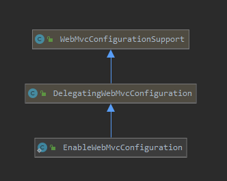
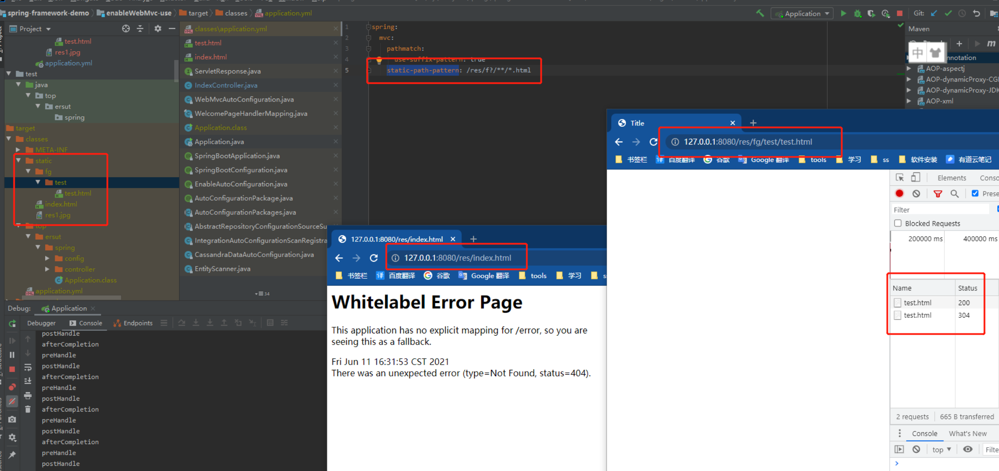

# WebMvcAutoConfiguration.EnableWebMvcConfiguration的作用

> spring-boot 版本：2.4.3

## 先看类图



- 不了解`DelegatingWebMvcConfiguration `和`WebMvcConfigurationSupport`，先阅读[这篇文章](../spring/【源码解析】@EnableWebMvc.md)
- `EnableWebMvcConfiguration`继承了`DelegatingWebMvcConfiguration `

## 作用

### 1、`EnableWebMvcConfiguration`等效于`@EnableWebMvc`，换句话说spring-boot自动开启了mvc配置器

#### @EnableWebMvc源码

```java
@Retention(RetentionPolicy.RUNTIME)
@Target(ElementType.TYPE)
@Documented
@Import(DelegatingWebMvcConfiguration.class)
public @interface EnableWebMvc {
}
```

`@EnableWebMvc`就干了一件事导入`DelegatingWebMvcConfiguration`注册bean

#### EnableWebMvcConfiguration源码

```java
@Configuration(proxyBeanMethods = false)
@EnableConfigurationProperties(WebProperties.class)
public static class EnableWebMvcConfiguration extends DelegatingWebMvcConfiguration implements ResourceLoaderAware {
    
    ...
    
}
```

`EnableWebMvcConfiguration`继承了`DelegatingWebMvcConfiguration`并且`DelegatingWebMvcConfiguration`本身就是个配置类，所以也注册了bean

**可以看出`@EnableWebMvc`和`EnableWebMvcConfiguration`做了同一件事情将`DelegatingWebMvcConfiguration`注册为bean,所以说`EnableWebMvcConfiguration`等效于`@EnableWebMvc`**

### 2、`EnableWebMvcConfiguration`又自动配置了一些信息，比如资源映射处理器、默认主页等

#### 资源映射处理器源码(注释版)

```java
@Configuration(proxyBeanMethods = false)
@EnableConfigurationProperties(WebProperties.class)
public static class EnableWebMvcConfiguration extends DelegatingWebMvcConfiguration implements ResourceLoaderAware {
	/**
      * 添加资源映射处理器
      * @param registry
      */
    @Override
    protected void addResourceHandlers(ResourceHandlerRegistry registry) {
        super.addResourceHandlers(registry);
        //获取配置查看是否关闭了静态资源
        if (!this.resourceProperties.isAddMappings()) {
            logger.debug("Default resource handling disabled");
            return;
        }
        ServletContext servletContext = getServletContext();
        //webjars规则
        addResourceHandler(registry, "/webjars/**", "classpath:/META-INF/resources/webjars/");
        /**
          * 项目配置的规则
          * 1、配置项：spring.mcv.static-path-pattern		为访问前缀，默认值是 /**
          * 2、配置项：spring.web.resource.static-locations	为静态资源目录，默认值是 {@code Resources#staticLocations}
          */
        addResourceHandler(registry, this.mvcProperties.getStaticPathPattern(), (registration) -> {
            registration.addResourceLocations(this.resourceProperties.getStaticLocations());
            if (servletContext != null) {
                /**
                  * 如果是servlet环境，那么servlet根目录也是资源目录
                  * 1、jar包运行时servlet根目录是随机的所以没啥用
                  * 2、war包运行时servlet根目录就是项目的根目录文件夹，如：\webapps\ROOT
                  * 综上所述 这个设置只有在war包运行时才有用
                  */
                registration.addResourceLocations(new ServletContextResource(servletContext, SERVLET_LOCATION));
            }
        });
    }

    private void addResourceHandler(ResourceHandlerRegistry registry, String pattern, String... locations) {
        addResourceHandler(registry, pattern, (registration) -> registration.addResourceLocations(locations));
    }

    private void addResourceHandler(ResourceHandlerRegistry registry, String pattern,
                                    Consumer<ResourceHandlerRegistration> customizer) {
        if (registry.hasMappingForPattern(pattern)) {
            return;
        }
        ResourceHandlerRegistration registration = registry.addResourceHandler(pattern);
        customizer.accept(registration);
        /**
          * 浏览器缓存时间即cache-control响应头，spring.web.resources.cache配置项内进行配置
          * 1、spring.web.resources.cache.period 设置客户端缓存时长(单位秒)
          * 2、spring.web.resources.cache.cachecontrol 设置cache-control响应头更详细的信息
          */
        registration.setCachePeriod(getSeconds(this.resourceProperties.getCache().getPeriod()));
        registration.setCacheControl(this.resourceProperties.getCache().getCachecontrol().toHttpCacheControl());
        customizeResourceHandlerRegistration(registration);
    }
    
    ...
    
}
```

对浏览器缓存机制不太理解的可以查看[这篇文章](../web/浏览器的缓存机制.md)

#### 默认主页源码(注释版)

**`WelcomePageHandlerMapping`部分源码：**

```java
final class WelcomePageHandlerMapping extends AbstractUrlHandlerMapping {

	...    

	WelcomePageHandlerMapping(TemplateAvailabilityProviders templateAvailabilityProviders,
			ApplicationContext applicationContext, Resource welcomePage, String staticPathPattern) {
		//有index.html并且静态资源访问规则为/** 才生效index.html
		if (welcomePage != null && "/**".equals(staticPathPattern)) {
			logger.info("Adding welcome page: " + welcomePage);
			setRootViewName("forward:index.html");
		}
		//存在index模板引擎，那么欢迎页就是他
		else if (welcomeTemplateExists(templateAvailabilityProviders, applicationContext)) {
			logger.info("Adding welcome page template: index");
			setRootViewName("index");
		}
	}
    
    ...
    
}
```

**注意：** 资源目录下有`index.html`，静态资源访问规则也必须为`/**`，具体原因看下图



[示例程序](./spring-boot-demo/static-resources-personalized)

当静态资源访问规则（static-path-pattern）复杂时可能就过滤掉了根目录的资源，所以根本无法访问根目录的`index.html`。

不过话说回来如果我只是添加一个前缀，完全可以进行识别，直接写死`/**`做的有点糙。但是话说回来现在大部分项目已经动静分离了，spring boot这个功能完全用不着。

**`EnableWebMvcConfiguration`部分源码：**

```java
@Configuration(proxyBeanMethods = false)
@EnableConfigurationProperties(WebProperties.class)
public static class EnableWebMvcConfiguration extends DelegatingWebMvcConfiguration implements ResourceLoaderAware {
    
    ...
    
    /**
     * 欢迎页映射处理器
     */
    @Bean
    public WelcomePageHandlerMapping welcomePageHandlerMapping(ApplicationContext applicationContext,
                                                               FormattingConversionService mvcConversionService, 
                                                               ResourceUrlProvider mvcResourceUrlProvider) {
        /**
         * 创建欢迎页映射处理器
         * getWelcomePage()是从静态资源目录获取index.html
         * this.mvcProperties.getStaticPathPattern() 静态资源访问路径前缀
         */
        WelcomePageHandlerMapping welcomePageHandlerMapping = new WelcomePageHandlerMapping(
            new TemplateAvailabilityProviders(applicationContext), applicationContext, getWelcomePage(),
            this.mvcProperties.getStaticPathPattern());
        welcomePageHandlerMapping.setInterceptors(getInterceptors(mvcConversionService, mvcResourceUrlProvider));
        welcomePageHandlerMapping.setCorsConfigurations(getCorsConfigurations());
        return welcomePageHandlerMapping;
    }

    ...

    private Resource getWelcomePage() {
        //遍历所有配置的资源目录，查找index.html
        for (String location : this.resourceProperties.getStaticLocations()) {
            Resource indexHtml = getIndexHtml(location);
            if (indexHtml != null) {
                return indexHtml;
            }
        }
        ServletContext servletContext = getServletContext();
        if (servletContext != null) {
            //查找servlet根目录的index.html
            return getIndexHtml(new ServletContextResource(servletContext, SERVLET_LOCATION));
        }
        return null;
    }

    private Resource getIndexHtml(String location) {
        return getIndexHtml(this.resourceLoader.getResource(location));
    }

    //根据提供的资源获取index.html
    private Resource getIndexHtml(Resource location) {
        try {
            Resource resource = location.createRelative("index.html");
            if (resource.exists() && (resource.getURL() != null)) {
                return resource;
            }
        }
        catch (Exception ex) {
        }
        return null;
    }

	...

}
```

## 注意事项

`WebMvcAutoConfiguration`类上有个@ConditionalOnMissingBean(WebMvcConfigurationSupport.class)注解也就是说用户自己使用了@EnableWebMvc那这个自动配置类全部失效。

```java
@Configuration(proxyBeanMethods = false)
...
@ConditionalOnMissingBean(WebMvcConfigurationSupport.class)
...
public class WebMvcAutoConfiguration {
    ...
}
```


