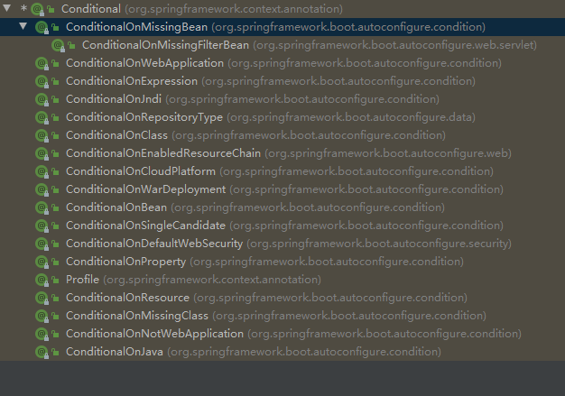

# Spring Boot 的注解

----------

## @SpringBootTest
- 功能：测试类添加SpringBoot环境
- 可用处：测试类
- 代码示例：
	```
	@SpringBootTest
	class StudentServiceTest {
	}
	```


## @ImportResource

- 功能：导入xml配置
- 可用处：一般放在配置类或启动类上
- 代码示例：
	```
	@SpringBootApplication
	@ImportResource("classpath:beans.xml")
	public class Application {
	
	    public static void main(String[] args) {
	        SpringApplication.run(Application.class,args);
	    }
	
	}
	```


## @Configuration

- 功能：替代之前spring中xml配置文件  
- 可用处：类
- 代码示例：
	```
	@Configuration
	public class ProjectConf {
	}
	```

## @Bean

- 功能：创建一个bean，等同于xml中的bean标签
- 可用处：一般在配置类的方法上
- 说明：方法名作为bean的名称（也可指定，未指定时使用方法名），返回值作为bean的实例
- 代码示例：
	```
	@Configuration
	public class ProjectConf {
	
	    //使用方法名作为bean的名称
	    @Bean
	    public StudentService studentService(){
	        return new StudentServiceImpl("studentService");
	    }
	
	    //指定bean的名称
	    @Bean("studentService01")
	    public StudentService studentServiceTow(){
	        return new StudentServiceImpl("studentService01");
	    }
	
	}
	```

**[@SpringBootTest、@ImportResource、@Configuration、@Bean 示例项目](./spring-boot-demo/anno-conf)**

## @Conditional

- 功能：满足一定条件的情况下注册bean
- 可用处：类、方法（一般在配置类中使用）

**源码**：

Conditional源码：

```
@Target({ElementType.TYPE, ElementType.METHOD})
@Retention(RetentionPolicy.RUNTIME)
@Documented
public @interface Conditional {

	/**
	 * All {@link Condition} classes that must {@linkplain Condition#matches match}
	 * in order for the component to be registered.
	 */
	Class<? extends Condition>[] value();

}
```

可以看出 `value` 值是一个Condition接口实现类的数组。

Condition源码:

```
@FunctionalInterface
public interface Condition {

	/**
	 * Determine if the condition matches.
	 * @param context the condition context
	 * @param metadata the metadata of the {@link org.springframework.core.type.AnnotationMetadata class}
	 * or {@link org.springframework.core.type.MethodMetadata method} being checked
	 * @return {@code true} if the condition matches and the component can be registered,
	 * or {@code false} to veto the annotated component's registration
	 */
	boolean matches(ConditionContext context, AnnotatedTypeMetadata metadata);

}
```

Condition类是一个接口,其`matches`方法返回true则注册bean,否则不注册

[测试用例(在生产环境时bean才进行注册)](./spring-boot-demo/conditional-demo/src/test/java/top/ersut/boot/conditional/ConditionalDemoTest.java)


**Spring Boot 中为 Conditional 衍生了很多子类**，如下图



### @Profile

- 功能：当 `spring.profiles.active` 配置包含某些值或某个值时注册bean
- [测试用例](./spring-boot-demo/conditional-demo/src/test/java/top/ersut/boot/conditional/ProfileDemoTest.java)
- 部分代码：

```
@Configuration
@Profile("prod")
public class ProfileDemo {
    @Bean("userServiceByProfile")
    public UserService userService(){
        return new UserServiceImpl();
    }
}
```

### @ConditionalOnBean

- 功能：当前IOC容器中**存在**某个或某些bean才注册这个bean
- 属性：
	- value：根据类型指定bean
	- name：根据名称指定bean
- 注意：只验证当前容器中的Bean，未来注册的Bean不进行验证，**谨慎使用**。[具体说明以及示例](./spring-boot-demo/conditional-demo/src/main/java/top/ersut/boot/conditional/ConditionalOnBeanDemo.java)
- [测试用例](./spring-boot-demo/conditional-demo/src/test/java/top/ersut/boot/conditional/ConditionalOnBeanDemoTest.java)
- 部分代码：

```
@Configuration
public class ConditionalOnBeanDemo {

    @ConditionalOnBean(name = "userServiceByOnBean02")
    @Bean
    public UserService userServiceByOnBean01(){
        return new UserServiceImpl();
    }

    @Bean
    public UserService userServiceByOnBean02(){
        return new UserServiceImpl();
    }

    @ConditionalOnBean(name = "userServiceByOnBean02")
    @Bean
    public UserService userServiceByOnBean03(){
        return new UserServiceImpl();
    }
}
```

### @ConditionalOnMissingBean
- 功能：当前IOC容器中**不存在**某个或某些bean才注册这个bean
- 属性：
	- value：根据类型指定bean
	- name：根据名称指定bean
- 注意：只验证当前容器中的Bean，未来注册的Bean不进行验证，**谨慎使用**。[具体说明以及示例](./spring-boot-demo/conditional-demo/src/main/java/top/ersut/boot/conditional/ConditionalOnMissingBeanDemo.java)
- [测试用例](./spring-boot-demo/conditional-demo/src/test/java/top/ersut/boot/conditional/ConditionalOnMissingBeanDemoTest.java)
- 部分代码：

```
@Configuration
public class ConditionalOnMissingBeanDemo {

    @ConditionalOnMissingBean(name = "userServiceByOnMissingBean02")
    @Bean
    public UserService userServiceByOnMissingBean01(){
        return new UserServiceImpl();
    }

    @Bean
    public UserService userServiceByOnMissingBean02(){
        return new UserServiceImpl();
    }

    @ConditionalOnMissingBean(name = "userServiceByOnMissingBean02")
    @Bean
    public UserService userServiceByOnMissingBean03(){
        return new UserServiceImpl();
    }
}
```

### @ConditionalOnClass

- 功能：当前项目中**存在**某个或某些类则注册bean
- 属性：
	- value：指定类
	- name：指定类的全路径
- 注意：当此注解在方法上时，请使用name属性，不要使用value属性。（[官方解释](https://docs.spring.io/spring-boot/docs/2.4.3/api/org/springframework/boot/autoconfigure/condition/ConditionalOnClass.html)）
- [测试用例](./spring-boot-demo/conditional-demo/src/test/java/top/ersut/boot/conditional/ConditionalOnClassDemoTest.java)
- 部分代码：

```
@Configuration
public class ConditionalOnClassDemo {

    //试着去掉 anno-conf 依赖再看看测试用例的结果
    @ConditionalOnClass(name = "top.ersut.boot.conf.service.StudentService")
    @Bean
    public UserService userServiceByOnClass01(){
        return new UserServiceImpl();
    }

    @Bean
    public UserService userServiceByOnClass02(){
        return new UserServiceImpl();
    }

    @ConditionalOnClass(name = "top.ersut.boot.conditional.service.UserService")
    @Bean
    public UserService userServiceByOnClass03(){
        return new UserServiceImpl();
    }
}
```
### @ConditionalOnMissingClass

- 功能：当前项目中**不存在**某个或某些类则注册bean
- 属性：
	- value：指定类的全路径
- [测试用例](./spring-boot-demo/conditional-demo/src/test/java/top/ersut/boot/conditional/ConditionalOnMissingClassDemoTest.java)
- 部分代码：

```
@Configuration
public class ConditionalOnMissingClassDemo {

    //试着去掉 anno-conf 依赖再看看测试用例的结果
    @ConditionalOnMissingClass("top.ersut.boot.conf.service.StudentService")
    @Bean
    public UserService userServiceByOnMissingClass01(){
        return new UserServiceImpl();
    }

    //试着添加 hello-world 依赖再看看测试用例的结果
    @ConditionalOnMissingClass("top.ersut.boot.helloworld.controller.HelloWorldController")
    @Bean
    public UserService userServiceByOnMissingClass02(){
        return new UserServiceImpl();
    }

    @ConditionalOnMissingClass("top.ersut.boot.conditional.service.UserService")
    @Bean
    public UserService userServiceByOnMissingClass03(){
        return new UserServiceImpl();
    }
}
```

### @ConditionalOnProperty

- 功能：属性与期望值匹配则注册bean
- 属性：
	- prefix：属性的前缀
	- name：属性的名称
	- havingValue：属性的期望值
	- matchIfMissing：如果没有找到这个属性，是否生成bean，默认false
- [测试用例](./spring-boot-demo/conditional-demo/src/test/java/top/ersut/boot/conditional/ConditionalOnPropertyDemoTest.java)
- 代码示例：

```
@Configuration
public class ConditionalOnPropertyDemo {

    //属性值存在 预期值不匹配，bean无法注册
    @ConditionalOnProperty(prefix = "spring.profiles",name = "active",havingValue = "prod")
    @Bean
    public UserService userServiceByOnProperty01(){
        return new UserServiceImpl();
    }

    //属性值存在 预期值匹配，bean成功注册
    @ConditionalOnProperty(prefix = "spring.profiles",name = "active",havingValue = "dev")
    @Bean
    public UserService userServiceByOnProperty02(){
        return new UserServiceImpl();
    }

    //属性值不存在 默认bean不注册
    @ConditionalOnProperty(prefix = "spring.profiles",name = "include",havingValue = "dev-jdbc")
    @Bean
    public UserService userServiceByOnProperty03(){
        return new UserServiceImpl();
    }

    //属性值不存在 bean注册
    @ConditionalOnProperty(prefix = "spring.profiles",name = "include",havingValue = "dev-jdbc",matchIfMissing = true)
    @Bean
    public UserService userServiceByOnProperty04(){
        return new UserServiceImpl();
    }
}
```

### @ConditionalOnResource

- 功能：指定资源存在则注册bean
- 属性：
	- resources：一个或多个资源路径
- [测试用例](./spring-boot-demo/conditional-demo/src/test/java/top/ersut/boot/conditional/ConditionalOnResourceDemoTest.java)
- 代码示例：

```
@Configuration
public class ConditionalOnResourceDemo {

    //资源存在，bean成功注册
    @ConditionalOnResource(resources = "classpath:application.yml")
    @Bean
    public UserService userServiceByOnResource01(){
        return new UserServiceImpl();
    }

    //资源不存在,bean不注册
    @ConditionalOnResource(resources = "classpath:test.yml")
    @Bean
    public UserService userServiceByOnResource02(){
        return new UserServiceImpl();
    }

}
```

## @Import

- 功能：导入一个或多个Bean。支持导入配置类， `ImportSelector` 和 `ImportBeanDefinitionRegistrar` 的实现类，以及常规类。导入bean的名称为类的全路径
- 属性：
	- value：一个类或多个类
- 优点：
	- 虽然@Bean也能实现同样效果，但是比@Bean方便
- 注意：当导入**xml配置文件**时使用 `@ImportResource`

### 常规类 示例

- [@Import导入](./spring-boot-demo/anno-Import/src/main/java/top/ersut/boot/annoimport/demo/ImportDemo.java)

```
/**
 * 常规类导入，bean名称为类的全路径
 * 例如下方 User.class 的 Bean 名称为 top.ersut.boot.annoimport.pojo.User
 */
@Import(User.class)
@Configuration
public class ImportDemo {
}
```

- [测试用例](./spring-boot-demo/anno-Import/src/test/java/top/ersut/boot/annoimport/demo/ImportDemoTest.java)


### ImportSelector 示例

- [实现类](./spring-boot-demo/anno-Import/src/main/java/top/ersut/boot/annoimport/selector/MyImportSelector.java)：

```
public class MyImportSelector implements ImportSelector {
    @Override
    public String[] selectImports(AnnotationMetadata importingClassMetadata) {
        //将 Teacher 和 Student 注册为bean，名称为类的全路径，即 top.ersut.boot.annoimport.pojo.Teacher 和 top.ersut.boot.annoimport.pojo.Student 
        return new String[]{Teacher.class.getName(), Student.class.getName()};
    }
}
```

- [@Import导入](./spring-boot-demo/anno-Import/src/main/java/top/ersut/boot/annoimport/demo/ImportSelectorDemo.java)：

```
@Import(MyImportSelector.class)
@Configuration
public class ImportSelectorDemo {
}
```

- [测试用例](./spring-boot-demo/anno-Import/src/test/java/top/ersut/boot/annoimport/demo/ImportSelectorDemoTest.java)


### ImportBeanDefinitionRegistrar 示例

- [实现类](./spring-boot-demo/anno-Import/src/main/java/top/ersut/boot/annoimport/definition/MyImportBeanDefinitionRegistrar.java)：

```
public class MyImportBeanDefinitionRegistrar implements ImportBeanDefinitionRegistrar {
    @Override
    public void registerBeanDefinitions(AnnotationMetadata importingClassMetadata, BeanDefinitionRegistry registry) {
        //注册bean
        registry.registerBeanDefinition("userDefinition",new RootBeanDefinition(User.class));
        registry.registerBeanDefinition("studentDefinition",new RootBeanDefinition(Student.class));
        registry.registerBeanDefinition("teacherDefinition",new RootBeanDefinition(Teacher.class));
    }
}
```

- [@Import导入](./spring-boot-demo/anno-Import/src/main/java/top/ersut/boot/annoimport/demo/ImportBeanDefinitionRegistrarDemo.java)：

```
@Import(MyImportBeanDefinitionRegistrar.class)
@Configuration
public class ImportBeanDefinitionRegistrarDemo {
}
```

- [测试用例](./spring-boot-demo/anno-Import/src/test/java/top/ersut/boot/annoimport/demo/ImportBeanDefinitionRegistrarDemoTest.java)