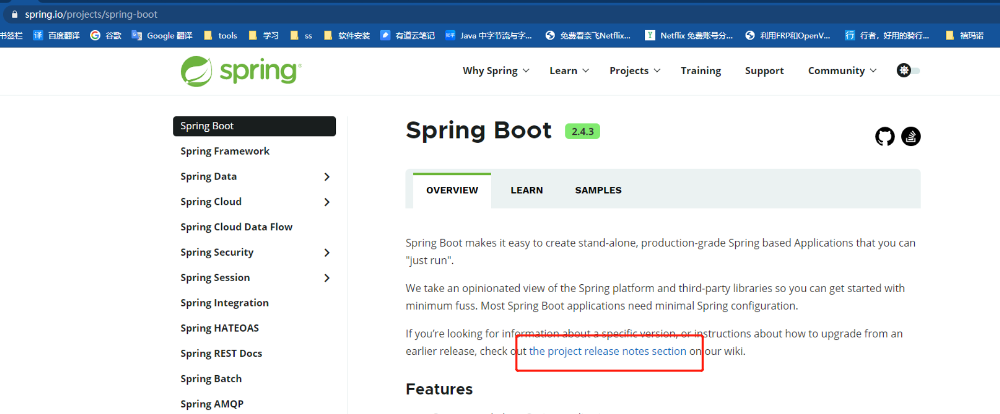

# Spring Boot 介绍

----------

## 什么是Spring Boot

一个集成spring生态以及第三方功能的生产级别框架，并且可快速搭建（简化配置以及版本依赖），让程序员专注业务开发。

## Spring Boot的优点

### 快速搭建（无需关注版本依赖以及配置）

引入一个依赖即可创建一个web应用

```
<dependency>
    <groupId>org.springframework.boot</groupId>
    <artifactId>spring-boot-starter-web</artifactId>
</dependency>
```

### 内嵌web容器

嵌入式tomcat，部署时不用再单独安装tomcat

### 支持响应式编程

基于`Reactor`所开发的web框架（webFlux），在有限的资源下提高吞吐量。

### 自动配置spring以及第三方功能

通过实现Spring Boot的约定并设置配置项默认值，Spring Boot会自动加载这些含有默认配置的Bean，从而实现自动配置。

当然这些配置项可以通过配置文件修改具体值。

### 提供生产级别的监控、健康检查及外部化配置


## Spring Boot 官方文档

### 参考文档

- 第一种：直接访问 https://docs.spring.io/spring-boot/docs/{version}/reference/html/
- 在 https://spring.io/projects/spring-boot#learn 里点击对应版本后的 	‘Reference Doc.’

### 更新日志

进入 https://spring.io/projects/spring-boot 点击图片红框中的链接



也就是 https://github.com/spring-projects/spring-boot/wiki#release-notes， 点击版本号，查看版本的更新内容