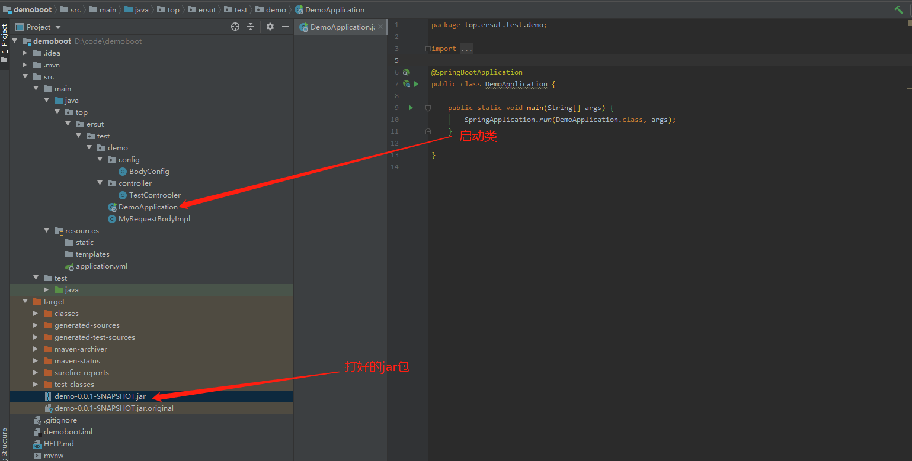
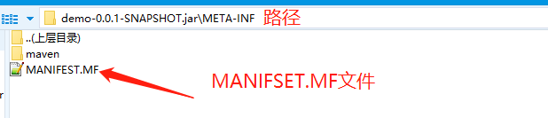
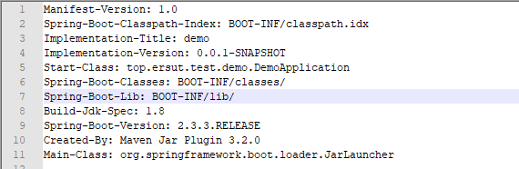
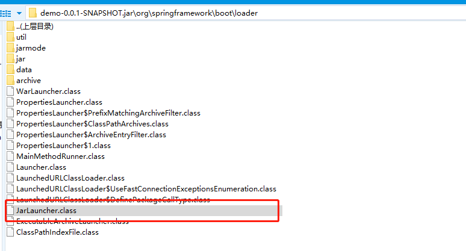
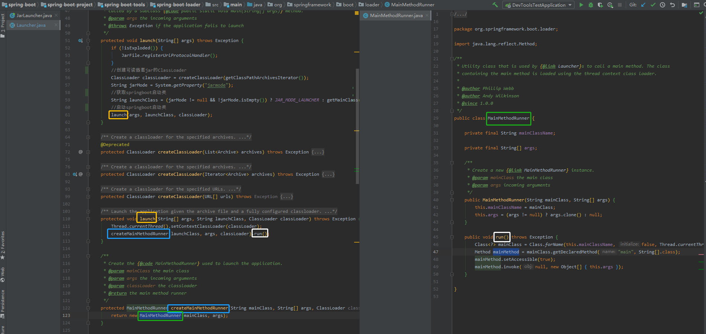

# spring-boot启动过程(简单分析) #
> 参考文章：
>
1. http://www.iocoder.cn/Spring-Boot/jar/?self

## jar包运行的两种方式 ##
1. 命令行指定运行类

	`java -cp xxx.jar com.xx.xxxx`
2. 读取jar包内的 MANIFEST.MF 文件的 Main-Class 属性
	1. jar包在启动时会读取jar包内的 MANIFEST.MF 文件的 Main-Class，从而找到jar包的启动类
	2. MANIFEST.MF 文件路径 META-INF/MANIFEST.MF
	3. 启动命令：
	
		`java -jar xxx.jar`

## spring boot jar包中 MANIFEST.MF 解读
### 先上图
1. 工程（图1）

	
2. jar包结构
	1. 根目录（图2）

	
	2. MANIFSET.MF文件目录（图3）

	
3. MANIFSET.MF文件内容（图4）

	
### MANIFSET.MF重要属性
- Manifest-Version : Manifest文件版本
- Spring-Boot-Version: Spring boot版本号
- Main-Class: jar包启动类（接下来要看的信息）
- Start-Class: spring boot 启动类（图1中的启动类路劲）
- Spring-Boot-Classes: 应用程序类的根目录
- Spring-Boot-Lib: 应用程序的依赖包路径
- 更多属性解读参考文章：
	- https://www.cnblogs.com/Gandy/p/7290069.html

## JarLauncher
> spring boot 启动jar显然是使用的第二种方式，那么jar包启动类就是 org.springframework.boot.loader.JarLauncher
### 为什么需要 JarLauncher 而不是直接在 Main-Class 上直接配置 springboot 的启动类
1. Java 规定可执行器的 jar 包禁止嵌套其它 jar 包
2. spring-boot-loader 的 LaunchedURLClassLoader 实现了 ClassLoader 解决了 嵌套jar包不能读取的问题。
### JarLauncher 位置
查看 图2 可以看到 org 目录（这个目录是springboot 的 maven 打包插件放进去），那么继续看图

ok,JarLauncher类找到了。
### JarLauncher 类继承图

从图中可以看到不仅有JarLauncher 还有 WarLauncher 那么springboot 肯定支持打war包

### JarLauncher源码
> 源码链接：https://github.com/spring-projects/spring-boot/blob/master/spring-boot-project/spring-boot-tools/spring-boot-loader/src/main/java/org/springframework/boot/loader/JarLauncher.java

org.springframework.boot.loader.JarLauncher#main (图1)

org.springframework.boot.loader.MainMethodRunner#run（图2）

#### 解读
1. 运行main方法的内容
2. 创建可读嵌套jar的ClassLoader
3. 获取springboot启动类（即MANIFSET.MF的Start-Class属性）
4. 运行springboot启动类
	1. 最终创建MainMethodRunner 运行 run 方法
	2. run方法使用反射机制 运行springboot启动类的main方法

## 进阶
- [spring-boot启动过程（源码分析）](./spring-boot启动过程（源码分析）.md)