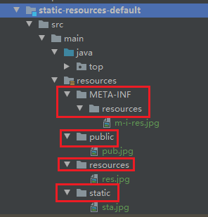
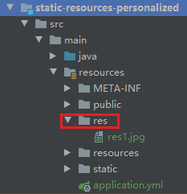
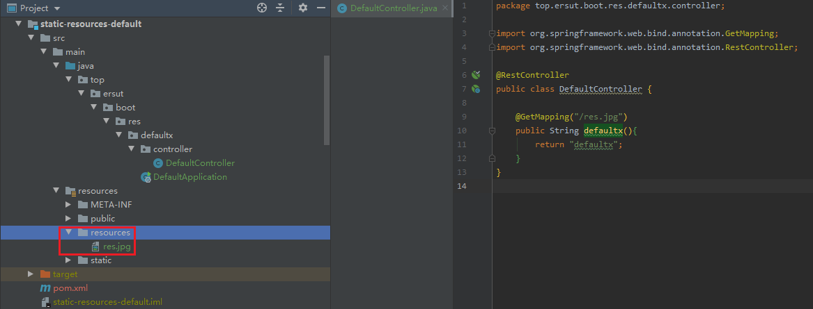
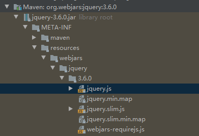

# 静态资源规则与定制化

> [静态资源默认值示例](./spring-boot-demo/static-resources-default)
>
> [静态资源定制示例](./spring-boot-demo/static-resources-personalized)

## 默认目录

`/META-INF/resources`、`/public`、`/resources`、`/static`这**四个目录**为静态资源默认目录，即将静态资源放在这几个目录下都可访问到。如图：



## 默认访问地址

默认情况下访问地址从根目录开始，那么上边图中的4张图片访问地址为：

- http://127.0.0.1:8080/m-i-res.jpg
- http://127.0.0.1:8080/pub.jpg
- http://127.0.0.1:8080/res.jpg
- http://127.0.0.1:8080/sta.jpg

## 定制目录

通过修改配置项`spring.web.resources.static-locations`可以指定静态资源目录（可以指定多个）

### 代码示例

```yaml
spring:
  web:
    resources:
      static-locations: classpath:/res/
```

### 目录示例



**注意：定制目录后原有的4个默认目录将失效** 

## 定制访问前缀

通过修改配置项`spring.mvc.static-path-pattern`可以设置静态资源的访问前缀。

### 代码示例：

```yaml
spring:
  mvc:
    static-path-pattern: /res/**
```

### 对应访问地址：

`/res/res1.jpg`（这是个定制目录）对应访问地址为：http://127.0.0.1:8080/res/res1.jpg

## 静态资源与controller地址冲突的情况

如遇地址冲突对应的静态资源将无法访问会直接返回controller的响应结果。

### [controller示例:](./spring-boot-demo/static-resources-default/src/main/java/top/ersut/boot/res/defaultx/controller/DefaultController.java)

```java
@RestController
public class DefaultController {
    @GetMapping("/res.jpg")
    public String defaultx(){
        return "defaultx";
    }
}
```

### 对应文件：



### 响应结果：



### 解决办法：

通过配置项`spring.mvc.static-path-pattern`给静态资源添加访问前缀，避免controller中的地址使用这个前缀。

## webjars的特殊情况

### 什么是webjars

将第三方库（例如jQuery、ECharts等等）封装成jar包这就是webjars。

### springboot中如何访问

访问形式与传统(spring MVC)的访问形式一至，只不过webjars不受配置项`spring.mvc.static-path-pattern`和`spring.mvc.static-path-pattern`的影响。

### 示例：

#### maven依赖：

```xml
<dependency>
    <groupId>org.webjars</groupId>
    <artifactId>jquery</artifactId>
    <version>3.6.0</version>
</dependency>
```

#### 文件目录：


#### 访问地址：

http://127.0.0.1:8080/webjars/jquery/3.6.0/jquery.js

