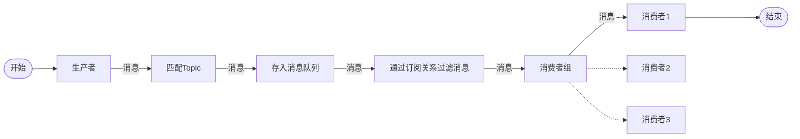
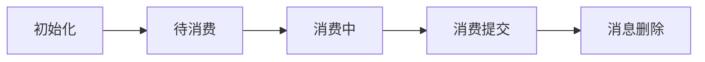

# RocketMQ消息队列

## 三大核心组件

### NameServer：注册中心

- Broker的注册中心
- 管理Broker的信息，并提供心跳机制金策是否存活。
- 客户端通过NameServer查找**Broker**
  - **5.0版本后客户端不直接访问NameServer而是通过Proxy转发数据**

### Broker：消息存储

- 接收生产者消息，并持久化消息
- 推送消息给消费者
- 根据主题（TOPIC）和队列（QUEUE）组织数据
- 支持集群
  - **多主模式**：多个主节点进行集群
    - 优点：部署简单
    - 缺点：宕机的节点在恢复前不可订阅，消息实时性会受到影响。
  - **多主从复制（异步复制）模式**：每个主节点带从节点
    - 优点：主节点宕机后，消费者仍然可以从Slave消费，而且此过程对应用透明，不需要人工干预，性能同多Master模式几乎一样。主节点宕机后**从节点替换为主节点**（4.5后支持自动切换）
    - 缺点：Master宕机，磁盘损坏情况下会丢失少量消息。

### Proxy：消息代理层

>  5.0版本后支持

把Broker职责拆分到Proxy，Broker专注于存储。

Proxy支持

- 提供负载均衡
- 访问控制
- 协议适配（MQTT等）
- 等....

## 领域模型

### 概述

**RocketMQ使用的发布订阅模型**

模型图:

**[Topic](#topic)**：主题，消息容器的名称，全局唯一。

**[Message Queue](#queue)**：消息队列，**真实存储消息的地方。**

- 主题内有多个消息队列组成

**[Message](#msg)**：消息，RocketMQ最小传输单元。

- 存储在消息队列中。

**[Producer](#producer)**：消息的生产者，创建消息并发送到RocketMQ中。

**[Consumer](#con)**：消息的消费者，处理收到的消息。

**[Subscription](#sub)**：订阅关系，处理消息的过滤规则。

**[Consumer Group](#conGroup)**：消费者分组，把相同的消费者放入一个组中，统一定义订阅关系（Subscription）、重试机制、消费者负责均衡等。

- 一个消费者组可以有多个订阅关系。

#### 一条消息的生产到消费

### 

Topic：主题

主题是RocketMQ 中消息传输和存储的顶层容器

- 根据主题区分不同业务或类型的消息
- 通过主题实现的**数据隔离**
- 主题是一个**逻辑概念**，实际存储的位置是消息队列中
- 💡主题名是**全局唯一的**
- 💡主题内的**消息类型必须一致**

### 

Queue：队列

队列是消息存储和传输的实际容器，所有主题都是由多个队列组成。

- 队列天然具备顺序性，**头部为最早写入的消息，尾部为最新写入的消息。**
- 消息在队列中的位置和消息之间的顺序**通过位点（Offset）进行标记管理**。通过位点可以读取任意位置的消息，从而实现类似聚合读取、回溯读取等特性。
- 主题下会由一到多个队列来存储消息
- 主题的**多个队列可以分布在不同的服务节点上**，以此实现横向的水平扩容。
- **队列数量的设置应遵循少用够用原则**

### 

Message：消息

RocketMQ 中的最小数据传输单元

- 消息一旦产生后，不会发生改变
- 消息会进行持久化，以实现消息的回溯和故障恢复。
- 生产者创建消息，消费者获取消息。
- 消息大小不得超过其类型所对应的限制，否则消息会发送失败。
  - 系统默认的消息最大限制如下：
    - 普通和顺序消息：4 MB
    - 事务和定时或延时消息：64 KB

#### 消息的类型

- **普通消息**（Normal）：消息本身无特殊语义
- **顺序消息**（FIFO）：通过消息组（MessageGroup）标记一组消息的先后顺序，保证消息按照**发送的顺序进行投递**
- **定时/延时消息**（Delay）：通过**指定延时时间控制消息**生产后不要立即投递，而是在延时间隔后才投递。
- **事务消息**：一种高级消息，保证按照本地业务逻辑成功发送消息或回滚消息，即**保证业务与消息一致性。**

#### 消息的内部属性

- 主题名称：即Topic
- 消息类型：即 普通消息、顺序消息、定时/延时消息、事务消息
- 消息队列：实际存储当前消息的队列
  - 由服务端指定
- 消息位点：当前消息存储在队列中的位置
  - 由服务端指定，取值范围：0 到 long.Max。
- **消息ID：消息的唯一标识**
  - 生产者客户端系统自动生成。固定为数字和大写字母组成的**32位字符串**。
- 索引Key列表（可选）：**消息索引**，方便快速查找。
- 过滤消息Tag（可选）：**消息的过滤项**，可快速过滤。
  - **一条消息只允许一个Tag字段**
- 定时时间（可选）：定时消息使用，延时投递的一个毫秒级时间戳。
  - 生产者定义，**最大可设置40天**
- 消息发送时间：发送消息时，生产者客户端系统的本地毫秒级时间戳
  - 由生产者客户端生成
  - 生产者与服务端时间可能不一致，这里采用**生产者的时间**
- 消息保存时间戳：消息失效的时间
  - 由服务端填充
  - 生产者与服务端时间可能不一致，这里采用**服务端的时间**
- 消费重试次数：消息投递失败时，每次重试 +1
- 业务自定义属性：生产者对消息的扩展信息
- 消息负载：消息的实际内容
  - 生产者对其进行序列化，以二进制发送。

### 

Producer：生产者

生产消息、创建消息、将消息发送到服务端的客户端称为生产者

- 生产者和主题的关系是多对多。

### 

Subscription：订阅关系

订阅关系是消费者获取消息、处理消息的规则和状态配置。

- 订阅关系按照**消费者分组和主题**粒度设计，因此，**一个订阅关系只能有一个消费者分组 和 一个主题。**
- 同一个主题可以关联多个订阅关系
- 一个消费者分组可以关联多个订阅关系

#### 订阅关系的内部属性

- **过滤类型**
  - 按照Tag字符串进行全文过滤匹配。
  - 按照SQL语法对消息属性进行过滤匹配。
- **过滤表达式**
  - https://rocketmq.apache.org/zh/docs/featureBehavior/07messagefilter

### 

ConsumerGroup：消费者分组

承载多个**消费行为一致的消费者**的**负载均衡**分组

- 以消费者分组的粒度管理订阅关系，可以关联过个订阅关系

- 消费者分组可以包含多个消费者

- 消费者分组中这些消费者共同处理消息，也就是**每条消息只有一个消费者进行消费**

  

### 

Consumer：消费者

接收服务端消息的客户端，被称为消费者

- 消费者必须关联一个消费者分组

## 消息类型

### 普通消息（Normal）

用于系统的解耦，没有特殊的功能。

#### 生命周期

1. 初始化

   消息被生产者构建并完成初始化，**待发送到服务端**的状态。

2. 待消费

   消息被发送到服务端，对**消费者可见，等待消费者消费**的状态。

3. 消费中

   **消息被消费者获取**，并按照消费者本地的业务逻辑进行处理的过程。 此时服务端会**等待消费者完成消费并提交消费结果**，如果一定时间后没有收到消费者的响应，RocketMQ会对消息**进行重试处理**。**最大重试次数和重试间隔在创建消费者分组时设置**

4. 消费提交

   **消费者完成消费处理，并向服务端提交消费结果**，服务端**标记当前消息已经被处理**（包括消费成功和失败）。 Apache RocketMQ默认支持保留所有消息，此时**消息数据并不会立即被删除**，只是逻辑标记已消费。**消息在保存时间到期或存储空间不足被删除**前，消费者仍然可以回溯消息重新消费。

5. 消息删除

#### 适用场景

- 日志收集业务
- 用户导出大量数据时，由于导出时间过长，采用后台**异步执行**导出，导出成功后将文件发送到邮箱。这里主要是利用消息实现异步处理，用户请求的接口只是发送一条消息到MQ，消费者执行导出业务。
- 

### 定时/延时消息（Delay）

#### 适用场景

- 物联网中 **多设备的控制** 按照延时来执行，例如执行10个空开的合闸，为了避免同时上电造成大电流，将每个空开直接间隔100ms，这时通过延时消息发送即可实现
- **非周期性**的定时任务，例如**未来两天中午12点发送App消息推送**、定时晚上6点发送公众号消息等

### 顺序消息（FIFO）

#### 适用场景

- 数据的同步避免数据的顺序错乱，使用顺序消息解决。
- 股票购买按照顺序成交
- 秒杀业务按照顺序成交

### 事务消息（Transaction）

💡注意：事务消息只**保证当前生产者的业务成功执行**，**无法保证消费者的业务成功执行**，所以**关键业务不要使用**

#### 适用场景

- 官方的示例是 **下单后处理商品和购物车** 业务，但是我任务这个例子不合适，因为这订单、商品、购物车这三个微服务应该用**全局事务管理**，若使用事务消息，无法保证**商品和购物车异常**后订单的回滚。
- 订单购买成功后的推送消息（站内信等），事务消息可以**确保订单在异常的情况下不推送消息**
- 