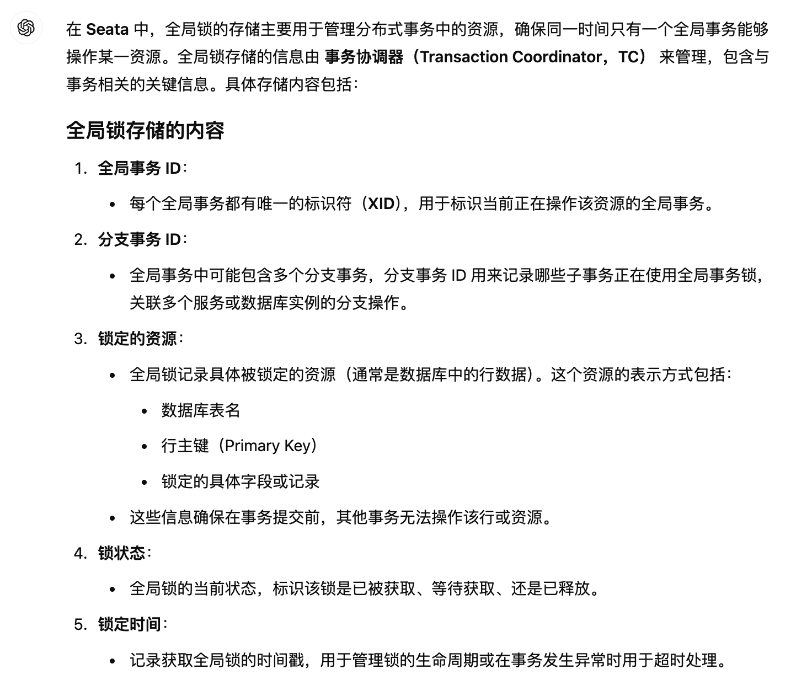
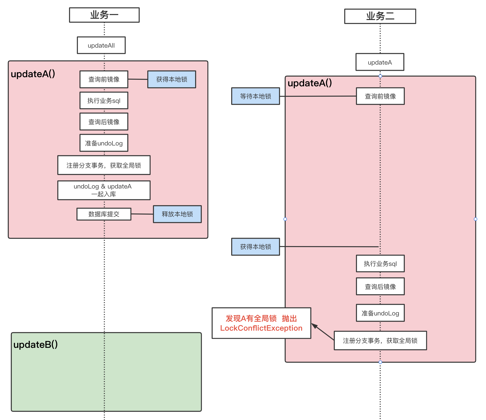
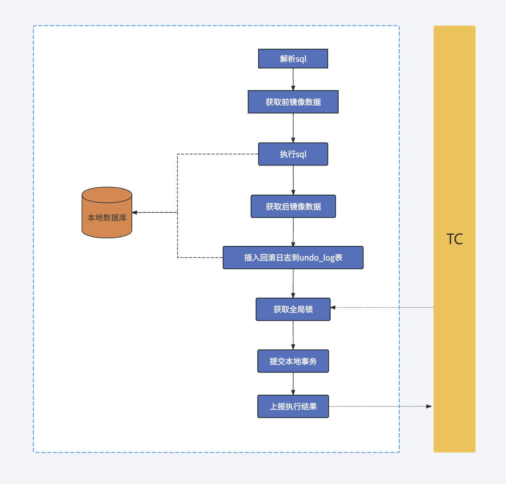
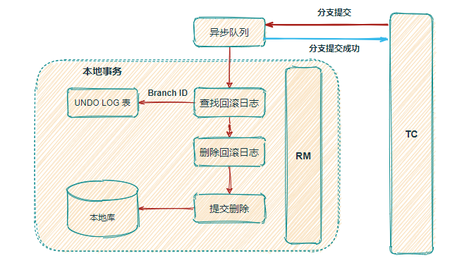
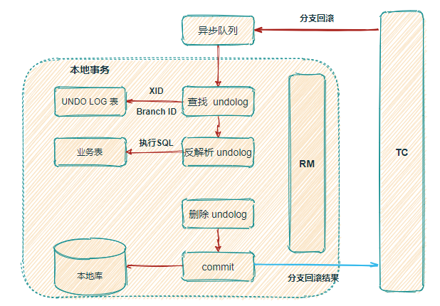

# Seata分布式事务

**基础：[事务的隔离性](./../spring/transaction.md#Isolation)**

## Seata术语

**TC (Transaction Coordinator) - 事务协调者**
维护全局和分支事务的状态，驱动全局事务提交或回滚。

**TM (Transaction Manager) - 事务管理器**
定义全局事务的范围：开始全局事务、提交或回滚全局事务。

**RM (Resource Manager) - 资源管理器**
管理分支事务处理的资源，与TC交谈以注册分支事务和报告分支事务的状态，并驱动分支事务提交或回滚。

## 全局锁

**每个全局事务都有一个全局锁**

### 💡全局锁的内容

- 全局事务id
- 分支事务id
- **锁定资源的信息**

  - 表名

  - 行
- 等

chatgpt的回答：

### ⭐️全局锁如何实现写隔离

官方的写隔离文档：https://seata.apache.org/zh-cn/docs/overview/what-is-seata#%E6%95%B4%E4%BD%93%E6%9C%BA%E5%88%B6

⭐️官方文档指出了描述了写隔离的执行逻辑以及写隔离通过全局锁实现，但是未说明全局锁是如何实现的写隔离

**一些个人理解**：

去TC查询所有的全局锁是否包含将要锁定的资源

- 如果没有则**获取该全局事务的全局锁，并往全局锁种写入该资源进行锁定**
- 如果有，则重新查询该资源

### 🙅🏻‍♀️对写隔离时 避免脏写 的补充

> 先阅读：https://seata.apache.org/zh-cn/docs/user/appendix/isolation#%E6%80%8E%E4%B9%88%E7%94%A8seata%E9%98%B2%E6%AD%A2%E8%84%8F%E5%86%99

[官方文档](https://seata.apache.org/zh-cn/docs/user/appendix/isolation#%E6%80%8E%E4%B9%88%E7%94%A8seata%E9%98%B2%E6%AD%A2%E8%84%8F%E5%86%99)中指出通过 `@GlobalTransactional`注解的事务**未获取到全局锁**抛出`LockConflictException`，未说明重试机制（具体配置项：retryInterval和retryTimes、相关类：`LockRetryController.java`）

官方泳道图：

抛出异常`LockConflictException`后，被捕获并进入`LockRetryController.java`的`sleep`方法休眠，之后再重试。

与**@GlobalLock + select for update**的区别

- @GlobalLock + select for update：重试时会释放本地锁
- @GlobalTransactional：重试时不释放本地锁（源码位置`SelectForUpdateExecutor#doExecute`）

[源码部分的解释](./md)

### 

二阶段流程（AT模式）

官方说明：https://seata.apache.org/zh-cn/docs/overview/what-is-seata#%E4%B8%80%E9%98%B6%E6%AE%B5

#### 一阶段

1. 解析sql获取元数据（操作类型、表、条件）
2. 获取执行sql前镜像数据
3. 执行sql
4. 获取执行sql后镜像数据
5. 将前后镜像数据存入undo_log表
6. **向TC注册事务分支并获取全局锁**
7. 提交本地事务：业务数据和undo_log的数据
8. 向TC报告执行结果

#### 二阶段-提交

1. 收到TC的提交信息，放入异步队列，马上返回提交成功的数据
2. 异步删除undo_log对应的数据

#### 二阶段-回滚

1. 收到TC的回滚信息，开启本地事务
2. 查询undo_log对应的数据
3. **数据校验**：验证后镜像数据与当前数据是否有变更，如果有不同，说明数据被当前全局事务之外的动作做了修改（比如未被seata接管事务、手动修改等）。这种情况根据配置策略来做处理。[参考链接](https://github.com/apache/incubator-seata/issues/3616)、[参考链接](https://blog.csdn.net/m0_47066332/article/details/122073027)
4. 反向解析并生成补充sql，执行sql
5. 提交本地事务，并把本地事务的执行结果上报给 TC。

## 部署

> 官方的docker-compose部署文档：https://seata.apache.org/zh-cn/docs/ops/deploy-by-docker-compose#nacos-db

docker-compose部署示例：https://github.com/ersutUp/docker-info/tree/master/seata

## 实操

