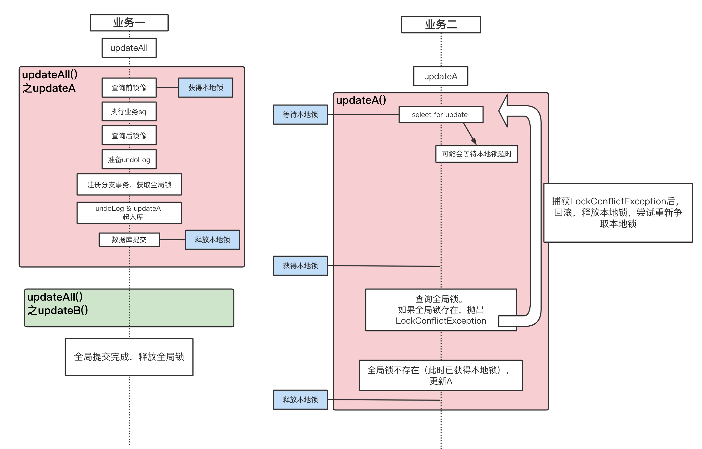

# seata源码


### <div id="GlobalLock-select-for-update"></div>避免脏写方案中，@GlobalLock + select for update 和 @GlobalTransactional 的区别


#### <div id="select-for-update"></div>**@GlobalLock + select for update 在重试的试会释放本地锁**

> 示例代码查看官方的：[这是链接，点我](https://seata.apache.org/zh-cn/docs/user/appendix/isolation#%E5%8A%9E%E6%B3%95%E4%B8%80updatea%E4%B9%9F%E5%8A%A0%E4%B8%8Aglobaltransactional%E6%AD%A4%E6%97%B6seata%E4%BC%9A%E5%A6%82%E4%BD%95%E4%BF%9D%E8%AF%81%E4%BA%8B%E5%8A%A1%E9%9A%94%E7%A6%BB)
>
> 或者查看截图:[点我](./images/select-for-update1.png)

官网流程图




<div id="err"></div>重试次数超过设定的 retryInterval（重试次数） 时会报错

```java
Caused by: org.apache.seata.rm.datasource.exec.LockWaitTimeoutException: Global lock wait timeout
	at org.apache.seata.rm.datasource.exec.LockRetryController.sleep(LockRetryController.java:66)
	at org.apache.seata.rm.datasource.exec.SelectForUpdateExecutor.doExecute(SelectForUpdateExecutor.java:115)
	at org.apache.seata.rm.datasource.exec.BaseTransactionalExecutor.execute(BaseTransactionalExecutor.java:127)
	at org.apache.seata.rm.datasource.exec.ExecuteTemplate.execute(ExecuteTemplate.java:168)
	at org.apache.seata.rm.datasource.exec.ExecuteTemplate.execute(ExecuteTemplate.java:63)
	... 58 more
Caused by: org.apache.seata.rm.datasource.exec.LockConflictException: get lock failed, lockKey: stock_tbl:1
	at org.apache.seata.rm.datasource.ConnectionProxy.checkLock(ConnectionProxy.java:121)
	at org.apache.seata.rm.datasource.exec.SelectForUpdateExecutor.doExecute(SelectForUpdateExecutor.java:103)
	... 64 more
```

获取锁失败报错 `LockConflictException`，之后被捕获进入`LockRetryController#sleep`方法（[LockRetryController源码解释](#LockRetryController)），这里负责处理重试次数和重试间隔，一旦超出重试次数就报错`LockWaitTimeoutException` 


<details open>
  <summary>SelectForUpdateExecutor.doExecute 源码部分</summary>


```java
    public T doExecute(Object... args) throws Throwable {
        
        ...
          
        try {

            ...
          
            //新建 LockRetryController 对象
            LockRetryController lockRetryController = new LockRetryController();
            while (true) { // 1处
                try {
                  
                    ...
                      
                    String lockKeys = ...;
                    if (StringUtils.isNullOrEmpty(lockKeys)) {
                        break;
                    }

                    if (RootContext.inGlobalTransaction() || RootContext.requireGlobalLock()) {
                        //获取全局锁失败会抛出 LockConflictException 异常  2处
                        statementProxy.getConnectionProxy().checkLock(lockKeys);
                    } else {
                        throw new RuntimeException("Unknown situation!");
                    }
                  	// 5处
                    break;
                } catch (LockConflictException lce) {
                    //3处
                    if (sp != null) {
                        conn.rollback(sp);
                    } else {
                        conn.rollback();
                    }
                    //重试 4处
                    lockRetryController.sleep(lce);
                }
            }
        } finally {
          ...
        }
        return rs;
    }
```

</details>


**1处** 通过死循环，重复执行 获取全局锁 （查看**2处**）

- 获取到全局锁，通过**5处**的 break 结束死循环
- 未获取到全局锁， 报错 `LockConflictException` → catch捕获异常 → 回滚数据并释放本地锁（查看**3处**） → 进入重试机制（**4处**） 
  - 重试未达到上限，执行下一次循环
  - 重试达到上限，抛出 `LockWaitTimeoutException` 异常


#### @GlobalTransactional（不含 select for update） 在重试时不会释放本地锁

> 官方泳道图中没有支持重试的机制
>
> 官方示例代码：[点我](https://seata.apache.org/zh-cn/docs/user/appendix/isolation#%E5%8A%9E%E6%B3%95%E4%BA%8C-globallock--select-for-update)
>
> 官方示例截图:[点我](./images/GlobalTransactional.png)

重试次数超过设定的 retryInterval（重试次数） 时也会报错

```java
Caused by: org.apache.seata.rm.datasource.exec.LockWaitTimeoutException: Global lock wait timeout
	at org.apache.seata.rm.datasource.exec.LockRetryController.sleep(LockRetryController.java:66)
	at org.apache.seata.rm.datasource.ConnectionProxy$LockRetryPolicy.doRetryOnLockConflict(ConnectionProxy.java:364)
	at org.apache.seata.rm.datasource.exec.AbstractDMLBaseExecutor$LockRetryPolicy.execute(AbstractDMLBaseExecutor.java:188)
	at org.apache.seata.rm.datasource.exec.AbstractDMLBaseExecutor.executeAutoCommitTrue(AbstractDMLBaseExecutor.java:144)
	at org.apache.seata.rm.datasource.exec.AbstractDMLBaseExecutor.doExecute(AbstractDMLBaseExecutor.java:83) //注意这里
	at org.apache.seata.rm.datasource.exec.BaseTransactionalExecutor.execute(BaseTransactionalExecutor.java:127)
	at org.apache.seata.rm.datasource.exec.ExecuteTemplate.execute(ExecuteTemplate.java:168)
	at org.apache.seata.rm.datasource.exec.ExecuteTemplate.execute(ExecuteTemplate.java:63)
	... 56 more
Caused by: org.apache.seata.rm.datasource.exec.LockConflictException: get global lock fail, xid:192.168.50.27:8091:36609072379771378, lockKeys:stock_tbl:1
	at org.apache.seata.rm.datasource.ConnectionProxy.recognizeLockKeyConflictException(ConnectionProxy.java:159)
	at org.apache.seata.rm.datasource.ConnectionProxy.processGlobalTransactionCommit(ConnectionProxy.java:252)
	at org.apache.seata.rm.datasource.ConnectionProxy.doCommit(ConnectionProxy.java:230)
	at org.apache.seata.rm.datasource.ConnectionProxy.lambda$commit$0(ConnectionProxy.java:188)
	at org.apache.seata.rm.datasource.ConnectionProxy$LockRetryPolicy.execute(ConnectionProxy.java:344)
	at org.apache.seata.rm.datasource.ConnectionProxy.commit(ConnectionProxy.java:187)
	at org.apache.seata.rm.datasource.exec.AbstractDMLBaseExecutor.lambda$executeAutoCommitTrue$2(AbstractDMLBaseExecutor.java:146)
	at org.apache.seata.rm.datasource.ConnectionProxy$LockRetryPolicy.doRetryOnLockConflict(ConnectionProxy.java:356)
```

这里的上报的异常 与 [@GlobalLock + select for update 的一致](#err)， 但是观察异常栈发现 `AbstractDMLBaseExecutor.doExecute(AbstractDMLBaseExecutor.java:83)` 这里之后发生了变化。


看下具体源码

<div id="AbstractDMLBaseExecutor"></div>AbstractDMLBaseExecutor.class

```java

    @Override
    public T doExecute(Object... args) throws Throwable {
        AbstractConnectionProxy connectionProxy = statementProxy.getConnectionProxy();
        if (connectionProxy.getAutoCommit()) {
            return executeAutoCommitTrue(args);//这里是 83 行
        } else {
            return executeAutoCommitFalse(args);
        }
    }
    
    protected T executeAutoCommitTrue(Object[] args) throws Throwable {
        ConnectionProxy connectionProxy = statementProxy.getConnectionProxy();
        try {
            connectionProxy.changeAutoCommit();
            return new LockRetryPolicy(connectionProxy).execute(() -> {
                //3处
                T result = executeAutoCommitFalse(args);
                connectionProxy.commit();
                return result;
            });
        } catch (Exception e) {
            ...
        } finally {
            ...
        }
    }
```

最终调用的 `new LockRetryPolicy(connectionProxy).execute()`方法，继续看源码


```java

    private static class LockRetryPolicy extends ConnectionProxy.LockRetryPolicy {


        @Override
        public <T> T execute(Callable<T> callable) throws Exception {
            if (LOCK_RETRY_POLICY_BRANCH_ROLLBACK_ON_CONFLICT) {
                return doRetryOnLockConflict(callable); // 这里是188行
            } else {
                return callable.call();
            }
        }
    }
```

异常栈中显示的行数为 118 行`AbstractDMLBaseExecutor$LockRetryPolicy.execute(AbstractDMLBaseExecutor.java:188)`


继续跟踪 `doRetryOnLockConflict` 方法

```java
        protected <T> T doRetryOnLockConflict(Callable<T> callable) throws Exception {
            LockRetryController lockRetryController = new LockRetryController();
            while (true) {
                try {
                    //1处
                    return callable.call();
                } catch (LockConflictException lockConflict) {
                    //2处 这里就是重试机制
                    lockRetryController.sleep(lockConflict);
                } catch (Exception e) {
                    onException(e);
                    throw e;
                }
            }
        }
```

1处使用了Callable类，其实调用的代码就是上方[源码AbstractDMLBaseExecutor.class](#AbstractDMLBaseExecutor)中3处的代码,这些代码中没有回滚释放本地锁的代码。

⭐️综上所述：@GlobalTransactional（不含 select for update） 在重试时并不会释放本地锁。


### <div id="LockRetryController"></div>LockRetryController源码

**负责处理 `client.rm.lock.retryInterval`和`client.rm.lock.retryTimes`配置项**

官方对该配置项的说明

| key  | desc | remark |
| ---- | ---- | ------ |
| client.rm.lock.retryInterval | 校验或占用全局锁重试间隔 | 默认 10，单位毫秒 |
| client.rm.lock.retryTimes    | 校验或占用全局锁重试次数 | 默认 30|

💡注意：这两个配置项可以被注解`@GlobalTransactional`和`@GlobalLock`的 lockRetryInterval 、lockRetryTimes属性覆盖


**核心方法sleep**

```java
public class LockRetryController {


    //重试次数
    private int lockRetryInterval;
    //重试间隔
    private int lockRetryTimes;

    public void sleep(Exception e) throws LockWaitTimeoutException {
        // 当达到 重试次数 时，抛出 LockWaitTimeoutException
        if (--lockRetryTimes < 0) {
            throw new LockWaitTimeoutException("Global lock wait timeout", e);
        }

        try {
            //根据 lockRetryInterval 的值，进行休眠一段时间
            Thread.sleep(lockRetryInterval);
        } catch (InterruptedException ignore) {
        }
    }
}
```

