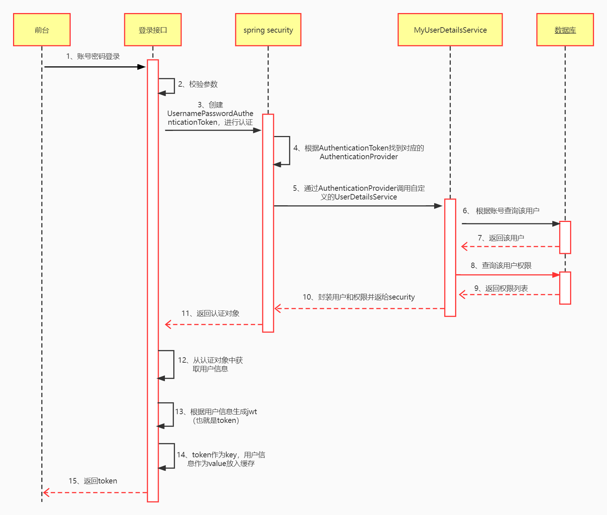
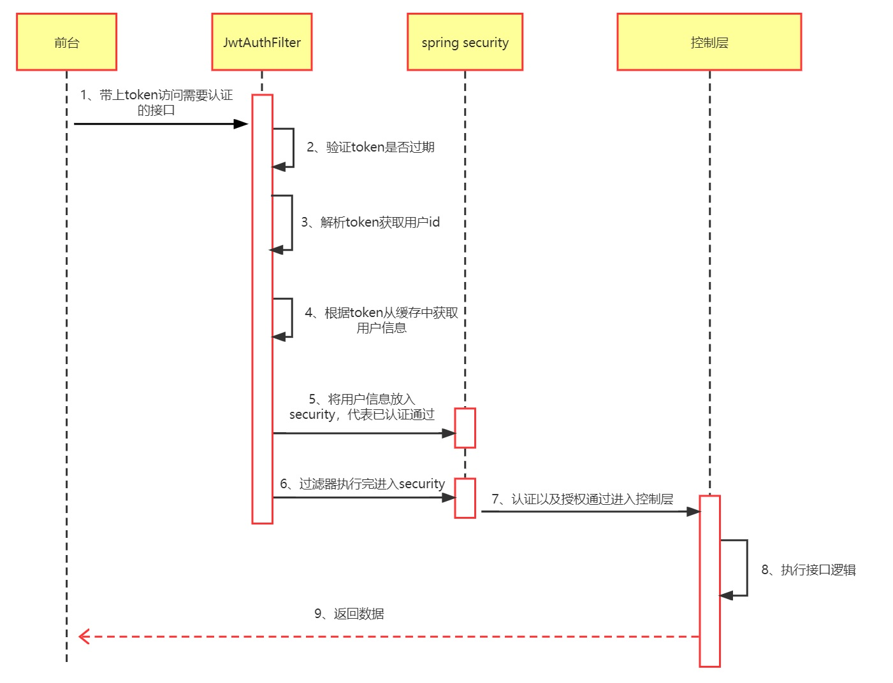

# security-demo说明

[security配置文件目录](./security-demo/src/main/java/xyz/ersut/security/securitydemo/config/security)

该demo中集成了两种认证方式：

1. 账号密码登录
   1. [参考配置](./security-demo/src/main/java/xyz/ersut/security/securitydemo/config/security/jwt)
2. 计算签名（摘要算法MD5）实现认证
   1.  签名的具体计算过程[点击这里](./spring-security集成api加密.md)
   2. [参考配置](./security-demo/src/main/java/xyz/ersut/security/securitydemo/config/security/openapi)

### 账号密码登录

登录逻辑：



其他接口认证逻辑：



[以上两个时序图源文件](./file/账号密码登录认证逻辑.pos)

##### 相关配置

```java
@Configuration
//开启注解式权限
@EnableGlobalMethodSecurity(prePostEnabled = true)
public class SecurityConfig extends WebSecurityConfigurerAdapter {

    @Autowired
    private JwtAuthFilter jwtAuthFilter;
    
    //配置 用户读取的位置（数据库还是缓存或者内存）
    @Bean
    public UserDetailsService userDetailsService(){
        return new MyUserDetailsService();
    }

    //密码的加密解密
    @Bean
    public PasswordEncoder passwordEncoder(){
        return new BCryptPasswordEncoder();
    }

    //配置 spring Security 的规则
    @Override
    public void configure(HttpSecurity http) throws Exception {
        http
                //关闭csrf
                .csrf().disable()
                //不通过Session获取SecurityContext
                .sessionManagement().sessionCreationPolicy(SessionCreationPolicy.STATELESS).and()
                .authorizeRequests()
                //对于登录接口 允许匿名访问(anonymous)
                .antMatchers("/user/login","/").anonymous()
                //对于 /hello 接口,无论是否登录都可以登陆(permitAll)
                .antMatchers("/hello").permitAll()
                //其他接口都需要认证
                .anyRequest().authenticated();

        //将jwt认证过滤器加入Security过滤器链中，并放在 UsernamePasswordAuthenticationFilter 之前
        http.addFilterBefore(jwtAuthFilter, UsernamePasswordAuthenticationFilter.class);

        //允许跨域
        http.cors();
    }
    
    //暴漏 AuthenticationManager
    @Bean
	@Override
	public AuthenticationManager authenticationManagerBean() throws Exception {
	    return super.authenticationManagerBean();
	}
}
```

### 计算签名（摘要算法MD5）实现认证

> 签名的计算逻辑[点击这里](./spring-security集成api加密.md)

认证逻辑与登录的大同小异，但是`AuthenticationProvider`、`AbstractAuthenticationToken`需要自己实现

需要注意：自己实现的`AuthenticationProvider`、`AbstractAuthenticationToken`通过重写`AbstractAuthenticationProvider#supports`方法进行关联

##### 相关配置

```java

@Configuration
//开启注解式权限
@EnableGlobalMethodSecurity(prePostEnabled = true)
public class SecurityConfig extends WebSecurityConfigurerAdapter {

    @Autowired
    private OpenAPIFilter openAPIFilter;

    //配置 spring Security 的规则
    @Override
    public void configure(HttpSecurity http) throws Exception {
        http
                //关闭csrf
                .csrf().disable()
                //不通过Session获取SecurityContext
                .sessionManagement().sessionCreationPolicy(SessionCreationPolicy.STATELESS).and()
                .authorizeRequests()
                //对于 /hello 接口,无论是否登录都可以登陆(permitAll)
                .antMatchers("/hello").permitAll()
                //其他接口都需要认证
                .anyRequest().authenticated();

        http
                .authenticationProvider(new OpenApiAuthenticationProvider())
                .addFilterBefore(openAPIFilter, UsernamePasswordAuthenticationFilter.class);

        //允许跨域
        http.cors();
    }

    //暴漏 AuthenticationManager
    @Bean
	@Override
	public AuthenticationManager authenticationManagerBean() throws Exception {
	    return super.authenticationManagerBean();
	}

}
```

