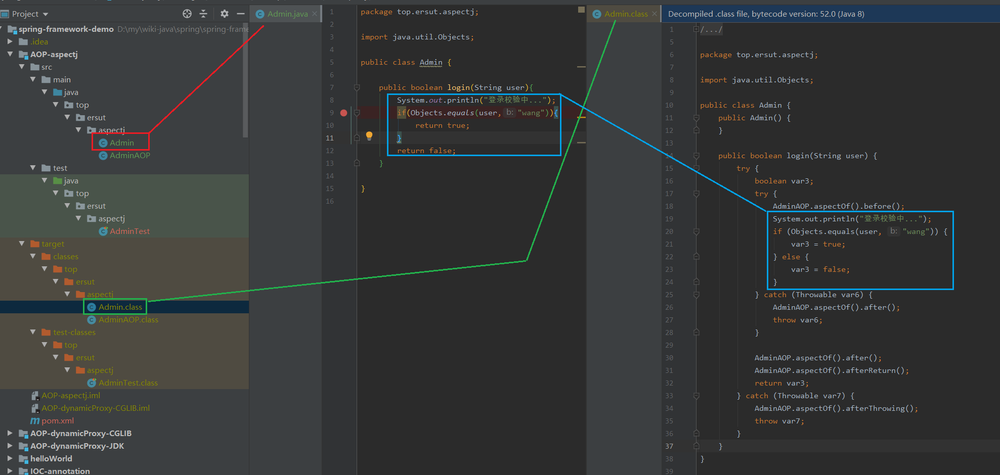

# AOP面向切面编程

## 什么是AOP
1. AOP 是个思想,其实现框架有**AspectJ**、spring AOP
2. AOP（面向切面编程）是能够让我们在不影响原有功能的前提下，为软件**横向扩展功能,功能增强**。
3. AOP降低了代码的耦合度，提高开发效率

## Spring AOP的实现原理

Spring AOP底层通过动态代理进行功能扩展

### 动态代理的两种方式
1. JDK动态代理
	1. 要代理的类必须是接口实现类
	2. 通过接口生成代理类，代理类进行功能扩展
	3. 由于接口类不允许private方法，所以代理类的private方法无法代理
	4. 由于接口类的static方法的具体实现是由本类实现的，所有实现类无法重写static方法，这代表着代理类无法代理static方法
	5. [项目示例](./spring-framework-demo/AOP-dynamicProxy-JDK),部分代码：
		1. 接口:必须有接口不然JDK动态代理无法实现
		```
		public interface UserServer {
		    void add();
		    void all();
		}
		```

		2. 调用处理器:动态代理处理的事情（invoke方法内,他是InvocationHandler的方法）
		```
		public class MyInvocationHandler implements InvocationHandler {

		    private Object obj;
		
		    public MyInvocationHandler(Object obj){
		        this.obj = obj;
		    }
		
		    @Override
		    public Object invoke(Object proxy, Method method, Object[] args) throws Throwable {
		        System.out.println(obj.getClass().getSimpleName()+"."+method.getName()+":before");
		        //调用被代理类的方法
		        Object result = method.invoke(obj,args);
		        System.out.println(obj.getClass().getSimpleName()+"."+method.getName()+":after");
		        return result;
		    }
		}
		```

		3. 单元测试
			1. 创建代理对象方法：public static Object newProxyInstance(ClassLoader loader,Class<?>[] interfaces,InvocationHandler h)
				1. 形参 loader 是类加载器
				2. 形参 interfaces 是接口数组，填写被代理类实现的接口
				3. 形参 h 是调用处理器
				4. 返回对象是生成的代理类对象
			2. 代码
			```
		    @Test
		    void tset() {
		        //不使用代理
		        System.out.println("不使用代理\n");
		        UserServer userServer = new UserServerImpl();
		        userServer.add();
		        System.out.println();
		        userServer.all();
		
		        System.out.println("----------------------");
		
		        //使用代理
		        System.out.println("使用代理\n");
		        UserServer userServerProxy = (UserServer) Proxy.newProxyInstance(this.getClass().getClassLoader(),new Class[]{UserServer.class},new MyInvocationHandler(new UserServerImpl()));
		        userServerProxy.add();
		        System.out.println();
		        userServerProxy.all();
		    }
			```
	4. 动态代理生成的代理类，[查看内存中的类](./../base/memory-class.md)
	```
	public final class $Proxy9 extends Proxy
	  implements UserServer
	{

	  ...

	  private static Method m3;
	
	  public $Proxy9(InvocationHandler paramInvocationHandler)
	  {
	    super(paramInvocationHandler);
	  }
	
	  public final void all()
	  {
	    try
	    {
		  //this.h 就是 MyInvocationHandler 实例
	      this.h.invoke(this, m3, null);
	      return;
	    }
	    catch (RuntimeException localRuntimeException)
	    {
	      throw localRuntimeException;
	    }
	    catch (Throwable localThrowable)
	    {
	    }
	    throw new UndeclaredThrowableException(localThrowable);
	  }
	
	  static
	  {
	    try
	    {

		  ...

	      m3 = Class.forName("top.ersut.spring.server.UserServer").getMethod("all", new Class[0]);

		  ...

	      return;
	    }
	    catch (NoSuchMethodException localNoSuchMethodException)
	    {
	      throw new NoSuchMethodError(localNoSuchMethodException.getMessage());
	    }
	    catch (ClassNotFoundException localClassNotFoundException)
	    {
	    }
	    throw new NoClassDefFoundError(localClassNotFoundException.getMessage());
	  }
	
	  ...

	}
	```

2. CGLIB动态代理
	1. 生成当前类的子类（代理类），进行扩展
	2. 由于CGLIB代理是通过子类实现的，那么代理类的 final 方法、private 方法 无法代理。
	3. CGLIB未实现代理static方法,即使实现了也需要通过反射去调用,类似下面代码比较麻烦
	```
	Object userServerObject = Enhancer.create(UserServer.class,null,new MyMethodInterceptor());
	Method addStatic = userServerObject.getClass().getMethod("addStatic");
    addStatic.invoke(userServerObject,null);
	```
	4. [项目示例](./spring-framework-demo/AOP-dynamicProxy-CGLIB),部分代码
		1. 被代理的类
		```
		public class UserServer {
		    public void add() {
		        System.out.println(this.getClass().getSimpleName()+".add:run");
		    }
		
		    public void all() {
		        System.out.println(this.getClass().getSimpleName()+".all:run");
		    }
		}
		```

		2. 回调类，类似JDK动态代理的调用处理器
		```
		public class MyMethodInterceptor implements MethodInterceptor {

		    /**
		     * @param obj 代理类
		     * @param method 被代理类的方法
		     * @param args 方法的参数
		     * @param proxy 代理类调用父类的方法（super.xxx()）
		     */
		    @Override
		    public Object intercept(Object obj, Method method, Object[] args, MethodProxy proxy) throws Throwable {
		        System.out.println(obj.getClass().getSimpleName()+"."+method.getName()+":before");
		        //调用被代理类的方法,注意是invokeSuper
		        Object result = proxy.invokeSuper(obj,args);
		        System.out.println(obj.getClass().getSimpleName()+"."+method.getName()+":after");
		        return result;
		    }
		}
		```

		3. 测试方法
		```
	    @Test
	    void tset() {
	        //不使用代理
	        System.out.println("不使用代理\n");
	        UserServer userServer = new UserServerImpl();
	        userServer.add();
	        System.out.println();
	        userServer.all();
	
	        System.out.println("----------------------");
	
	        //使用代理
	        System.out.println("使用代理\n");
	        UserServer userServerProxy = (UserServer) Proxy.newProxyInstance(this.getClass().getClassLoader(),new Class[]{UserServer.class},new MyInvocationHandler(new UserServerImpl()));
	        userServerProxy.add();
	        System.out.println();
	        userServerProxy.all();
	    }
		```

		4. 生成的代理类,部分代码
		```
		public class UserServer$$EnhancerByCGLIB$$12fbbc62 extends UserServer implements Factory {

			...

		    private static final Method CGLIB$all$0$Method;
    		private static final MethodProxy CGLIB$all$0$Proxy;
			private static final Object[] CGLIB$emptyArgs;

			...

		    static {
		        CGLIB$STATICHOOK1();
		    }

		    static void CGLIB$STATICHOOK1() {

				...

				CGLIB$emptyArgs = new Object[0];

				//代理类
		        Class var0 = Class.forName("top.ersut.spring.server.UserServer$$EnhancerByCGLIB$$12fbbc62");
				//被代理类
		        Class var1 = Class.forName("top.ersut.spring.server.UserServer");

		        Method[] var10000 = ReflectUtils.findMethods(new String[]{"all", "()V", "add", "()V"}, var1.getDeclaredMethods());

				//被代理类的方法
		        CGLIB$all$0$Method = var10000[0];
				//代理类调用父类的方法（super.xxx()）
		        CGLIB$all$0$Proxy = MethodProxy.create(var1, var0, "()V", "all", "CGLIB$all$0");
				
				...

		    }
					
		    final void CGLIB$all$0() {
		        super.all();
		    }

		    public final void all() {
				//回调类
		        MethodInterceptor var10000 = this.CGLIB$CALLBACK_0;
		        if (var10000 == null) {
		            CGLIB$BIND_CALLBACKS(this);
		            var10000 = this.CGLIB$CALLBACK_0;
		        }
		
		        if (var10000 != null) {
		            var10000.intercept(this, CGLIB$all$0$Method, CGLIB$emptyArgs, CGLIB$all$0$Proxy);
		        } else {
		            super.all();
		        }
		    }

		}
		```

### Spring AOP具体使用哪种动态代理
因为JDK动态代理仅支持实现接口的类，所以当具体切面的方法有对应接口那么使用JDK动态代理否则使用CGLIB动态代理。


## 专业术语

### 连接点(Joint point)
接入点指的是类中**可增强**的方法

### 切入点(Pointcut)
切入点指的是类中实际**要增强**的方法

### 通知（Advice）
通知指的要增强的功能点

#### 通知类型
- 前置通知：指切入点方法执行前的逻辑
- 最终通知：指切入点方法执行完毕或return后的逻辑,**若无论抛出异常都执行**这部分逻辑
- 返回通知：指切入点方法执行完毕或return后的逻辑,**若抛出异常**则**不执行**这部分逻辑
- 异常通知：指切入点方法抛出异常后执行的逻辑
- 环绕通知：指切入点方法前后添加逻辑

### 切面
将通知应用到切入点的动作称为切面

## AspectJ
1. AspectJ实现了AOP思想
2. AspectJ所采用的静态编织技术（我理解为静态代理的另一种实现方式），而非动态代理实现
3. AspectJ不受类的特殊限制,不管方法是private、static、final的,都可以代理

### 静态编织是什么
在编译期或者编译后将增强逻辑织入形成含有增强逻辑的字节码文件。

### 相关注解
- @Aspect：标识是一个切面类
- @Before：前置通知的逻辑
- @After：最终通知的逻辑
- @AfterReturning：返回通知的逻辑
- @AfterThrowing：异常通知的逻辑
- @Around：环绕通知的逻辑

其总通知类注解的value属性是一个切入点表达式

### 切入点表达式写法
格式：execution([访问修饰符] 返回值 全类名.方法名(参数列表))

示例：( '..'、'*' 这俩个是通配符)

|说明|切入点表达式|
|----:|:----|
|匹配具体方法|public boolean top.ersut.aspectj.Admin.login(java.lang.String)|
|匹配所有返回类型|public * top.ersut.aspectj.Admin.login(java.lang.String)|
|匹配所有作用域|* boolean top.ersut.aspectj.Admin.login(java.lang.String)|
|匹配所有作用域(忽略方式)|boolean top.ersut.aspectj.Admin.login(java.lang.String)|
|匹配所有参数(匹配1个或多个)|public boolean top.ersut.aspectj.Admin.login(*)|
|匹配所有参数(匹配0个或多个)|public boolean top.ersut.aspectj.Admin.login(..)|
|匹配所有方法名|public boolean top.ersut.aspectj.Admin.*(java.lang.String)|
|匹配所有包|public boolean *..Admin.login(java.lang.String)|
|匹配前缀为‘log’的所有方法|public boolean top.ersut.aspectj.Admin.log*(..)|
|匹配所有方法| \* \*..\*.\*(..)|


### 注意事项
AspectJ中环绕通知与最终通知、返回通知、异常通知冲突

### [示例](./spring-framework-demo/AOP-aspectj),静态编织的体现
切入点方法源码与字节码比较



相比来看字节码文件中多出了很多代码,这些多出来的代码就是静态编织的；这些多出来的代码是根据`AdminAOP.java`类所生成的。

AdminAOP.java
```

@Aspect
public class AdminAOP{


    @Before("execution(* top.ersut.aspectj.Admin.login(..))")
    public void before(){
        System.out.println("前置通知：开始登录...");
    }

    @After("execution(* top.ersut.aspectj.Admin.login(..))")
    public void after(){
        System.out.println("最终通知：登录关闭...");
    }

    @AfterReturning("execution(* top.ersut.aspectj.Admin.login(..))")
    public void afterReturn(){
        System.out.println("返回通知：登录结束...");
    }

    @AfterThrowing("execution(* top.ersut.aspectj.Admin.login(..))")
    public void afterThrowing(){
        System.out.println("异常通知：登录异常...");
    }

//    @Around("execution(* top.ersut.aspectj.Admin.login(..))")
    public Object around(ProceedingJoinPoint proceedingJoinPoint) throws Throwable {
        System.out.println("环绕通知：["+proceedingJoinPoint.getArgs()[0]+"]登录结...");
        Object obj = proceedingJoinPoint.proceed();
        System.out.println("环绕通知：["+proceedingJoinPoint.getArgs()[0]+"]登录束...");
        return obj;
    }
}
```

## Spring AOP示例

### 依赖包

### 表达式