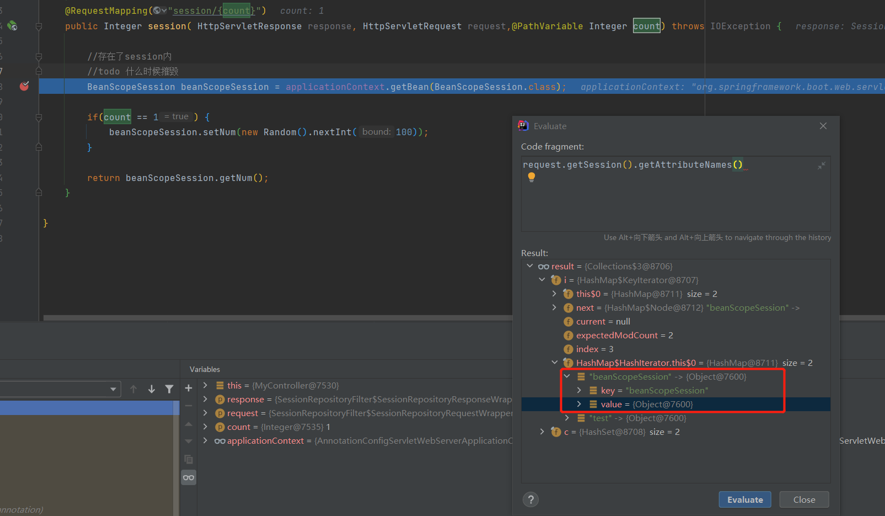

# bean 的作用域

|      作用域 | 描述                                                         |
| ----------: | ------------------------------------------------------------ |
|   singleton | 单例模式，不管引用多少次都是同一个实例，默认值               |
|   prototype | 原型模式，每次引用的都是不同的实例                           |
|     request | 作用域限制在http请求的生命周期。也就是说每个请求的实例不同，但是一个请求内多次引用是同一个实例。**仅限于web环境内使用。**[测试用例](./spring-framework-demo/IOC-Bean-scope-web-annotation/src/test/java/top/ersut/spring/ioc/BeanScopeRequestTest.java) |
|     session | 作用域限制在http中session的生命周期。**仅限于web环境内使用。**[测试用例](./spring-framework-demo/IOC-Bean-scope-web-annotation/src/test/java/top/ersut/spring/ioc/BeanScopeSessionTest.java) |
| application | 作用域限制在`ServletContext`的生命周期。**仅限于web环境内使用。** |
|   websocket | 作用域限制在websocket的生命周期。**仅限于web环境内使用。**   |

  **注意:**

1. prototype作用域下，spring不完全管理其生命周期，配置的摧毁方法不会被调用，[示例代码](./spring-framework-demo/IOC-Bean-scope-annotation/src/test/java/top/ersut/spring/ioc/BeanScopePrototypeTest.java)

2. **作用域的`proxyMode`属性**

	1. 作用：是否使用代理使用哪种代理

	2. 有4个值：DEFAULT（默认值，不代理）、NO（不代理）、INTERFACES（JDK代理需要接口）、TARGET_CLASS（CGLIB代理可以没有接口）

	3. 代理的作用：**对于不进行代理的request、session作用域bean较简单的方法是使用方法注入（[@Lookup](./IOC-@Lookup.md)）**，更简单的方式是使用代理将bean注入给对象。

	4. `@RequestScope`、`@SessionScope`注解默认使用CGLIB代理

		```java
		@Scope(WebApplicationContext.SCOPE_REQUEST)
		public @interface RequestScope {
		   @AliasFor(annotation = Scope.class)
		   ScopedProxyMode proxyMode() default ScopedProxyMode.TARGET_CLASS;
		}
		
		@Scope(WebApplicationContext.SCOPE_SESSION)
		public @interface SessionScope {
			@AliasFor(annotation = Scope.class)
			ScopedProxyMode proxyMode() default ScopedProxyMode.TARGET_CLASS;
		}
		```

3. session作用域下，实现的方式是将bean序列化存入session中，使用时在session中取出反序列化给bean，具体看下图

  


