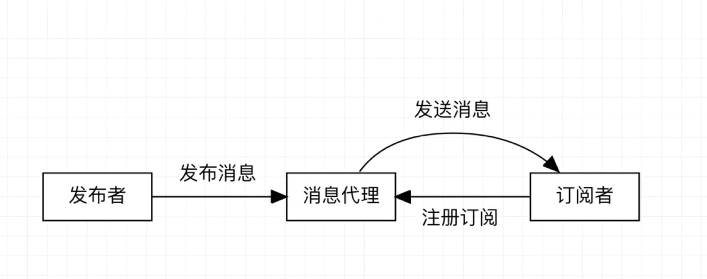

# spring WebFlux

## 什么是 WebFlux 

- WebFlux 是一个 web 框架，功能与springMVC类似
- WebFlux 是**响应式编程（即异步非阻塞的）框架** 
- WebFlux 需要Servlet3.1+支持
- WebFlux 的核心基于**spring Reactor**的API实现

## 什么是异步非阻塞

异步非阻塞是俩个词，即异步、非阻塞

### 什么是异步

- 异步的反义词是同步。
- 异步、同步是调用方（客户端）的情况
- 异步指的是调用后不等待结果继续执行后续的操作

例如：用户的行为，其中行为日志进行异步添加，不影响这个行为具体业务的执行，从而加快程序的处理

### 什么是非阻塞

- 非阻塞的反义词是阻塞
- 非阻塞、阻塞是被调用方（服务端）的情况
- 非阻塞指的是被调用后先给结果再执行具体逻辑

## spring Reactor是什么

- spring Reactor 是一个响应式框架
- 符合 Reactive Streams 规范（Reactive Streams 是由 Netflix、TypeSafe、Pivotal 等公司发起的）的一项技术

## WebFlux 与 springMVC 比较

### 相同点
- 都支持基于注解的编程模型
- 都在tomcat等容器内运行，WebFlux 需要Servlet3.1+

### 不同点
- WebFlux 需要 JDK1.8 的支持，springMVC 支持更低版本的JDK
- springMVC 是阻塞式框架，WebFlux 是非阻塞式框架

### 如何抉择使用哪个框架
- 如果是老旧项目就使用 SpringMVC
- 在熟悉 Java 8 lambdas表达式的前提下，开发新项目可以使用 WebFlux

**如果未来转向 WebFlux 可以在 SpringMVC 中使用 WebClient 进行网络请求**


## 响应式编程

### 什么是响应式编程

响应式编程是一种面向数据流和变化传播的编程范式。这意味着可以在编程语言中很方便地表达静态或动态的数据流，而相关的计算模型会自动将变化的值通过数据流进行传播。

例如：

excle就是响应式编程的一个例子。单元格可以包含字面值或类似"=B1+C1"的公式，而包含公式的单元格的值会依据其他单元格的值的变化而变化。

### Java实现(JDK1.8以及之前版本)

java 提供了**观察者模式**的连个类`Observer`和`Observable`。被观察的类继承于`Observable`类，每个观察者类都需要实现`Observer`接口。

代码示例：

```
//继承Observable
public class ObserverDemo extends Observable {
    public static void main(String[] args) {
        ObserverDemo demo = new ObserverDemo();
        //实现Observer接口并添加到Observable
        demo.addObserver((o,arg)->{
            System.out.println("观察者1:"+arg);
        });
        demo.addObserver((o,arg)->{
            System.out.println("观察者2:"+arg);
        });

        //设置变化点
        demo.setChanged();
        //通知变化
        demo.notifyObservers(11);
    }
}
```

### Reactor实现

#### 依赖包

```
<dependency>
    <groupId>io.projectreactor</groupId>
    <artifactId>reactor-core</artifactId>
    <version>3.4.3</version>
</dependency>
```

#### 介绍

##### 其设计模式：发布\订阅

发布订阅模型



##### 发布者核心类：`Mono`、`Flux`
- 都实现了`Publisher`接口，并提供了丰富的操作符；
- 都是发布数据流；
- 都可以发出三种信号：元素值、错误信号（同时携带错误信息）、完成信号。
	- 错误信号和完成信号都是终止信号(告诉订阅者数据流结束了)，不能共存的
	- 没有发送任何元素值，而是直接发送错误或者完成信号，表示是空数据流
	- 没有错误信号，没有完成信号，表示是无限数据流
- `Mono`是0到1个元素的发布者
- `Flux`是0到N个元素的发表者

#### 示例
- 声明元素

```
//使用Flux声明元素
Flux.just("测试","test",123);

//使用Mono声明元素
Mono.just(234);
```

- 声明元素并订阅

```
//使用Flux声明元素并订阅
Flux.just("测试","test",123).subscribe(System.out::println);

System.out.println();

//使用Mono声明元素并订阅
Mono.just("list").subscribe(System.out::println);
```

### [项目示例](./spring-framework-demo/webFlux-reactive-programming)

## <div id="webFulx-annotation"></div>spring WebFlux 注解式编程模型

### 依赖

```
<dependency>
    <groupId>org.springframework.boot</groupId>
    <artifactId>spring-boot-starter-webflux</artifactId>
</dependency>
```

注意：需要springboot2.0以上版本，因为2.0以上版本基于spring5开发

### [示例项目](./spring-framework-demo/webFlux-annotation)

### 使用springMVC实现相同功能：[示例项目](./spring-framework-demo/MVC-annotation)


## <div id="webFulx-func"></div>spring WebFlux 函数式编程模型

需要 lambda 、 函数式编程、spring Reactor 的基础，待学完再回来更新。

## <div id="webFulx-client"></div>webClient

需要 spring Reactor 基础，待学完再回来更新。

### [示例](./spring-framework-demo/webFlux-annotation/src/test/java/top/ersut/webflux/controller/UserControllerTest.java)