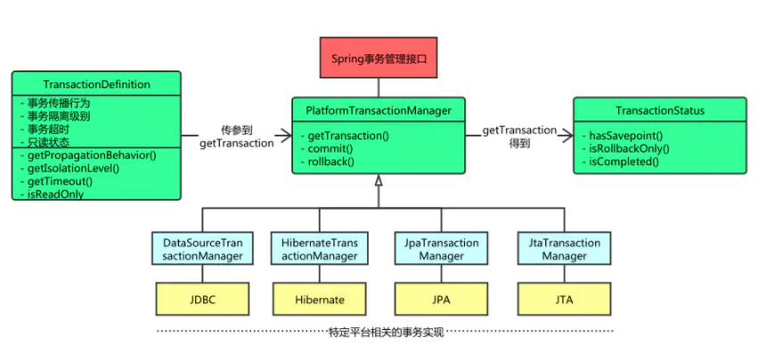

# 事务

## 什么是事务
事务是数据库的最小工作单元，其作用是对数据库中的一组操作要么都执行，要么都不执行

例如：

1. 5条sql，第三条报错那么整体都不执行;前两条sql虽然没有报错但是也不执行，后两条因为第三条报错不再运行。
2. 业务中如果程序异常，那这条业务中的sql都可以不执行。

## 什么场景下应用
- 转账业务:张三转给李四500元,分两步
	1. 张三账户减少500
	2. 李四账户增加500

  我们不能因为李四账户增加500失败而张三账户减少500，所已两个步骤要一起撤回（这个撤回操作事务中成为回滚）


## <div id="characteristic"></div>事务的四个特性

### 原子性

原子性是指事务包含的所有操作要么全部成功，要么全部失败回滚。

### 一致性

一致性是指事务必须使数据库从一个一致性状态变换到另一个一致性状态，也就是说一个事务执行之前和执行之后都必须处于一致性状态

例如：

张三银行存款1000元，李四银行存款500元，他们俩个总共1500元。

张三转给李四200元，张三剩余800元，李四增加到700元；他们两个加起来还是1500元。

转账前后总和都是1500元，这就是事务的一致性。


### 隔离性

当多个事务同时操作一张表时互不干扰相互隔离，关于事务的隔离数据库提供了多种隔离级别，详情点击[事务的隔离性](./transaction.md#Isolation)

### 持久性

事务一旦提交后，数据库中数据的改变也是永久的，即使在提交前数据库故障了也不会丢失这个操作。

例如：

用户在前台注册账号，提交事务后提示用户注册成功，如果数据库丢失了事务提交那将造成重大失误，这是不允许的。

## <div id="program"></div>使用spring控制事务（编程式），已转账为例

### [示例项目](./spring-framework-demo/transaction-program)

### 依赖包

```
<!-- 事务 -->
<dependency>
    <groupId>org.springframework</groupId>
    <artifactId>spring-tx</artifactId>
    <version>${spring.version}</version>
</dependency>
```

### <div id="PlatformTransactionManager"></div>PlatformTransactionManager接口类（命令式事务管理器中心接口类）

类图：



#### TransactionDefinition类

用来定义事务的一些属性的接口，例如事务的传播行为、隔离性、超时时间、等等

#### TransactionStatus 类

存储事务状态的接口

#### 命令式事务管理器实现类

- DataSourceTransactionManager：jdbc的事务管理器
- JtaTransactionManager：分布式事务管理器
- HibernateTransactionManager:Hibernate事务管理器
- JpaTransactionManager:jpa事务管理器

多说一句**mybatis是自己处理的事务**没有实现PlatformTransactionManager接口


### 配置jdbc事务管理器

```
@Bean
public DataSourceTransactionManager transactionManager(@Qualifier("druidDataSource") DataSource dataSource){
    DataSourceTransactionManager dataSourceTransactionManager = new DataSourceTransactionManager();
    dataSourceTransactionManager.setDataSource(dataSource);
    return dataSourceTransactionManager;
}
```

### 数据库表结构

#### account表
|列名|类型|含义|
|---|---|---|
|id|bigint|主键|
|user_name|varchar(50)|姓名|
|money|bigint|账户金额|

### 没有事务的情况下抛出异常

由于没有事务，执行的sql将实时入库不可回滚，所以遇到异常，异常前的sql正常执行，异常后的sql不再执行，这样就丢失了一致性

#### 关键代码

```
public boolean transferAccountsNotTransaction(Long formId, Long toId, Long money) {

    try{
        // form 账户减掉200
        AccountChangeDTO accountChangeFrom = new AccountChangeDTO();
        accountChangeFrom.setId(formId);
        accountChangeFrom.setChangemoney(-money);
        int row = accountDao.moneyChange(accountChangeFrom);
        if(row <= 0){
            throw new Exception("转账来源错误");
        }

        /** 制造异常 */
        int num = 1/0;

        // to 账户增加200
        AccountChangeDTO accountChangeTo = new AccountChangeDTO();
        accountChangeFrom.setId(formId);
        accountChangeFrom.setChangemoney(money);
        row = accountDao.moneyChange(accountChangeTo);
        if(row <= 0){
            throw new Exception("转账接收方错误");
        }
    } catch (Exception e){
        e.printStackTrace();
        return false;
    }

    return true;
}
```

#### 测试用例

```
Long zhangsangId;
Long lisiId;
@Test
void transferAccountsNotTransaction() {
    boolean flag = accountService.transferAccountsNotTransaction(zhangsangId,lisiId,200L);
    Assertions.assertEquals(flag,false);

    //初始金额为1000
    Account zhangsan = accountService.queryById(zhangsangId);
    Assertions.assertEquals(zhangsan.getMoney(),800L);

    //由于异常接收方的金额变动还没有执行，所以金额还是500
    Account lisi = accountService.queryById(lisiId);
    Assertions.assertEquals(lisi.getMoney(),500L);
}
```

#### 最终数据库数据
id|user_name|money
----|:----:|:----:
29|张三|800
30|张三|500

一开始两人总共1800元，最终由于异常 张三 金额变动成功，李四 金额变动未执行，导致最后两个人总共1600元，200元不翼而飞。这种情况是不允许的，需要使用事务来解决。

### 使用事务时抛出异常

当有事务时遇到异常可以回滚数据，避免了上边的问题。

#### 关键代码

```
public boolean transferAccountsTransaction(Long formId, Long toId, Long money) {
    //设置事务的属性（隔离级别、传播行为、超时时间、等）
    TransactionDefinition transactionDefinition = new DefaultTransactionDefinition();
    //开启事务
    TransactionStatus transactionStatus = platformTransactionManager.getTransaction(transactionDefinition);

    try{
        // form 账户减掉 money 
        AccountChangeDTO accountChangeFrom = new AccountChangeDTO();
        accountChangeFrom.setId(formId);
        accountChangeFrom.setChangemoney(-money);
        int row = accountDao.moneyChange(accountChangeFrom);
        if(row <= 0){
            throw new Exception("转账来源错误");
        }

        /** 制造异常 */
        int num = 1/0;

        // to 账户增加 money 
        AccountChangeDTO accountChangeTo = new AccountChangeDTO();
        accountChangeFrom.setId(formId);
        accountChangeFrom.setChangemoney(money);
        row = accountDao.moneyChange(accountChangeTo);
        if(row <= 0){
            throw new Exception("转账接收方错误");
        }
    } catch (Exception e){
        e.printStackTrace();
        platformTransactionManager.rollback(transactionStatus);
        return false;
    }

    platformTransactionManager.commit(transactionStatus);
    return true;

}
```

#### 测试用例

```
@Test
void transferAccountsTransaction() {
    boolean flag = accountService.transferAccountsTransaction(zhangsangId,lisiId,200L);
    Assertions.assertEquals(flag,false);

    //初始金额为1000 事务回滚后金额不变
    Account zhangsan = accountService.queryById(zhangsangId);
    Assertions.assertEquals(zhangsan.getMoney(),1000L);

    //由于异常接收方的金额变动还没有执行，即使执行了因为异常也会回滚，所以金额还是500
    Account lisi = accountService.queryById(lisiId);
    Assertions.assertEquals(lisi.getMoney(),500L);
}
```

#### 最终数据库数据

id|user_name|money
----|:----:|:----:
31|张三|1000
32|李四|500

由于添加了事务，遇到异常后回滚了数据，所有张三扣除的200元并没有提交到数据库，不影响数据库中的数据。

## <div id="statement"></div>声明式事务

### [示例项目](./spring-framework-demo/transaction-statement)

### 开启注解式事务

在配置类上添加 `@EnableTransactionManagement` 注解

示例：

```
@Configuration
//开启注解式事务
@EnableTransactionManagement
public class SpringConf {
}
```

### 使用

在方法上添加 `@Transactional` 注解开启事务

示例：

```
@Transactional
public boolean transferAccountsTransaction(Long formId, Long toId, Long money) throws Exception {

    // form 账户减掉 money
    AccountChangeDTO accountChangeFrom = new AccountChangeDTO();
    accountChangeFrom.setId(formId);
    accountChangeFrom.setChangemoney(-money);
    int row = accountDao.moneyChange(accountChangeFrom);
    if(row <= 0){
        throw new Exception("转账来源错误");
    }

    /** 制造异常 */
    int num = 1/0;

    // to 账户增加 money
    AccountChangeDTO accountChangeTo = new AccountChangeDTO();
    accountChangeFrom.setId(formId);
    accountChangeFrom.setChangemoney(money);
    row = accountDao.moneyChange(accountChangeTo);
    if(row <= 0){
        throw new Exception("转账接收方错误");
    }
        
    return true;

}
```

### 原理

声明式事务通过aop进行切面开启事务、回滚事务、提交事务，部分核心代码：

```

public abstract class TransactionAspectSupport implements BeanFactoryAware, InitializingBean {
	protected Object invokeWithinTransaction(Method method, @Nullable Class<?> targetClass,
			final InvocationCallback invocation) throws Throwable {

		...

		TransactionInfo txInfo = createTransactionIfNecessary(ptm, txAttr, joinpointIdentification);

		Object retVal;
		try {
			//执行代理方法
			retVal = invocation.proceedWithInvocation();
		} catch (Throwable ex) {
			// 回滚
			completeTransactionAfterThrowing(txInfo, ex);
			throw ex;
		}

		...

		//提交
		commitTransactionAfterReturning(txInfo);
		return retVal;

		...

	}
}
```

所以声明式事务遇到异常会自动回滚

## 事务的传播行为

## <div id="Isolation"></div>事务的隔离性