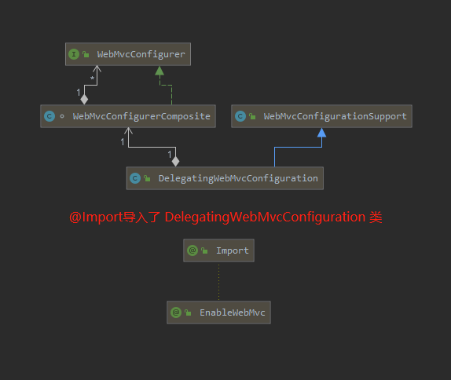

# 【源码解析】@EnableWebMvc & WebMvcConfigurer 

> 相关文章：
>
> - [@Import的作用](../spring-boot/boot-annotation.md#Import)

-------

## 作用

- `@EnableWebMvc`是开启mvc的自定义配置，`WebMvcConfigurer `接口是mvc配置的API。
- 实现`WebMvcConfigurer`的方法可以配置拦截器、跨域请求、静态资源映射处理器、视图控制器等。
- `@EnableWebMvc`有一个类上添加就够了，如果是spring-boot项目这个注解可以不用添加，因为通过自动配置（`EnableWebMvcConfiguration`）已经开启了

**示例**

- [拦截器示例](./spring-framework-demo/enableWebMvc-use/src/main/java/top/ersut/spring/config/InterceptorsConfig.java)
- [视图控制器示例](./spring-framework-demo/enableWebMvc-use/src/main/java/top/ersut/spring/config/ViewControllersConfig.java)

------

**↓↓↓↓↓↓↓↓↓↓↓↓↓↓↓↓↓↓开始看源码↓↓↓↓↓↓↓↓↓↓↓↓↓↓↓↓↓↓开始看源码↓↓↓↓↓↓↓↓↓↓↓↓↓↓↓↓↓↓开始看源码↓↓↓↓↓↓↓↓↓↓↓↓↓↓↓↓↓↓**

## 先认识几个相关类

- WebMvcConfigurationSupport : MVC的缺省配置
- DelegatingWebMvcConfiguration : MVC的配置代理类
- WebMvcConfigurerComposite : MVC的配置委托类
- WebMvcConfigurer : MVC的配置器接口
- @EnableWebMvc : 开启MVC的配置支持

## 类图



**从类图可以看出：**

1. `WebMvcConfigurerComposite`（配置委托类）创建了一组`WebMvcConfigurer`，并实现了`WebMvcConfigurer`接口
2. `DelegatingWebMvcConfiguration`（配置代理类）继承了`WebMvcConfigurationSupport`类，创建了`WebMvcConfigurerComposite `类
3. `@EnableWebMvc`注解通过`@Import`导入了`DelegatingWebMvcConfiguration`类

## 分析第一点，`WebMvcConfigurerComposite`与`WebMvcConfigurer`

### `WebMvcConfigurerComposite`（配置委托类）源码

```java
//实现了WebMvcConfigurer接口
class WebMvcConfigurerComposite implements WebMvcConfigurer {

    //定义了一组WebMvcConfigurer
	private final List<WebMvcConfigurer> delegates = new ArrayList<>();

    //给delegates添加数据
	public void addWebMvcConfigurers(List<WebMvcConfigurer> configurers) {
		if (!CollectionUtils.isEmpty(configurers)) {
			this.delegates.addAll(configurers);
		}
	}

	@Override
	public void configurePathMatch(PathMatchConfigurer configurer) {
		//迭代delegates
		for (WebMvcConfigurer delegate : this.delegates) {
			delegate.configurePathMatch(configurer);
		}
	}

	@Override
	public void configureContentNegotiation(ContentNegotiationConfigurer configurer) {
		//迭代delegates
		for (WebMvcConfigurer delegate : this.delegates) {
			delegate.configureContentNegotiation(configurer);
		}
	}
    
    ...
    
}
```

- 实现了`WebMvcConfigurer`接口，多说一句`WebMvcConfigurer`接口内的方法都是`WebMvcConfigurationSupport`抽象出来的
- 定义了一组`WebMvcConfigurer`，变量`delegates`
- 实现了`WebMvcConfigurer`接口中的所有方法，具体实现都是迭代`delegates`并调用对应的方法。
- `addWebMvcConfigurers`方法实现给delegates添加数据，这个方法是提供给`DelegatingWebMvcConfiguration`类使用的

`WebMvcConfigurerComposite`的作用：**只要调用实现了`WebMvcConfigurer`接口的方法，相当于调用了这一组（变量`delegates`）mvc配置器对应的方法**

## 分析第二点，`WebMvcConfigurerComposite`、`DelegatingWebMvcConfiguration`与`WebMvcConfigurationSupport`的源码

`WebMvcConfigurationSupport`内通过方法注册了大量的 bean ，这些方法内调用了扩展方法，这些扩展方法抽象出了`WebMvcConfigurer`接口。由于代码量比较大只展示静态资源映射处理器。

### `WebMvcConfigurationSupport`源码

```java
public class WebMvcConfigurationSupport implements ApplicationContextAware, ServletContextAware {

    ...
   
    //注册一个bean
	@Bean
	@Nullable
	public HandlerMapping resourceHandlerMapping(
			@Qualifier("mvcContentNegotiationManager") ContentNegotiationManager contentNegotiationManager,
			@Qualifier("mvcConversionService") FormattingConversionService conversionService,
			@Qualifier("mvcResourceUrlProvider") ResourceUrlProvider resourceUrlProvider) {

		Assert.state(this.applicationContext != null, "No ApplicationContext set");
		Assert.state(this.servletContext != null, "No ServletContext set");

		//匹配路径配置器
		PathMatchConfigurer pathConfig = getPathMatchConfigurer();

		//创建注册资源处理器
		ResourceHandlerRegistry registry = new ResourceHandlerRegistry(this.applicationContext,
				this.servletContext, contentNegotiationManager, pathConfig.getUrlPathHelper());
		//调用扩展方法
		addResourceHandlers(registry);

		//获取映射处理器
		AbstractHandlerMapping handlerMapping = registry.getHandlerMapping();
        
		...
        
		return handlerMapping;
	}

	//下边这个方法是不是眼熟，WebMvcConfigurer接口内的方法是抽象的这些扩展方法
	//扩展方法 被DelegatingWebMvcConfiguration类重写
	protected void addResourceHandlers(ResourceHandlerRegistry registry) {
	}
    
    ...
    
}
```

- 注册bean
- 创建注册器
- 调用扩展方法

**`WebMvcConfigurationSupport`的作用：注册bean，bean内创建注册器并调用扩展方法（总感觉缺点啥）**

### `DelegatingWebMvcConfiguration`源码

```java
//配置类
@Configuration(proxyBeanMethods = false)
//继承了WebMvcConfigurationSupport
public class DelegatingWebMvcConfiguration extends WebMvcConfigurationSupport {

	//创建WebMvcConfigurerComposite
	private final WebMvcConfigurerComposite configurers = new WebMvcConfigurerComposite();

    //自动注入用户的mvc配置，并交给WebMvcConfigurerComposite持有
	@Autowired(required = false)
	public void setConfigurers(List<WebMvcConfigurer> configurers) {
		if (!CollectionUtils.isEmpty(configurers)) {
			//交给WebMvcConfigurerComposite持有
			this.configurers.addWebMvcConfigurers(configurers);
		}
	}
    
    //重写扩展方法的实现，代理WebMvcConfigurerComposite对应的方法
	@Override
	protected void configurePathMatch(PathMatchConfigurer configurer) {
		this.configurers.configurePathMatch(configurer);
	}
	
    //重写扩展方法的实现，代理WebMvcConfigurerComposite对应的方法
	@Override
	protected void configureContentNegotiation(ContentNegotiationConfigurer configurer) {
		this.configurers.configureContentNegotiation(configurer);
	}
 
    ...
    
}
```

- 这是个配置类
- 继承了`WebMvcConfigurationSupport`类
- 创建了`WebMvcConfigurerComposite`对象
- 通过自动注入用户的mvc配置，把配置交给`WebMvcConfigurerComposite`持有
- 通过重写扩展方法的实现，代理了`WebMvcConfigurerComposite`对应的方法

`DelegatingWebMvcConfiguration`的作用：

1. 通过自动注入获取用户的mvc配置器并托管给`WebMvcConfigurerComposite`的`delegates`变量
2. 通过`WebMvcConfigurationSupportz`内注册的bean调用这些重写的扩展方法，从而达到调用所有mvc配置器的效果

## 分析第三点：`@EnableWebMvc`

### `@EnableWebMvc`源码

```java
@Retention(RetentionPolicy.RUNTIME)
@Target(ElementType.TYPE)
@Documented
@Import(DelegatingWebMvcConfiguration.class)
public @interface EnableWebMvc {
}
```

- 通过`@Import`导入了`DelegatingWebMvcConfiguration`类

**`@EnableWebMvc`作用：导入`DelegatingWebMvcConfiguration`，只有`DelegatingWebMvcConfiguration`注册bean后才能通过自动注入获取到用户的mvc配置器。**

------

### **思考**

既然`@EnableWebMvc`作用就是注册`DelegatingWebMvcConfiguration`为bean，同时`DelegatingWebMvcConfiguration`又是个配置类，那么扫描包的时候添加上这个类目录是不是就不用使用`@EnableWebMvc`了

可以试试下边的代码：

```java
@SpringBootApplication(exclude = {WebMvcAutoConfiguration.class},scanBasePackageClasses = {DelegatingWebMvcConfiguration.class,Application.class})
public class Application {
    public static void main(String[] args) {
        SpringApplication.run(Application.class,args);
    }
}
```

`exclude = {WebMvcAutoConfiguration.class}`是排除webmvc的自动注入，`scanBasePackageClasses = {DelegatingWebMvcConfiguration.class,Application.class}`是扫描`DelegatingWebMvcConfiguration`类目录以及项目目录。

## 延伸阅读

- [spring-boot的EnableWebMvcConfiguration类 ,相当于注解 @EnableWebMvc（还没写）](../spring-boot/EnableWebMvcConfiguration.md)

