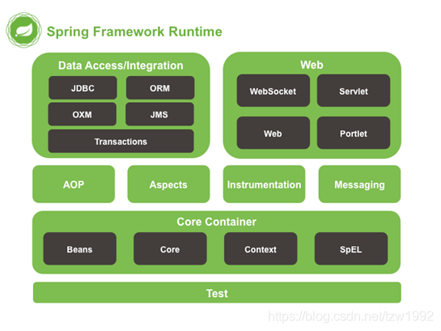

# 创建一个spring5项目

----------

## Spring Framework整体架构



从图中可以看到**核心容器**包含Beans、Core、Context、SpEL各代表：
- Beans：bean支持
- Core：核心库
- Context：运行时上下文
- SpEL：Spring表达式语言

所以创建一个spring5项目最少需要以上4个jar包。

## 创建maven项目,引入依赖
```
<dependency>
	<groupId>org.springframework</groupId>
	<artifactId>spring-beans</artifactId>
	<version>${spring.version}</version>
</dependency>
<dependency>
	<groupId>org.springframework</groupId>
	<artifactId>spring-core</artifactId>
	<version>${spring.version}</version>
</dependency>
<dependency>
	<groupId>org.springframework</groupId>
	<artifactId>spring-context</artifactId>
	<version>${spring.version}</version>
</dependency>
<dependency>
	<groupId>org.springframework</groupId>
	<artifactId>spring-expression</artifactId>
	<version>${spring.version}</version>
</dependency>
<dependency>
	<groupId>org.springframework</groupId>
	<artifactId>spring-expression</artifactId>
	<version>${spring.version}</version>
</dependency>
```
## 简单示例：通过spring调用方法
[点击进入项目目录](./spring5-helloWorld)

Hello.java
```
public class Hello {
    public void world(){
        System.out.println("hello world");
    }
}
```

bean.xml
```
<?xml version="1.0" encoding="UTF-8"?>
<beans xmlns="http://www.springframework.org/schema/beans"
       xmlns:xsi="http://www.w3.org/2001/XMLSchema-instance"
       xsi:schemaLocation="http://www.springframework.org/schema/beans http://www.springframework.org/schema/beans/spring-beans.xsd">

    <!--注入bean-->
    <bean id="hello" class="top.ersut.spring5.Hello"></bean>

</beans>
```

HelloTest.java
```
class HelloTest {
    @Test
    void world() {
        //创建上下文对象
        ApplicationContext applicationContext = new GenericXmlApplicationContext("bean.xml");
        //获取bean
        Hello hello = applicationContext.getBean("hello",Hello.class);
        //调用方法
        hello.world();
    }
}
```
