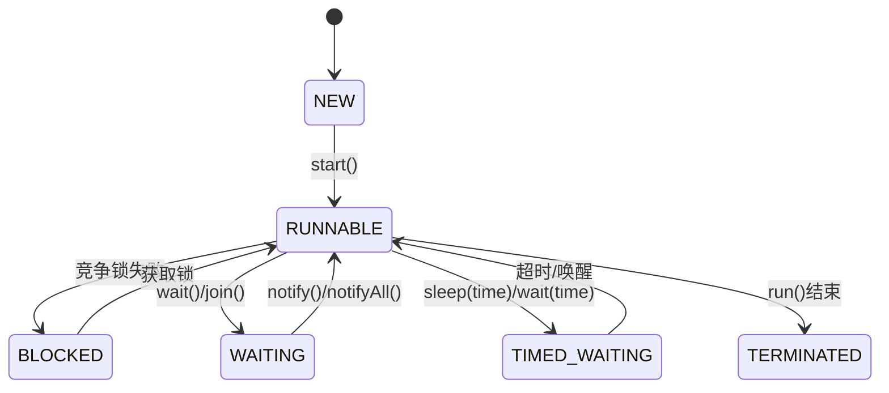

# 进程和线程

> 资料：由 https://javabetter.cn/thread/why-need-thread.html 和 元宝提供

### ⭐️CPU的时间片

CPU通过**时间片**给进程或线程分配使用CPU的时间

- 当 线程\进程 结束时，无论时间片是否结束都立马是否CPU给其他 线程\进程
- 当时间片结束时，线程\进程还未处理完成，那么将当前的 线程\进程 暂停并释放CPU，重新等待新的时间片

### 什么是进程

- **单独占有一部分内存**
- 各个进程之间是相互隔离的，互不干扰
- 进程是操作系统进行资源分配的基本单位

### 什么是线程

- **是进程的一部分，与进程共享其内存**
- 进程的子任务就由线程负责


### 💡关于并发

对于CPU线程和进程都可以实现并发，不过每次创建进程都会分配内存，而线程与进程共享内存，所以**进程要比线程重**！


# 多线程

> 进程：启动一个java项目就是一个进程
>
> 线程：进程的子任务，进程结束，进程内的所有线程也结束。

## 运行线程

创建线程的三种方式

- Thread：无返回值
- Runnable：无返回值
- Callable：**有返回值**

### Thread（类）

继承Thread类，重写run方法。

通过Thread.start()启动线程

### Runnable（接口）

实现Runnable接口的run方法

通过 new Thread(Runnable).start()启动线程

### Callable（接口）

实现Callable接口的call方法

将Callable包装到FutureTask。

通过new Thread(FutureTask).start()启动线程

### 面试点

- Runnable接口和Callable接口的实现可以复用到多个线程，Thread是类不具备这个功能（💡一个线程只能运行一次）
- 一个线程只能运行一次

## 线程的状态

⭐️**线程的六种状态：创建、运行、阻塞、无限等待、超时等待、终止**

```java
public enum State {
    //创建
    NEW,
    //运行
    RUNNABLE,
    //阻塞
    BLOCKED,
    //无限等待
    WAITING,
    //超时等待 
    TIMED_WAITING,
    //终止
    TERMINATED;
}
```



### 面试点

💡**`Thread.sleep(long)` 和 `Object.wait(long)`的区别**

他俩都可以将线程从 `RUNNABLE状态`转换为`TIMED_WAITING`状态，但是 

- `Thread.sleep(long)`**不会释放锁**，只是休眠一段时间
- `Object.wait(long)`**会释放锁**，时间到了继续争夺锁


💡**`Object.wait(long)` 和`Object.wait()`的区别**

 他们两个都可以通过` notify()`或`notifyAll()`唤醒，但是 `Object.wait(long)`时间到了之后自动唤醒，而`Object.wait()`只能被动唤醒


💡**`Thread.join(long)`与`Thread.join()`的功能和区别**

`.join` 是等待阻塞主线程，等待子线程的结果。`Thread.join(long)`会等待一段时间，即使线程**没有结果也会结束阻塞**；`Thread.join()`会一直阻塞等待结果。

## 线程中断

Thread 类里提供的关于线程中断的几个方法：

- `Thread.interrupt()`：中断线程。这里的中断线程并不会立即停止线程，而是设置线程的中断状态为 true（默认是 flase）；
- `Thread.isInterrupted()`：测试当前线程是否被中断。
- `Thread.interrupted()`：检测当前线程是否被中断，与 `isInterrupted()` 方法不同的是，这个方法如果发现当前线程被中断，会清除线程的中断状态。

在线程中断机制里，当其他线程通知需要被中断的线程后，线程**中断的状态被设置为 true**，但是**具体被要求中断的线程要怎么处理，完全由被中断线程自己决定**，可以在合适的时机中断请求，也可以完全不处理继续执行下去。

摘抄自：https://javabetter.cn/thread/thread-state-and-method.html#%E7%BA%BF%E7%A8%8B%E4%B8%AD%E6%96%AD

## 线程组（`ThreadGroup`）

线程组可以统一管理线程

**每个 Thread 必然存在于一个 ThreadGroup 中，Thread 不能独立于 ThreadGroup 存在。**

执行`main()`方法的线程名字是 main，如果在 new Thread 时没有显式指定，那么默认将父线程（`main()`方法的线程）线程组设置为自己的线程组。


`ThreadGroup`的成员变量

```java
public class ThreadGroup implements Thread.UncaughtExceptionHandler {
    private final ThreadGroup parent; // 父亲ThreadGroup
    String name; // ThreadGroup 的名称
    int maxPriority; // 最大优先级
    boolean destroyed; // 是否被销毁
    boolean daemon; // 是否守护线程
    boolean vmAllowSuspension; // 是否可以中断

    int nUnstartedThreads = 0; // 还未启动的线程
    int nthreads; // ThreadGroup中线程数目
    Thread threads[]; // ThreadGroup中的线程

    int ngroups; // 线程组数目
    ThreadGroup groups[]; // 线程组数组
}
```

**线程组内还可以包含线程组（groups参数）**

通过`maxPriority`变量可以统一控制线程组内线程的优先级

## 线程的优先级

线程的优先级分为十个等级（1~10），1是最高级，Java的默认值是5。**这个优先级只是给系统一个参考值，具体执行顺序由系统决定。**

⚠️**顺序性逻辑（业务），不要依靠这个优先级实现，因为具体执行顺序由系统决定！！**


### 守护线程（Daemon）

- 守护进程主要服务与其他线程，比如定时任务。

- 在所有非守护线程结束了，那么守护线程会自动关闭！

- 创建线程时默认是非守护线程，通过`Thread.setDaemon(true)`设置为守护线程

- ⚠️结束守护线程时，该线程不会收到消息和通知，所以**<span style="color:red">在守护线程中不要使用任何需要关闭的资源</span>**比如读取文件等

## 线程的安全问题：原子性、可见性、活跃性

### 原子性

**指所有操作要么全部成功，要么全部失败。**

```java
int i = 0; //原子操作
i++; //非原子操作
```

验证 i++ 非原子性操作：

不同的线程在操作 i（共享变量）， 对该变量进行i++操作，这是3个步骤（read-modify-write）：读取、修改、赋值（写入），现在有两个线程进行如下操作：


💡读取时是从**主内存**读取，而修改是在 i++的写入操作是在**工作内存**进行的，写入操作是将修改后的值写入到主内存，

而A线程可能读取的B线程未写入到主内存的值（即旧值0），这种情况i最终是1

### 可见性

**可见性：当多个线程访问同一个变量时，一个线程修改了这个变量的值，其他线程能够立即看得到修改的值。**

共享变量用 `volatile`修饰可以解决上边 i++ 的问题，该关键字保证修改后的值立马写入到主内存中，这样其他线程读取到的一定是最新的值。


**通过java的锁机制（如 synchronized 和 lock）也可以保证可见性**


### 活跃性：死锁、活锁、饥饿问题

- 死锁：A线程持有B线程需要的锁（B线程会等待），B线程持有A线程需要的锁（A线程会等待），如下图

  - 这里的等待会阻塞当前线程

  

  ```mermaid
  graph
  
    A[线程A] --持有--> B(( 锁A ))
    A -.等待.-> D(( 锁B ))
    C[线程B] --持有--> D
    C -.等待.-> B
  ```

- 活锁：A线程依赖B线程的某一个状态，B线程依赖A线程的某一个状态

  - 死锁与活锁的区别在于是否阻塞，死锁是阻塞的

    ```mermaid
    graph
    	subgraph 共享变量
    		B(变量B)
    		A(变量A)
      end
      
      T1[线程A] -.2、循环判断B是否true.-> B
      T1 --1、赋值0--> A
      
      T2 --1、赋值false--> B
      
      T2[线程B] -.2、循环判断A大于0.-> A
      

- 饥饿问题：如果一个线程无其他异常却迟迟不能继续运行，那基本上是处于饥饿状态了。

  常见的有几种场景:

  - 高优先级的线程一直在运行消耗 CPU，所有的低优先级线程一直处于等待；
  - 一些线程被永久堵塞在一个等待进入同步块的状态，而其他线程总是能在它之前持续地对该同步块进行访问；
