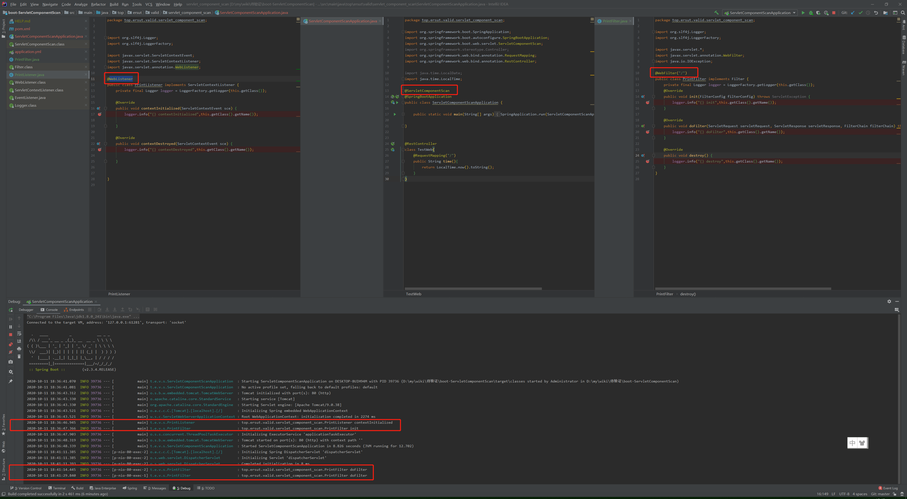
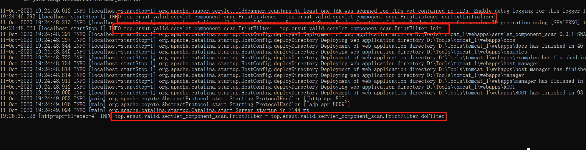

# 待验证

----------

## 到底需不需要 @ServletComponentScan（已验证）
图一：

图二：

### 描述
图一中说当且仅当使用内嵌的 Web Server 才会生效，但是我依稀记得图二中的 在外置tomcat下是没问题的，而且图二中的application类中没有添加 @ServletComponentScan

### 结论

####情况一：内嵌的tomcat下 使用@ServletComponentScan、@WebFilter、@WebListener

好使看下图

####情况二：外置的tomcat下 使用@ServletComponentScan、@WebFilter、@WebListener

还是好使,说明 @ServletComponentScan 在外置tomcat中 也没有文图 与文章中的描述不一致，看下图
