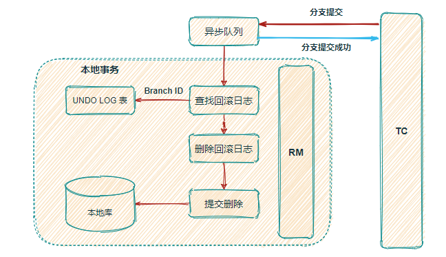

# 面试重点

## 事务

### [事务的隔离性](./spring/transaction.md#Isolation)

事务的隔离性简介绍

| 事务隔离级别                 |                             描述                             | 脏读 | 不可重复读 | 幻读 |
| ---------------------------- | :----------------------------------------------------------: | :--: | :--------: | :--: |
| 读未提交（Read Uncommitted） |            一个事务可以读取另一个未提交事务的数据            |  是  |     是     |  是  |
| 读已提交（Read Committed）   | 若有事务对数据进行**更新**（UPDATE）操作时，读操作事务要等待这个更新操作**事务提交后**才能读取数据 |  否  |     是     |  是  |
| 可重复读（Repeatable Read）  | 开始读取数据（事务开启）时，**不再允许修改操作**（其他事务修改会引起“不可重复读”的情况） |  否  |     否     |  是  |
| 串行化（Serializable）       |                      事务串行化顺序执行                      |  否  |     否     |  否  |

### [事务的传播方式（spring框架的）](./spring/transaction.md#propagation)

事务的传播方式介绍

| -           | REQUIRED（确保自己有事务） | MANDATORY(调用方必须有事务) | REQUIRES_NEW(必须使用新事务)    | SUPPORTS（可以不使用事务） | NOT_SUPPORTED(强制不使用事务) | NEVER(不允许在事务中运行) | NESTED（嵌套事务）               |
| :---------- | :------------------------- | :-------------------------- | :------------------------------ | :------------------------- | :---------------------------- | :------------------------ | :------------------------------- |
| A方法有事务 | B方法使用A方法的事务       | B方法使用A方法的事务        | A方法的事务挂起,B方法开启新事务 | B方法使用A方法的事务       | A方法的事务挂起               | 抛出异常                  | B方法在A方法事务的嵌套事务中运行 |
| A方法无事务 | B方法开启新事务            | 抛出异常                    | B方法开启新事务                 | B方法不使用事务            | B方法不使用事务               | B方法不使用事务           | B方法开启新事务                  |

## spring

### [IOC](./spring/IOC.md)

- IOC即控制反转，一种思想
- 将创建对象和对象之间的调用过程(依赖注入)交给Spring管理
- 使用IOC的目的是为了降低耦合

### [AOP](./spring/AOP.md)

- AOP 是个思想,其实现框架有**AspectJ**、spring AOP
- AOP（面向切面编程）是能够让我们在不影响原有功能的前提下，为软件**横向扩展功能,功能增强**。
- AOP降低了代码的耦合度，提高开发效率

## Seata(分布式事务)

### [AT模式的二阶段](./spring-cloud/seata分布式事务.md#AT-2)

  
一阶段图示

  

  
二阶段提交图示

  

  
二阶段回滚图示

  

## Nacos

- 
